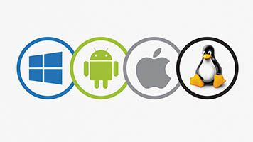
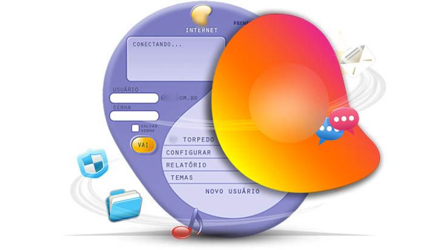

# 🖥 Arquitetura de Computadores

Dentro dos estudos de Arquitetura de Computadores iremos desempenhar um papel fundamental na nossa jornada de formação profissional na área de Tecnologia e Informação (T.I). Nesta trajetória, iremos entender melhor a computação na visão de máquina, ja que estudaremos como o Hardware funciona, que seria o próprio computador, consequentemente, aprendendo a lidar com problemas mais físicos na computação, desde aprender com todos os componentes internos funcionam, até mesmo ter bagagem teórica sobre arquiteturas computacionais mais especificas.

Primeiramente, vamos analisar a historia evolutiva da Arquitetura de Computadores, apresentando o que chamamos de **"o primeiro computador"**, mas vale ressaltar que o século XX trouxe varias inovações nos diversos campos da ciência e tecnologia. Uma das que mais alterou o estilo de vida e a sociedade foi a invenção e o desenvolvimento dos computadores.

Como dito, **"o primeiro computador"**, foi desenvolvido no inicio do século XX, pelo matemático britânico Alan Touring, amplamente reconhecido como o pai da computação e da inteligência artificial. Sua vida e trabalho foram revolucionárias, influenciando profundamente a forma como pensamos sobre máquinas, computação e a lógica matemática. 

Suas principais contribuições foram:

1. **Maquina de Turing (1936):** Desenvolveu um modelo teórico de computação, que é um dispositivo abstrato capaz de realizar qualquer cálculo lógico. Portanto, esse conceito estabeleceu os fundamentos da computação moderna e demonstrou que alguns problemas são computacionalmente insolúveis. Sobre suas características, ele foi montada a partir de 4 elementos, sendo eles: Uma fita infinita dividida em células que pode ser lida e escrita, um cabeçote capaz de ler ou escrever em uma célula da fita e mover-se para a esquerda ou direita da fita, um registrador que mantém o estado atual da máquina e uma função de transição que calcula a partir do estado atual e do símbolo lido, qual o novo estado e se o cabeçote deve se mover ou escrever na fita.

2. **Criptografia e a Segunda Guerra Mundial:** Durante a 2º Guerra Mundial, Turing trabalhou em Bletchley Park, o centro de inteligência britânico, onde desempenhou um papel crucial na decodificação das mensagens criptografas pela máquina **Enigma**, usada pelos nazistas. Então, ele projetou a **Bombe**, um maquina eletromecânica que acelerava o processo de decifração, contribuindo significativamente para a vitória dos Aliados.

3. **Computadores de Programa Armazenado:** Após a guerra, Turing trabalhou no desenvolvimento de computadores digitais, projetando a Automatic Computing Engine (ACE), umas das primeiras arquiteturas modernas de computadores.

4. **Inteligência Artificial:** Turing foi o pioneiro na ideia de que máquinas poderiam pensar. Em 1950 publicou um artigo chamado **"Computing Machinery and Intelligence"**, onde propôs o famoso teste de Turing, um método para determinar se uma máquina pode exibir inteligência semelhante à humana.

> Ainda durante a Segunda Guerra Mundial, Claude Elwood Shannon, que trabalhava na Bell Labs (American Industrial Research and Development Company) que desenvolveu estudo para a comunicação entre equipamentos, e seu principal artigo **"Mathematical Theory of Communication"** foi publicado após o fim da guerra que introduziu a unidade mínima para guardar uma informação, ou seja, um dígito binário, também conhecido como Bit (binary digit), podendo ter apenas 2 valores, sendo eles:
>
> 0 = falso ou desligado
>
> 1 = verdadeiro ou ligado
>
> Com os bits podemos representar qualquer número ou informação, tanto que esse sistema de bit ainda é utilizado nos computadores, denominada como Teoria da Informação.
>
> Exemplificando:
>
> ```01001101 01010101 01001110 01000100 01001111 - Significa "Mundo"```


## 📌 Gerações dos Computadores

### ➜ Primeira Geração: Válvulas Termiônicas


Ainda durante a Segunda Guerra Mundial, nos Estados Unidos, foi desenvolvido o primeiro computador eletrônico da história por John Presper Eckert e John Mauchly, na universidade de Pensilvânia. Trata-se do **ENIAC (Eletronic Numerical Integrator and Computer)**, um computador integrador numérico eletrônico, cujos números impressionam. Sendo criado para realizar cálculos complexos necessários para o exército dos Estados Unidos durante a Segunda Guerra Mundial, como:

1. Cálculos de trajetórias balísticas;
2. Simulações de armas nucleares.

Após a guerra, o ENIAC foi usado para outra tarefas científicas, como estudos relacionados à energia nuclear e problemas matemáticos avançados.

Componentes: 170.000 válvulas termiônicas;
</br>
Peso: Cerca de 30 toneladas;
</br>
Tamanho: Sala de 150m²;
</br>
Capacidade de Processamento: 1 bilhão de vezes menor que a dos celulares usados hoje em dia.

### ➜ Segunda Geração: Transistores 


Transistores são componentes eletrônicos fundamentais em circuitos modernos, usados para amplificar, controlar ou comutar sinais elétricos. Eles são pequenos dispositivos semicondutores que substituíram as válvulas eletrônicas em grande parte dos sistemas eletrônicos por serem mais eficientes, compactos e confiáveis. Um transistor tem três terminais principais:

1. Base (B): Controla o fluxo de corrente;
2. Coletor (C): Onde a corrente entra no transistor;
3. Emissor (E): Onde a corrente sai do transistor.

Ele age como um interruptor eletrônico ou um amplificador

- Interruptor: Permite ou bloqueia o fluxo de corrente elétrica entre o coletor e o emissor, dependendo do sinal de base.

- Amplificador: Aumenta a intensidade de um sinal fraco na base para produzir um sinal mais forte entre o coletor e o emissor.

**Tipos de Transistores:**

1. Transistor Bipolar de Junção (BJT)
    - Funciona por meio do fluxo de elétrons e lacunas (cargas positivas)
    - Exemplos: NPN e PNP

2. Transistor de Efeito de Campo (FET)
    - Controla a corrente por meio de um campo elétrico
    - Exemplos: MOSFET e JFET

**Principais aplicações do transistores:**

1. Eletrônica de consumo: Estão presentes em smartphones, computadores, TVs, etc...
2. Amplificação de áudio: em sistemas de som, para aumentar o sinal de entrada
3. Circuitos digitais: Funcionam como interruptores em processadores e memórias
4. Fontes de alimentação; Controlam tensões em circuitos reguladores

### ➜ Terceira Geração: Circuitos Integrados


Na década de 1960, o proximo salto de evolução foi dado com a criação dos **circuitos integrados (CI)**, também conhecidos como chip ou microchip, é um dispositivo eletrônico que contém diversos componentes como *transistores, resistores, capacitores e outros elementos* em um único pedaço de material semicondutor (geralmente silício). Ele é projetado para executar uma função ou conjunto de funções específicas em um circuito elétrico. Portanto, vamos exemplificar como funciona o CI:

- Os componentes internos de um CI são interconectados e formam um circuito completo, como o que antes seria montado com vários componentes separados em uma placa.
- Esses componentes são miniaturizados e construídos diretamente na superfície de um material semicondutor, permitindo que muitos dispositivos caibam em um espaço muito pequeno.

Tipos de circuitos integrados:

1. Circuitos digitais:
    - Realizam operações baseadas em lógica binária (0s e 1s).
    - Exemplos: processadores, memórias RAM e chips de controle.

2. Circuitos analógicos:
    - Lidam com sinais contínuos, como amplificação de áudio ou controle de sinais.
    - Exemplos: amplificadores operacionais, reguladores de tensão.

3. Circuitos mistos:
    - Combinam elementos digitais e analógicos.
    - Exemplos: chips para smartphones que incluem processamento digital e amplificação de som.

Exemplos de aplicações de circuitos integrados:

- Processadores: O cérebro de computadores e smartphones, como o Intel Core ou os chips Apple M1/M2.
- Memórias: Chips de armazenamento, como RAM e SSDs.
- Eletrônica de consumo: Televisões, micro-ondas, controles remotos, etc.
- Automóveis: Sensores e sistemas de controle eletrônico.

Vantagens dos circuitos integrados:
1. Miniaturização: Substituem circuitos grandes e complexos por chips pequenos.
2. Eficiência: Consomem menos energia e são mais rápidos.
3. Confiabilidade: Reduzem falhas porque eliminam conexões externas entre componentes.
4. Custo-benefício: Produção em massa torna os dispositivos mais baratos.

### ➜ Quarta Geração: Microprocessadores


A década de 1980 presenciou a proliferação de PC's cada vez mais potentes, baratos e conectador por meio do surgimento das redes locais de computadores e da internet: a rede mundial. Além disso, um novo equipamento aparecia nos lares: o videogame, um tipo de computador especializado, cujos programas são jogos eletrônicos com ênfase nos gráficos e na interação com os usuários.

Após o fim do século XX, os computadores já eram tão pequenos e potentes que se encontravam embarcados em diversos equipamentos cotidianos, como automóveis, aviões e videogames, além de se tornar mais comum a presença dos laptops (microcomputadores pessoais portáteis) nas casas das pessoas. Não tardou muito para que eles fossem integrados a televisões e celulares. Nos anos 2010, essa integração passou a ser feita por intermédio de smartphones e smart TVs.

Um microprocessador é um circuito integrado que contém milhões ou até bilhões de transistores organizados para realizar operações complexas. Ele trabalha com base em um conjunto de instruções (a linguagem de máquina) para processar dados e controlar dispositivos conectados.

**Componentes principais de um microprocessador:**

1. Unidade de Controle (UC):
    - Interpreta as instruções e coordena as operações dos outros componentes.

2. Unidade Lógica e Aritmética (ALU):
    - Realiza cálculos matemáticos (adição, subtração, etc.) e operações lógicas (comparações, AND, OR).

2. Registradores:
    - Pequenas áreas de memória internas que armazenam temporariamente dados ou instruções durante o processamento.

4. Barramento (Bus):
    - Sistema de comunicação que transporta dados entre o microprocessador, memória e outros periféricos.

**Como funciona um microprocessador:**

1. Busca: A unidade de controle busca uma instrução na memória.

2. Decodificação: A instrução é decodificada para entender qual operação deve ser realizada.

3. Execução: A ALU realiza os cálculos ou operações indicadas pela instrução.

4. Armazenamento: O resultado é armazenado nos registradores ou na memória.


### 📌 Computação no cotidiano

Hoje em dia, muitos celulares já são, de fato, computadores pessoais portáteis, até mesmo o caso dos dispositivos da Samsung que tem um sistema nomeado como **DEX** dentro do próprio sistema, entre outros que estão plenamente conectados pela rede de telefonia móvel (celular). Nossa dependência em relação a tecnologia para as tarefas do cotidiano já é tão forte que nem percebemos que necessitamos diretamente de algum aparelho telefônico para solucionar muitas vezes problemas simples, inclusive estranhando sua ausência. Afinal, usamos os computadores e qualquer meio de dispositivo móvel para:

1. Comunicação;
2. Meios de Transportes;
3. Transações bancárias e comerciais;
4. Cálculos;
5. Lembretes e Despertadores;
6. Dispositivos de produtividade...

Atualmente, até o dinheiro não é guardado mais em cofres. Os saldos bancários são armazenados digitalmente nos servidores dos bancos. Se todos os correntistas de um banco solicitassem retirar inteiramente o dinheiro guardado nele, não haveria cédulas suficientes no cofre para atendê-los.

O ramo da Ciência da Computação está em amplo desenvolvimento. Segundo o portal Statista, em 2019, cinco das seis maiores companhias do mundo (em valor de mercado) eram do ramo da computação:

- Apple
- Microsoft
- Amazon
- Alphabet (Google)
- Facebook

## 📌 Hardware e Software

Os computadores são feitos com um conjunto de componentes dividido em dois grandes grupos:

**Hardware x Software**

O hardware é a parte física de um computador ou dispositivo eletrônico. São os componentes tangíveis, ou seja, aquilo que você pode ver e tocar, como placas, cabos, processadores, teclados, monitores, etc.

**Exemplos de hardware:**

1. Processador (CPU): O "cérebro" do computador.
2. Memória RAM: Responsável pelo armazenamento temporário de dados.
3. Disco rígido (HD) ou SSD: Armazenam os dados de forma permanente.
4. Placa-mãe: Conecta todos os componentes e permite que eles se comuniquem.
5. Periféricos: Teclado, mouse, monitor, impressoras.

O Software é a parte lógica, ou seja, os programas e instruções que fazem o hardware funcionar. Ele não pode ser tocado, pois é intangível, mas é essencial para que o hardware execute tarefas.

**Tipos de software:**

1. Sistema operacional: O programa principal que gerencia o hardware e os demais softwares (ex.: Windows, Linux, macOS, Android).
2. Aplicativos: Programas que executam tarefas específicas (ex.: Word, Excel, navegadores).
3. Softwares de sistema: Ferramentas para comunicação entre hardware e software (ex.: drivers).
5. Jogos: Entretenimento digital interativo (ex.: Fortnite, Minecraft).

**Como eles trabalham juntos?**
O hardware e o software dependem um do outro para funcionar:

- O hardware executa as instruções fornecidas pelo software.
- O software, por sua vez, precisa do hardware para processar as tarefas e produzir resultados visíveis para o usuário.
Um exemplo prático é quando você digita algo no teclado (hardware) e vê o texto aparecer no Word (software). Ambos trabalham em conjunto para realizar a tarefa!

| **Aspecto**            | **Hardware**                       | **Software**                     |
|-------------------------|-------------------------------------|-----------------------------------|
| **Definição**           | Parte física do dispositivo        | Parte lógica (programas e dados) |
| **Tangibilidade**       | Tangível, pode ser tocado          | Intangível, não pode ser tocado  |
| **Exemplos**            | CPU, RAM, HD, teclado, mouse       | Windows, Word, Google Chrome     |
| **Função**              | Executar as tarefas do software    | Fornecer instruções para o hardware |
| **Durabilidade**        | Sujeito a desgaste físico          | Sujeito a erros e bugs           |

### 📌 Principais Componentes de Hardware dos computadores:


Também conhecido como CPU (Central Processing Unit ou Unidade Central de Processamento, em português), processador é o cérebro do computador, pois recebe as instruções e as executa sequencialmente. Seu principal componente é a unidade lógica e aritmética, responsável por operações como adicionar e subtrair.

A execução das instruções em um processador é regulada pela presença de um pulso de frequência constante denominado clock, que é medido em Hertz (Hz) – número de pulsos por segundo.

> Uma das principais características de um processador é a velocidade com que consegue executar instruções. Isso depende diretamente da frequência do clock.

Como vimos, os processadores foram criados na década de 1970. Inicialmente, eles tiveram sua velocidade aumentada, gerando uma competição acirrada entre as produtoras de microprocessadores. Era comum medir a qualidade do CPU pela velocidade de seu clock. Entendia-se que um processador de 1800 MHz era melhor que um de 1600 MHz.

O aumento de clock a cada geração de processadores seguiu ao longo dos anos, até que, por conta de interferências físicas entre seus componentes, ficou inviável a continuação desse procedimento. A solução dada pelos projetistas foi colocar diversos miniprocessadores (chamados de núcleos) dentro de um mesmo chip de processador. Em termos práticos, é como se houvesse dois, quatro ou até mais processadores trabalhando em um mesmo chip. Essa técnica é conhecida como multicore, mas, em função do número de núcleos, também é chamada de:


</br>
Dual Core (2 Núcleos) e Quad Core (4 Núcleos)

Atualmente, a maioria dos processadores de mercado (inclusive os de celulares) utiliza ao menos quatro cores e frequências de clock de alguns bilhões de pulsos por segundo (GHz). Além do clock e do número de núcleos, outra característica importante do processador é a sua memória cache. Veja como ela funciona:

1. Ela funciona como uma pequena parte da memória principal dentro do próprio chip do processador.

2. As informações são lidas ou escritas na memória cache com muito mais velocidade que nos pentes de memória.

3. Por isso, uma boa quantidade dela consegue acelerar a velocidade do processador.

Por fim, outra característica importante a ser considerada na avaliação do processador é seu encaixe (conhecido como pinagem). Para permanecer encaixado na placa-mãe, ele conta com pinos cujo formato deve corresponder ao dos buracos disponíveis (chamados de soquete).


A memória principal é parte fundamental do computador, pois se trata do espaço onde são armazenados os dados e os programas executados no processador. Ela funciona como uma série de células em que cada uma armazena um conjunto de oito bits (chamado de um byte). Essas células funcionam como caixas de correio: cada uma tem seu endereço, embora só armazene uma carta por vez.

A memória também é chamada de RAM (em seu formato mais comum) por permitir o acesso a qualquer endereço em qualquer ordem. Disso resulta o nome Memória de Acesso Aleatório (em inglês, Random Access Memory). Normalmente, as memórias RAM são vendidas em pentes de memória.

> A memória RAM é volátil, ou seja, seus dados são apagados quando o sistema fica sem energia.

Vejamos, a seguir, as principais características de uma memória RAM:

1. Capacidade de armazenamento
    - Se possui 4 GB (quatro gigabytes) de armazenamento, a memória RAM conta com 4 bilhões dessas células, podendo armazenar até 32 bilhões de bits de dados.
2. Velocidade de comunicação com o barramento
    - Trata-se da velocidade com que a memória consegue transferir os dados para o processador. Por exemplo, uma memória de 400 MHz consegue transferir dados para o processador com uma taxa de até 3200 Mbps (3 bilhões e 200 milhões de bits por segundo).


Mesmo com a operacionalidade garantida por esses dispositivos, ainda existe o seguinte problema: a memória principal perde as informações quando se desliga o computador, ou seja, ela é volátil.

**Mas é possível resolver esse tipo de problema?**

A resposta é: sim. Precisamos de um sistema de armazenamento persistente que não perca as informações após esse desligamento.

Para isso, são usadas as memórias secundárias. Mais conhecidas como HD (Hard Disk ou Disco Rígido, em português), elas possuem essa nomenclatura porque sua tecnologia predominante envolve discos magnéticos lidos e escritos por um cabeçote. Atualmente, essa tecnologia tem sido substituída por Discos de Estado Sólido (SSD), que são muito mais rápidos e menos propensos a falhas e desgaste por não haver partes móveis mecânicas neles.As principais características das memórias secundárias são similares às da principal: capacidade de armazenamento normalmente medida em GB (gigabytes ou bilhões de bytes) ou TB (terabytes ou trilhões de bytes), e a velocidade de transmissão Depende do barramento que o liga à placa-mãe.

Hoje, a principal tecnologia de barramento de memória secundária é o SATA2, que é capaz de atingir taxas de transmissão de 3 Gb/s (3 gigas por segundo).


A placa-mãe consiste em um circuito elétrico impresso e uma série de componentes conectados nela. Os principais são:

1. Soquetes de encaixe dos "pentes" de memória
2. Soquete de Processador
3. Barramentos de periféricos (PCIx por exemplo)

A função básica da placa-mãe é conectar o processador, a memória principal e os periféricos (outros componentes não essenciais do computador). Essas conexões são chamadas de barramentos. Conforme a tecnologia se desenvolve, a placa-mãe começa a integrar em si periféricos que, até então, precisavam ser encaixados nela, como placas de vídeo, placas de rede, placas controladoras de portas seriais e paralelas.

> Atenção
As placas-mãe dos celulares atuais são circuitos altamente complexos, contando com processador, memória, controladora de vídeo, controladora de tela touchscreen, acelerômetros, GPS e placa de rede sem fio e celular. Todos eles estão diretamente integrados à sua placa-mãe.


Por se conectarem à parte central do computador, seus demais componentes são chamados, em geral, de periféricos. Muitos mostram ser tão relevantes que não seríamos capazes de imaginar sistemas computacionais sem eles. O primeiro computador usava apenas uma série de lâmpadas como saída e alguns cartões perfurados como entrada. Inicialmente, são necessários apenas dois instrumentos nesse processo, embora haja outro que também precisa ser apontado.

**Dispositivos de entrada:** Usados para interagir com o computador. Os mais comuns são:

1. Tela touchscreen: permite a seleção de elementos sem precisar de um mouse.

2. Teclado: segue um padrão já difundido das máquinas de escrever, facilitando seu uso e sua aceitação.

3. Mouse: abre novos rumos por permitir a indicação de pontos na tela e a seleção deles, o que gerou um grande impacto no desenvolvimento de interfaces gráficas.

4. Microfone: capta o áudio.

5. Câmera: capta áudio com vídeo.

6. Placa de rede: recebe os dados transmitidos pela rede.

**Dispositivos de saída:** Eles leem os resultados por computador. Os mais usuais são:

1. Sistema de vídeo: Composto, geralmente, por uma placa de vídeo e um monitor ou uma tela.

2. Alto-falantes ou caixas de som: Emite sons e sinais sonoros.

3. Impressora: Imprime documentos elaborados no computador.

4. Placa de rede: Envia os dados pela rede.

### 📌 Software:

Retornando um pouco sobre o que seria o Software, precisamos ressaltar que as possibilidades criadas pela presença de um hardware no computador requerem a execução de um conjunto de programas, trazendo, assim, suas funcionalidades à tona, que definem o software. Costuma-se dividi-lo em dois tipos:

1. Geralmente, são rodados de forma consciente nos computadores, entregando as funcionalidades desejadas por seu usuário.Observe alguns exemplos a seguir:
    - Navegadores de internet - Chrome, Firefox e Internet Explorer;
    - Planilhas: - Excel e Libreoffice Calc;
    - Editores de texto - Word e Libreoffice Writer;
    - Jogos eletrônicos - LoL e Fortnite.
2. Permitem que os finalísticos rodem em muitas máquinas com hardwares diversificados. Os softwares de sistema incluem os drivers dos dispositivos instalados no computador, ou seja, programas que controlam como se acessa e comanda determinado periférico. 

    - Exemplo: Uma placa de rede. 
    - O principal software de sistema é o conhecido sistema operacional.

A área de desenvolvimento de hardwares e softwares mostra diversos casos de sucesso. O surgimento de Circuitos Integrados (CI), microprocessadores, placas de vídeo, mouse, touchscreen, USB e muitos outros hardwares gerou saltos evolutivos no desenvolvimento dos computadores, alguns chegando a mudar drasticamente a sua forma de uso.

No ramo de softwares, diversos programas mudaram a forma como trabalhamos e nos divertimos, tais como:

- Jogos eletrônicos
- Sistemas operacionais com interface gráfica (Windows)
- Aplicativos para realizar diversas tarefas cotidianas (e-bank, e-commerce e e-mail)
- Navegador de internet (web browser)
- Planilhas
- Editores de texto

### 📌 Sistema Operacional



Sabemos que o sistema operacional (OS) é um dos principais – e o mais conhecido – softwares de sistema. Responsável por conhecer o hardware instalado no computador, ele possui diversas funções importantes.

Como exemplo, temos: fornecer aos programas acessibilidade ao processador e garantir transparência no acesso aos periféricos. 

Neste módulo, destacaremos a importância do sistema operacional, além de descrevermos sua evolução.

**Principais funções do OS:**

1. Servir como uma camada de abstração entre o hardware e a aplicação do usuário.
Cuidar da alocação do armazenamento e da memória principal.
Ao pedir para executar um programa, o OS deve alocar espaço na memória tanto para ele quanto para os dados que ele precisará manipular.
2. Nos computadores atuais, diversos programas executam simultaneamente. Por uma solicitação do usuário, alguns o fazem em primeiro plano, enquanto outros rodam em segundo (ou em background). Exemplo: Sempre que iniciamos o computador, mandamos executar alguns programas, como antivírus e demais programas de comunicação, a saber: Skype, Discord e WhatsApp.
3. Informar quando e quais programas ganham acesso ao uso do processador.
4. Escolher quando determinados programas devem passar o uso do processador para outro programa.
5. Este subsistema do OS é chamado de escalonador. Como os processadores atuais são normalmente compostos por muitos núcleos, para decidir a alocação de seu tempo a cada programa, o escalonador precisa levar em conta:
    - Todos os núcleos disponíveis.
    - Características de cada programa a ser executado.
    
O Sistema Operacional é um programa intermediário que: gerencia os recursos de hardware do computador, fornece acesso a eles para os demais programas. Peça fundamental de um computador, o OS é carregado quando o ligamos. Mas os sistemas computacionais carregam, primeiramente, um programa chamado BIOS (Basic Input/Output System), ele fica gravado em uma memória não volátil, geralmente em um chip da placa-mãe, ao ligarmos o computador, a memória está vazia, pois é volátil. Se não houvesse o BIOS, não seria possível carregar o OS (que está em uma memória secundária, geralmente, o disco rígido) em memória para ser executado.

> Atenção: O sistema operacional ainda é um programa. Portanto, sua execução depende desse carregamento em memória.

### 📌 Origem da Internet

Na década de 1960, os computadores já eram uma realidade consolidada. Desse modo, o Departamento de Defesa Norte-Americano resolveu iniciar os estudos para a construção de uma rede de comunicação capaz de permitir trabalhos em conjunto de pessoas muito distantes geograficamente. Assim, a ARPANET foi criada. A ARPANET (Advanced Research Projects Agency Network) foi a primeira rede de computadores do mundo e o precursor do que conhecemos hoje como a internet. Desenvolvida nos Estados Unidos em 1969 pela ARPA (Advanced Research Projects Agency), uma agência do Departamento de Defesa, ela tinha o objetivo de conectar computadores de diferentes instituições para facilitar a troca de informações e promover pesquisas.

**Contribuições da ARPANET:**

1. Protocolo de comunicação:
    - Inspirou o desenvolvimento do TCP/IP, o protocolo padrão usado na internet moderna.

2. Primeiro e-mail:
    - O primeiro e-mail da história foi enviado por Ray Tomlinson na ARPANET em 1971.
Expansão:

3. Conectou universidades, institutos de pesquisa e, posteriormente, organizações comerciais, mostrando o potencial de redes interconectadas.


> Evolução da ARPANET, uma rede de armazenamento de dados que, inicialmente, conectava algumas universidades e alguns centros de pesquisa.

Pensado para possibilitar uma troca de informações, o conceito de sistemas computacionais em rede necessariamente evoluiu, permitindo, hoje em dia, a interação com diversas aplicações, o que era uma realidade até então impensável para sistemas isolados.

**Fim da ARPANET:**
</br>
Em 1990, a ARPANET foi desativada porque a internet, como conhecemos hoje, já havia começado a substituí-la. No entanto, as ideias e tecnologias desenvolvidas na ARPANET foram a base para a criação da internet global.


Na concepção original dos computadores, não se planejava fazer com que vários deles se comunicassem entre si. Eles foram pensados apenas como máquinas programáveis para solucionar problemas. Nas décadas de 60 e 70 acontecia o nascimento da comunicação em rede.

> **1960**
</br>
Na década de 1960, surgiu a ideia de conectar computadores espalhados pelos centros acadêmicos norte-americanos.

> **1970**
</br>
A ARPANET foi montada para permitir o trabalho de pesquisa em conjunto por pessoas nas duas costas dos Estados Unidos. Essa ligação foi efetivada em 1970, surgindo, dessa forma, a primeira rede a integrar a internet.

No entanto, conectar computadores não era fácil. Foi necessário:

1. Comunicação entre computadores
    - Lançar meios de comunicação (como fios de cobre ou enlaces de rádio) entre os dois computadores.

2. Protocolos de comunicação
    - Criar protocolos para que ambos pudessem entender como falar entre si, pois eles precisam de um hardware para enviar e receber dados em rede.

Conforme outras redes iam se juntando, crescia a rede de redes (que passou a ser chamada de internet em 1986). Os computadores pessoais já estavam entrando no mercado, e as pessoas queriam se conectar de suas casas.

**Internet discada:**
</br>
Por uma questão de simplicidade, as empresas de telefonia assumiram o papel de prover conexão à internet para os usuários domésticos. Surgia, assim, o modem de internet discada, que se conectava como se estivéssemos fazendo um telefonema e atingia taxas de transmissão de 14400 bps (s por segundo).



**Endereço IP e roteador:**
</br>
Uma das barreiras a serem vencidas para interligar tantas máquinas foi a forma de endereçamento, ou seja, como identificar unicamente um computador com o qual se deseja falar. A solução foi dar um endereço – como o da sua casa, por exemplo – para cada máquina. Trata-se de um processo denominado endereço IP, abreviação de Internet Protocol (ou Protocolo de Internet, em português). O endereço IP consistia em uma sequência de quatro números entre 0 a 255 (representados em 8 bits). Como exemplos de endereço IP, temos:

```117.0.0.1```
</br>
```192.168.1.1```
</br>
```8.8.8.8```

Em posse do endereço de destino, um pacote (também chamado de datagrama) é enviado através das diversas redes existentes entre o remetente e o destino. Nas fronteiras delas, existem os roteadores, que funcionam como agências de correio e escolhem a rota que o pacote seguirá para chegar a seu destino. Dessa forma, passando de roteador em roteador, o pacote de dados consegue alcançá-lo com a sua mensagem.

**E-mail e páginas disponíveis na rede:**
</br>
A conexão de tantos usuários em rede não trouxe só dificuldades técnicas a serem superadas como também – e principalmente – propiciou a criação de oportunidades para outros mercados e outras tecnologias.


Inicialmente, os correios eletrônicos (e-mail) eram transmitidos por rede em uma analogia direta com o sistema de correios em que se baseou o conceito da ARPANET. Passadas três décadas, o sistema tradicional de correios raramente transporta cartas, limitando-se a encomendas e boletos. A maior parte do tráfego de correio é eletrônico.

Da mesma forma, quando se desenvolveu o conceito de páginas disponíveis na rede (originalmente chamado de World Wide Web: WWW) e se criou um navegador capaz de passear por essa rede de páginas, surgiu o que a maior parte das pessoas entende ser a internet. Essa tecnologia mudou a maneira como:

- Fazemos comércio (por meio de sites de e-commerce);
- Vamos ao banco (internet banking);
- Acessamos serviços públicos (a maioria está disponível na rede);
- Adquirimos informação.

Páginas de pesquisa, chats e programas de troca de mensagens

Para organizar a procura por tanta informação e pelas páginas disponíveis na World Wide Web, o software de busca Google se mostrou vitorioso entre diversos concorrentes. Atualmente, é possível buscar qualquer página ou tópico na web. Isso tornou a Google uma das empresas mais ricas do mundo.

Após alguns anos, as pessoas se acostumaram a ficar sentadas diante de seus computadores, estando conectadas à internet em grande parte do dia. Com essa nova realidade, a comunicação por e-mail ficou lenta, pois podia levar dias para que uma troca de mensagens fosse realizada. Surgiram, então, os servidores de chat, nos quais os usuários podiam interagir entre si em tempo real. O IRC, por exemplo, é usado até hoje. Também foram desenvolvidos programas de trocas de mensagem, como o ICQ.

**Interação entre usuários**
</br>
Com a conexão de diversos usuários domésticos, uma nova geração que crescia na década de 1990 via seus jogos eletrônicos começarem a permitir uma interação entre usuários.


Inicialmente, essa interação foi realizada em redes locais (chamadas de LAN), o que impulsionou o surgimento de LAN houses: lojas onde era possível jogar em rede usando os computadores e a LAN dos estabelecimentos. Em um processo de evolução natural, as empresas começaram a realizar jogos por meio da internet.

Com sua Battle.net, a Blizzard Entertainment pavimentou o caminho para o surgimento do que é conhecido como e-sports: jogos competitivos entre usuários de computador via internet.

**Banda Larga:**
</br>
Graças ao desenvolvimento de novas tecnologias de transmissão, como a fibra ótica, o aumento da banda de internet disponível ao usuário doméstico permitiu que novos serviços fossem oferecidos, como música e vídeo via internet. Atualmente, testemunhamos a gradual – embora inevitável – substituição da televisão por serviços de streaming, como:

1. Netlfix;
2. Youtube;
3. Prime Video;
4. Disney Plus...

De fato, a profissão de influenciador digital já é algo rentável. Novos conceitos de programas surgiram quando passamos a estar conectados em nível pessoal. Os celulares se tornaram computadores de bolso, e a tecnologia de comunicação de dados permite, hoje, transmissões até de vídeo (acima de 1 Mbps – bilhão de bits por segundo). Por isso, as pessoas estão cada vez mais conectadas a todo momento. Os aplicativos de mensagem, as redes sociais e até os jogos migraram para os celulares. Dessa forma, surgiram aplicativos colaborativos para:

1. Waze
    - Mostrar o caminho para qualquer destino 
2. Uber
    - Contratar um meio de transporte
3. Tinder
    - Aplicativo para relacionamentos
4. Entre outros...

---
### Passando para o Módulo 02
---
</br>

# Componentes de Hardware

Componentes de hardware são as partes físicas de um computador ou dispositivo eletrônico que permitem seu funcionamento. Eles são responsáveis por realizar as tarefas de processamento, armazenamento e comunicação entre os diversos sistemas de um dispositivo. Ou seja, tudo aquilo que está fisicamente presente para o contato do usuário, diferentemente do software, visto que já foi explicado sua diferença, mas relembrando:

> Software: é o conjunto de programas, dados e instruções que fazem um computador ou dispositivo eletrônico funcionar. Diferente do hardware, que é a parte física, o software é a parte "intangível" que dita como o hardware deve se comportar para realizar tarefas específicas.

**Alguns exemplos de Hardware são:**

1. **Processador (CPU)**:  
   - É o "cérebro" do computador, responsável por executar as instruções e processar dados. Ele coordena todas as operações e determina a velocidade do sistema.

2. **Memória RAM**:  
   - Armazena dados temporários que o processador usa enquanto executa programas. Quanto mais RAM, mais dados o computador pode processar ao mesmo tempo, o que melhora a performance.

3. **Disco Rígido (HD) ou SSD**:  
   - Dispositivos de armazenamento permanente. O HD usa discos magnéticos, enquanto o SSD usa memória flash, sendo mais rápido e durável.

4. **Placa-mãe**:  
   - É a principal placa de circuito que conecta todos os outros componentes do computador, como CPU, memória, armazenamento e periféricos. Ela permite que os dados sejam transmitidos entre as partes.

5. **Placa de Vídeo (GPU)**:  
   - Responsável pelo processamento de gráficos e imagens, principalmente em jogos, vídeos e programas de design gráfico. Uma boa placa de vídeo é essencial para quem trabalha com mídia visual.

6. **Fonte de Alimentação**:  
    - Converte a energia elétrica da tomada em energia que o computador pode usar. Ela distribui a energia para todos os componentes do sistema.

7. **Periféricos**:  
   - São dispositivos externos que conectam ao computador, como teclado, mouse, monitor, impressora, fones de ouvido, etc.

Todos essas partes de hardware são dividas em 3 partes chamados de sub-sistemas


### 📍 Oque é uma sistema?

A área conhecida como **implementação de computadores** se relaciona, em geral, com a abordagem de aspectos que são desnecessários ao programador. Por exemplo, a tecnologia usada na construção da memória, a frequência do relógio, sinais de controle para iniciar as micro-operações etc.

A implementação de computadores difere do conceito de **arquitetura de computadores**, cujo termo se relaciona, em geral, ao tratamento de pontos que são de interesse do programador, a saber, conjunto de instruções do processador, tamanho da palavra, modos de endereçamento de instruções, entre outros. A implementação de computadores e a arquitetura de computadores estão inseridas no domínio mais geral dos sistemas de computação.

A definição de computação pode ser entendida como a realização de cálculos de forma ordenada ou apenas a manipulação de valores.


> Partindo dessa definição, como você definiria um sistema de computação?
>
> Resposta: Um sistema de computação é um conjunto de partes coordenadas que concorrem para a realização do objetivo de computar (dados).

Outro termo importante que devemos incluir no vocabulário é o data processing ou, processamento de dados que consiste em uma série de atividades ordenadamente realizadas (receita de bolo), com o objetivo de produzir um arranjo determinado de informações a partir de outras obtidas inicialmente. Veja a seguir as etapas de um processamento de dados:


