# 🖥 Arquitetura de Computadores

### 📌 Introdução:

Nessa disciplina acadêmica, iremos estudar a parte da tecnologia voltada às peças mecânicas do computador. **A arquitetura de computadores é a área da computação que estuda o design, a organização e a estrutura de sistemas computacionais.** Em termos gerais, ela trata de como os componentes de um computador (hardware e software) interagem para executar tarefas.

Primeiramente, gostaria de edificar o conhecimento prévio do que seria Hardware e Software:

### 📍 Hardware:

Parte física de um computador ou sistema eletrônico. Basicamente, são os componentes tangíveis, como os dispositivos eletrônicos e mecânicos que formam o computador. Exemplos:

- Processador;
- Placa-mãe;
- Memória RAM (Memória Principal);
- HD e SSDs;
- Placa de vídeo;
- Periféricos;
- Entre outros...

Além disso, o hardware é conhecido por executar as instruções do software.

### 📍 Software:

Parte lógica de um computador, composta por programas, sistemas operacionais, aplicativos e dados. Responsável por dar as instruções para o hardware executar. Afinal, existem três tipos de software, sendo eles:

1. **Software de Sistema**
    - Gerencia o hardware e cria uma interface de usuário;
    - Exemplo: Sistemas Operacionais (SO), Windows, Linux, macOS...

2. **Software de Aplicativos**
    - Programas usados para realizar tarefas específicas;
    - Exemplo: Navegadores, editores de texto/vídeo, jogos...

3. **Software de Desenvolvimento** 
    - Ferramentas usadas por programadores para criar softwares;
    - Exemplo: Editores de código, versionadores de código, compiladores...

Para uma interpretação menos acadêmica e mais didática, podemos nos referir ao software como a mente do computador, tudo que possui lógica por trás, e ao hardware como o corpo responsável por executar a lógica.

Portanto, dentro dos estudos da **Arquitetura de Computadores**, retrataremos principalmente o hardware, mas teremos alguns assuntos abordando o software e a junção de funcionalidades dos dois. Além de entender a área de TI de uma forma mais mecânica, visto que estudaremos como os componentes internos funcionam, para que servem ou até mesmo como o computador se comporta em diferentes situações. Também desenvolveremos uma bagagem teórica sobre a arquitetura computacional de maneira mais específica.

Afinal, é preciso evidenciar que estudar como a arquitetura de computadores funciona resulta em uma qualificação melhor, paralelamente, auxiliando no desenvolvimento de alto desempenho. Isso seria o método de usar o conhecimento de linguagens de programação, codificando seus softwares, juntamente com o aprendizado sobre hardware, possibilitando no desenvolvimento utilizando o máximo do potêncial do hardware e analisar e como ele se comporta sob suas requisições.

**"Estudaremos cada parte desses conceitos de forma mais aprofundada futuramente"**

## 📌 A História e Evolução dos Computadores

Em meados do século XX, no ápice da Segunda Guerra Mundial, uma máquina de criptografia foi desenvolvida pelos nazistas, nomeada **Enigma**, que foi considerada uma grande adversidade na guerra. O mais importante naquele momento era a informação, já que os mensageiros poderiam tentar entregar mensagens entre comandantes sem risco de vazamento de dados, visto que somente quem tivesse acesso à Enigma poderia descriptografá-las. 

Portanto, como medida para combater essa questão, o britânico Alan Turing, amplamente reconhecido como o pai da computação e da inteligência artificial, desenvolveu técnicas revolucionárias. Algo que estava muito à frente do seu tempo, mas sua determinação e conhecimento foram mais que suficientes para suas grandes descobertas. Sua vida e trabalho foram revolucionários, já que influenciaram profundamente a forma como pensamos sobre máquinas, computação e lógica matemática. Portanto, podemos considerá-lo como o precursor da área de TI. Seus grandes desenvolvimento revolucionários foram os seguintes:

1. **Máquina de Turing (1936):** Desenvolveu um modelo teórico de computação, que é um dispositivo abstrato capaz de realizar qualquer cálculo lógico. Esse conceito estabeleceu os fundamentos da computação moderna e demonstrou que alguns problemas são computacionalmente insolúveis. Sobre suas características, ela foi montada a partir de 4 elementos, sendo eles:  
   - Uma fita infinita dividida em células que podem ser lidas e escritas;  
   - Um cabeçote capaz de ler ou escrever em uma célula da fita e mover-se para a esquerda ou direita da fita;  
   - Um registrador que mantém o estado atual da máquina;  
   - Uma função de transição que, a partir do estado atual e do símbolo lido, calcula qual será o novo estado e determina se o cabeçote deve se mover ou escrever na fita.  

2. **Criptografia e a Segunda Guerra Mundial:** Durante a 2ª Guerra Mundial, Turing trabalhou em Bletchley Park, o centro de inteligência britânico, onde desempenhou um papel crucial na decodificação das mensagens criptografadas pela máquina **Enigma**, usada pelos nazistas. Ele projetou a **Bombe**, uma máquina eletromecânica que acelerava o processo de decifração, contribuindo significativamente para a vitória dos Aliados.  

3. **Computadores de Programa Armazenado:** Após a guerra, Turing trabalhou no desenvolvimento de computadores digitais, projetando a **Automatic Computing Engine (ACE)**, uma das primeiras arquiteturas modernas de computadores.  

4. **Inteligência Artificial:** Turing foi pioneiro na ideia de que máquinas poderiam pensar. Em 1950, publicou um artigo chamado **"Computing Machinery and Intelligence"**, onde propôs o famoso **teste de Turing**, um método para determinar se uma máquina pode exibir inteligência semelhante à humana.  

> Ainda durante a Segunda Guerra Mundial, Claude Elwood Shannon, que trabalhava na Bell Labs (American Industrial Research and Development Company) que desenvolveu estudo para a comunicação entre equipamentos, e seu principal artigo **"Mathematical Theory of Communication"** foi publicado após o fim da guerra que introduziu a unidade mínima para guardar uma informação, ou seja, um dígito binário, também conhecido como Bit (binary digit), podendo ter apenas 2 valores, sendo eles:
>
> 0 = falso ou desligado
>
> 1 = verdadeiro ou ligado
>
> Com os bits podemos representar qualquer número ou informação, tanto que esse sistema de bit ainda é utilizado nos computadores, visto que o computador "fala" nessa lingua, explicando de uma forma mais dinâmica, além do mais, esse ramo de estudos é denominado como **Teoria da Informação**.
>
> Exemplificando:
>
> ```01001101 01010101 01001110 01000100 01001111 - Bits com significado da palavra "Mundo"```

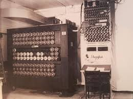

> Fotografia do Bombe

Acima temos o primeiro modelo do que chamamos de umadispositivo eletromecânico projetado para realizar cálculos específicos, no caso, quebrar o código Enigma usado pelos nazistas durante a Segunda Guerra Mundial. Além do mais, sendo o principal exemplo para as futuras máquinas lógicas.

### 📍 Desenvolvimento do computador em gerações

Iremos entender melhor como funcionou o desenvolvimento do avanço dos computadores divididos em gerações:

### 📍 Primeira Geração: Válvulas Termiônicas

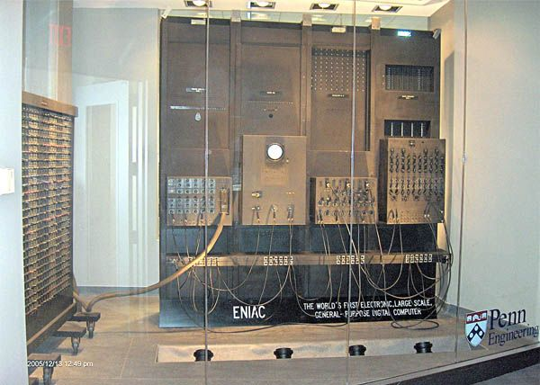

Ainda durante a Segunda Guerra Mundial, nos Estados Unidos, foi desenvolvido o primeiro computador eletrônico da história por John Presper Eckert e John Mauchly, na universidade de Pensilvânia. Trata-se do **ENIAC (Eletronic Numerical Integrator and Computer)**, um computador integrador numérico eletrônico, cujos números impressionam. Sendo criado para realizar cálculos complexos necessários para o exército dos Estados Unidos durante a Segunda Guerra Mundial, como:

1. Cálculos de trajetórias balísticas;
2. Simulações de armas nucleares.

Após a guerra, o ENIAC foi usado para outra tarefas científicas, como estudos relacionados à energia nuclear e problemas matemáticos avançados.

Componentes: 170.000 válvulas termiônicas;
</br>
Peso: Cerca de 30 toneladas;
</br>
Tamanho: Sala de 150m²;
</br>
Capacidade de Processamento: 1 bilhão de vezes menor que a dos celulares usados hoje em dia.

### 📍 Segunda Geração: Transistores 

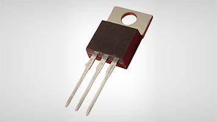

Transistores são componentes eletrônicos fundamentais em circuitos modernos, usados para amplificar, controlar ou comutar sinais elétricos. Eles são pequenos dispositivos semicondutores que substituíram as válvulas eletrônicas em grande parte dos sistemas eletrônicos por serem mais eficientes, compactos e confiáveis. Um transistor tem três terminais principais:

1. Base (B): Controla o fluxo de corrente;
2. Coletor (C): Onde a corrente entra no transistor;
3. Emissor (E): Onde a corrente sai do transistor.

Ele age como um interruptor eletrônico ou um amplificador

- Interruptor: Permite ou bloqueia o fluxo de corrente elétrica entre o coletor e o emissor, dependendo do sinal de base.

- Amplificador: Aumenta a intensidade de um sinal fraco na base para produzir um sinal mais forte entre o coletor e o emissor.

### ➜ Tipos de Transistores:

1. Transistor Bipolar de Junção (BJT)
    - Funciona por meio do fluxo de elétrons e lacunas (cargas positivas)
    - Exemplos: NPN e PNP

2. Transistor de Efeito de Campo (FET)
    - Controla a corrente por meio de um campo elétrico
    - Exemplos: MOSFET e JFET

### ➜ Principais aplicações do transistores:

1. Eletrônica de consumo: Estão presentes em smartphones, computadores, TVs, etc...
2. Amplificação de áudio: em sistemas de som, para aumentar o sinal de entrada
3. Circuitos digitais: Funcionam como interruptores em processadores e memórias
4. Fontes de alimentação; Controlam tensões em circuitos reguladores

### 📍 Terceira Geração: Circuitos Integrados

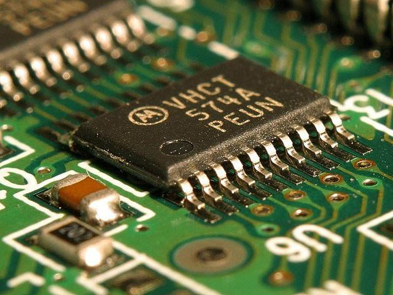

Na década de 1960, o proximo salto de evolução foi dado com a criação dos **circuitos integrados (CI)**, também conhecidos como chip ou microchip, é um dispositivo eletrônico que contém diversos componentes como *transistores, resistores, capacitores e outros elementos* em um único pedaço de material semicondutor (geralmente silício). Ele é projetado para executar uma função ou conjunto de funções específicas em um circuito elétrico. Portanto, vamos exemplificar como funciona o CI:

- Os componentes internos de um CI são interconectados e formam um circuito completo, como o que antes seria montado com vários componentes separados em uma placa.
- Esses componentes são miniaturizados e construídos diretamente na superfície de um material semicondutor, permitindo que muitos dispositivos caibam em um espaço muito pequeno.

Tipos de circuitos integrados:

1. Circuitos digitais:
    - Realizam operações baseadas em lógica binária (0s e 1s).
    - Exemplos: processadores, memórias RAM e chips de controle.

2. Circuitos analógicos:
    - Lidam com sinais contínuos, como amplificação de áudio ou controle de sinais.
    - Exemplos: amplificadores operacionais, reguladores de tensão.

3. Circuitos mistos:
    - Combinam elementos digitais e analógicos.
    - Exemplos: chips para smartphones que incluem processamento digital e amplificação de som.

Exemplos de aplicações de circuitos integrados:

- Processadores: O cérebro de computadores e smartphones, como o Intel Core ou os chips Apple M1/M2.
- Memórias: Chips de armazenamento, como RAM e SSDs.
- Eletrônica de consumo: Televisões, micro-ondas, controles remotos, etc.
- Automóveis: Sensores e sistemas de controle eletrônico.

Vantagens dos circuitos integrados:
1. Miniaturização: Substituem circuitos grandes e complexos por chips pequenos.
2. Eficiência: Consomem menos energia e são mais rápidos.
3. Confiabilidade: Reduzem falhas porque eliminam conexões externas entre componentes.
4. Custo-benefício: Produção em massa torna os dispositivos mais baratos.

### 📍 Quarta Geração: Microprocessadores

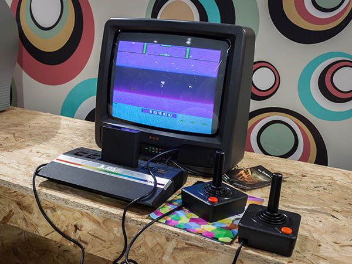

A década de 1980 presenciou a proliferação de PC's cada vez mais potentes, baratos e conectador por meio do surgimento das redes locais de computadores e da internet: a rede mundial. Além disso, um novo equipamento aparecia nos lares: o videogame, um tipo de computador especializado, cujos programas são jogos eletrônicos com ênfase nos gráficos e na interação com os usuários.

Após o fim do século XX, os computadores já eram tão pequenos e potentes que se encontravam embarcados em diversos equipamentos cotidianos, como automóveis, aviões e videogames, além de se tornar mais comum a presença dos laptops (microcomputadores pessoais portáteis) nas casas das pessoas. Não tardou muito para que eles fossem integrados a televisões e celulares. Nos anos 2010, essa integração passou a ser feita por intermédio de smartphones e smart TVs.

Um microprocessador é um circuito integrado que contém milhões ou até bilhões de transistores organizados para realizar operações complexas. Ele trabalha com base em um conjunto de instruções (a linguagem de máquina) para processar dados e controlar dispositivos conectados.

### ➜ Componentes principais de um microprocessador:

1. Unidade de Controle (UC):
    - Interpreta as instruções e coordena as operações dos outros componentes.

2. Unidade Lógica e Aritmética (ALU):
    - Realiza cálculos matemáticos (adição, subtração, etc.) e operações lógicas (comparações, AND, OR).

2. Registradores:
    - Pequenas áreas de memória internas que armazenam temporariamente dados ou instruções durante o processamento.

4. Barramento (Bus):
    - Sistema de comunicação que transporta dados entre o microprocessador, memória e outros periféricos.

### ➜ Como funciona um microprocessador:

1. Busca: A unidade de controle busca uma instrução na memória.

2. Decodificação: A instrução é decodificada para entender qual operação deve ser realizada.

3. Execução: A ALU realiza os cálculos ou operações indicadas pela instrução.

4. Armazenamento: O resultado é armazenado nos registradores ou na memória.

## 📌 Computação no cotidiano

Hoje em dia, muitos celulares já são, de fato, computadores pessoais portáteis, até mesmo o caso dos dispositivos da Samsung que tem um sistema nomeado como **DEX** dentro do próprio sistema, que consiste em um sistema operacional Windows, mas em um modelo portátil, entre outros que estão plenamente conectados pela rede de telefonia móvel (celular). Nossa dependência em relação a tecnologia para as tarefas do cotidiano já é tão forte que nem percebemos que necessitamos diretamente de algum aparelho telefônico para solucionar muitas vezes problemas simples, inclusive estranhando sua ausência. Afinal, usamos os computadores e qualquer meio de dispositivo móvel para:

1. Comunicação;
2. Meios de Transportes;
3. Transações bancárias e comerciais;
4. Cálculos;
5. Lembretes e Despertadores;
6. Dispositivos de produtividade...

Atualmente, até o dinheiro não é guardado mais em cofres. Os saldos bancários são armazenados digitalmente nos servidores dos bancos. Até mesmo a nível de curisoidade, se todos os correntistas de um banco solicitassem retirar inteiramente o dinheiro guardado nele, não haveria cédulas suficientes no cofre para atendê-los.

Todos os ramos de Inovação e Tecnologia está em amplo desenvolvimento. Segundo o portal Statista, em 2019, cinco das seis maiores companhias do mundo (em valor de mercado) eram do ramo da computação:

- Apple
- Microsoft
- Amazon
- Alphabet (Google)
- Facebook

Vale ressaltar que com todo esse avanço tecnologico muitos novos projetos e equipamentos vem sendo produzidos com isso, já que, estamos caminhando para um futuro cada vem mais ligado a tecnologia.

## 📌 Hardware

Como dito, **hardware** seria toda a parte física de um computador ou sistema eletrônico, são as peças que estão ao alcance do usuário de forma palpável. Portanto, para enterdemos melhor e apliarmos nossos estudos de forma mais prática, iremos trazer as principais peças do hardware.

### 📍 Processador ou CPU (Central Processing Unit)

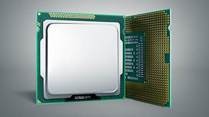

Considerado o "cérebro" do computador. Ela é responsável por executar os comandos de programas, processar dados e coordenar as operações entre os diversos componentes do sistema, como a memória, dispositivos de entrada e saída, entre outros.

A CPU realiza três tarefas principais:

1. Busca: Ela busca as instruções no armazenamento (geralmente memória RAM).

2. Decodificação: Depois de buscar a instrução, a CPU interpreta o que deve ser feito com ela.

3. Execução: Finalmente, ela executa a instrução e realiza a ação necessária, como cálculos ou movimentação de dados.

A CPU também pode ter múltiplos núcleos (como dual-core, quad-core, etc.), o que permite que ela realize várias tarefas simultaneamente, aumentando o desempenho em tarefas mais exigentes.

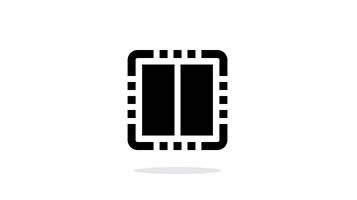 

> Como vimos, os processadores foram criados na década de 1970. Inicialmente, eles tiveram sua velocidade aumentada, gerando uma competição acirrada entre as produtoras de microprocessadores. Era comum medir a qualidade do CPU pela velocidade de seu clock. Entendia-se que um processador de 1800 MHz era melhor que um de 1600 MHz.
>
> Overclocking, por sua vez, é o processo para customizar a velocidade do clock do processador acima de sua frequência de uso normal. Tal prática deixa o computador mais rápido, pois uma maior quantidade de operações pode ser realizada ao mesmo tempo. Há certos riscos envolvidos no overclocking, como danos ao processador e sobreaquecimento.
>
> O aumento de clock a cada geração de processadores seguiu ao longo dos anos, até que, por conta de interferências físicas entre seus componentes, ficou inviável a continuação desse procedimento. A solução dada pelos projetistas foi colocar diversos miniprocessadores (chamados de núcleos) dentro de um mesmo chip de processador. Em termos práticos, é como se houvesse dois, quatro ou até mais processadores trabalhando em um mesmo chip. Essa técnica é conhecida como multicore, mas, em função do número de núcleos.
>
>Atualmente, a maioria dos processadores de mercado (inclusive os de celulares) utiliza ao menos quatro cores e frequências de clock de alguns bilhões de pulsos por segundo (GHz). Além do clock e do número de núcleos, outra característica importante do processador é a sua memória cache. Veja como ela funciona:
>
>1. Ela funciona como uma pequena parte da memória principal dentro do próprio chip do processador.
>
>2. As informações são lidas ou escritas na memória cache com muito mais velocidade que nos pentes de memória.
>
>3. Por isso, uma boa quantidade dela consegue acelerar a velocidade do processador.

### 📍 Mémoria RAM ou Mémoria Principal

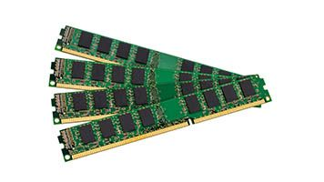

A memória principal é parte fundamental do computador, pois se trata do espaço onde são armazenados os dados e os programas executados no processador. Ela funciona como uma série de células em que cada uma armazena um conjunto de oito bits (chamado de um byte). Essas células funcionam como caixas de correio: cada uma tem seu endereço, embora só armazene uma carta por vez.

A memória também é chamada de RAM (em seu formato mais comum) por permitir o acesso a qualquer endereço em qualquer ordem. Disso resulta o nome Memória de Acesso Aleatório (em inglês, Random Access Memory). Normalmente, as memórias RAM são vendidas em pentes de memória.

> A memória RAM é volátil, ou seja, seus dados são apagados quando o sistema fica sem energia.

Portanto, mémoria RAM ou Mémoria Principal é um componente do computador que serve para armazenar dados que são precisos ser processados das aplicações que estão em funcionamento no momento de forma rápida e que não precisa se guardado. Afinal, por ser volátil, ela acaba sendo muito mais rápida que outros modelos de armazenamento, criando uma peça fundamental no processamento de dados rápidos para o funcionamento de aplicações em andamento.

1. Capacidade de armazenamento
    - Se possui 4 GB (quatro gigabytes) de armazenamento, a memória RAM conta com 4 bilhões dessas células, podendo armazenar atualmente até 37 bilhões de bits de dados.
    - Existem atualmente mémoria ram com armazenamento de 64gb por peça

2. Velocidade de comunicação com o barramento
    - Trata-se da velocidade com que a memória consegue transferir os dados para o processador. Por exemplo, uma memória de 400 MHz consegue transferir dados para o processador com uma taxa de até 3200 Mbps (3 bilhões e 200 milhões de bits por segundo).
    - Atualmente possuimos mémorias com mais de 5000 MHz

### 📍 HD/SSD's ou Mémorias Secundárias

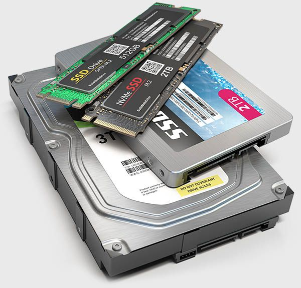

Mémoria Principais são muito importantes para o funcionamento do comptaudor, mas é preciso ter algum componente responsável por armazenar os dados que o usuários realmente precisa manter guardado, para tanto, existe oque chamamos de **mémoria secundária**, que é responsável por guardar dados em suas depedências. Mais conhecidas como **HD (Hard Disk ou Disco Rígido, em português)** elas possuem essa nomenclatura porque sua tecnologia predominante envolve discos magnéticos lidos e escritos por um cabeçote. Atualmente, essa tecnologia tem sido substituída por **Discos de Estado Sólido (SSD)**, que são muito mais rápidos e menos propensos a falhas e desgaste por não haver partes móveis mecânicas neles.

As principais características das memórias secundárias são similares às da principal:

1. Capacidade de armazenamento
    - Normalmente medida em GB (gigabytes ou bilhões de bytes) ou TB (terabytes ou trilhões de bytes).

2. Velocidade de transmisão com o barramento
    - Depende completamente do tipo de barramento e seria um HD ou SSD

### 📍 Placa-Mãe

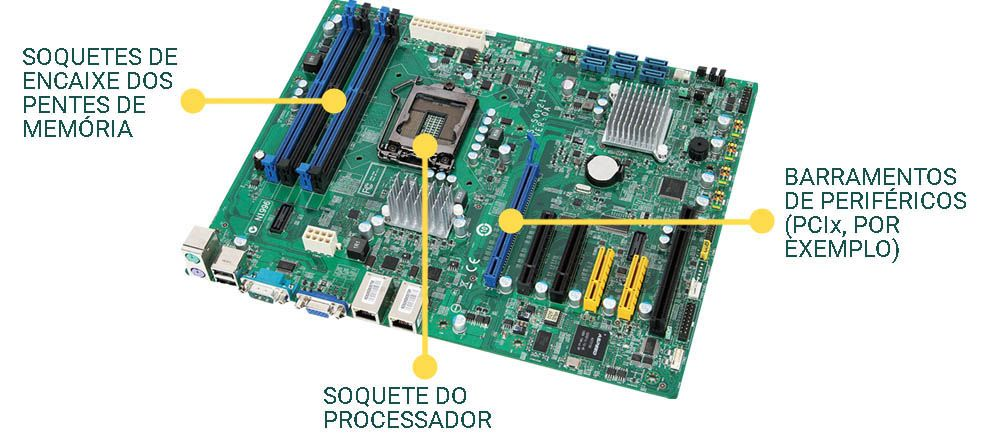

A placa-mãe consiste em um circuito elétrico impresso e uma série de componentes conectados nela. Os principais são:

- Soquetes de encaixe das mémorias principais;
- Soquete de processador;
- Barramentos de periféricos.

A função básica da placa-mãe é conectar o processador, a memória principal e os periféricos (outros componentes não essenciais do computador). Essas conexões são chamadas de barramentos. Conforme a tecnologia se desenvolve, a placa-mãe começa a integrar em si periféricos que, até então, precisavam ser encaixados nela, como placas de vídeo, placas de rede, placas controladoras de portas seriais e paralelas.

> As placas-mãe dos celulares atuais são circuitos altamente complexos, contando com processador, memória, controladora de vídeo, controladora de tela touchscreen, acelerômetros, GPS e placa de rede sem fio e celular. Todos eles estão diretamente integrados à sua placa-mãe.
>
> Como também existem algumas placa-mães de computadores e notebooks com todas essas funcionalidades.

### 📍 Periféricos

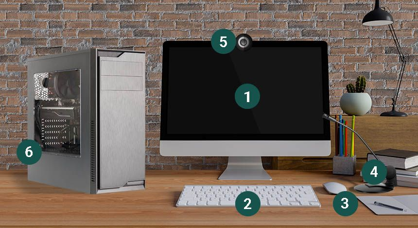

Por se conectarem à parte central do computador, seus demais componentes são chamados, em geral, de periféricos. Muitos mostram ser tão relevantes que não seríamos capazes de imaginar sistemas computacionais sem eles. O primeiro computador usava apenas uma série de lâmpadas como saída e alguns cartões perfurados como entrada. Inicialmente, são necessários apenas dois instrumentos nesse processo, embora haja outro que também precisa ser apontado.

Dentro dos periféricos existem dois grupos:

1. **Dispositivos de entrada:** Usados para interagir com o computador. Os mais comuns são:
    - Tela touchscreen: permite a seleção de elementos sem precisar de um mouse.
    - Teclado: segue um padrão já difundido das máquinas de escrever, facilitando seu uso e sua aceitação.
    - Mouse: abre novos rumos por permitir a indicação de pontos na tela e a seleção deles, o que gerou um grande impacto no desenvolvimento de interfaces gráficas.
    - Microfone: capta o áudio.
    - Câmera: capta áudio com vídeo.
    - Placa de rede: recebe os dados transmitidos pela rede.
    - Entre Outros...

2. **Dispositivos de Saída:** Eles leem os resultados por computador. Os mais usuais são:
    - Placa de Vídeo: Responsável pelo processamento gráfico do computador
    - Alto-falantes ou caixas de som: Emite sons e sinais sonoros.
    - Impressora: Imprime documentos elaborados no computador.
    - Placa de rede: Envia os dados pela rede.

## 📌 Sistema Operacional

SO (Sistema Operacional) é o software responsável por gerenciar e controlar o hardware do computador, além de fornecer uma interface para que o usuário interaja com o sistema. Em outras palavras, o SO atua como uma ponte entre o usuário e os componentes físicos do computador, garantindo que tudo funcione de maneira integrada.

As principais funções de um sistema operacional incluem:

- Gerenciamento de Processos: O SO controla a execução de programas, alocando tempo de CPU para os processos e gerenciando a execução de várias tarefas simultaneamente (multitarefa). **ESSE SISTEMA DE GERENCIAR AS EXECUÇÕES DOS PROGRAMAS É FEITO ATRAVÉS DO ESCALONADOR**

- Gerenciamento de Memória: Ele controla a memória do computador, alocando espaço para os programas e gerenciando o uso da RAM.

- Gerenciamento de Entrada/Saída (E/S): O SO gerencia os dispositivos de entrada e saída, como o teclado, mouse, impressora, e outros periféricos.

- Gerenciamento de Arquivos: Ele organiza e controla o armazenamento de arquivos, permitindo a criação, leitura, escrita e exclusão de arquivos no sistema de armazenamento.

- Segurança e Controle de Acesso: O SO protege o sistema contra acessos não autorizados, garantindo que apenas usuários e programas com permissões adequadas possam acessar certos recursos.

Afinal, ele é responsável por todas os componentes do **hardware** funcionarem

**Exemplos de sistemas operacionais são o Windows, macOS, Linux, Android, entre outros.**

### 📍 Historia dos Sistemas Operacionais

Os primeiros sistemas operacionais eram específicos para as máquinas que os empregavam. Basicamente, eles serviam de interface entre os programas do usuário e o hardware. Veja sua evolução histórica!

### ➜ Anos 1970

Surge o Unix, um OS de uso geral muito difundido por ter sido distribuído gratuitamente para o setor acadêmico e o público nos Estados Unidos. Como ele não possuía uma interface gráfica, todos os seus comandos eram dados via console a partir de um texto.

> Exemplo:
>
> Se estiver em um Windows, segure a tecla Windows + R, digite cmd e aperte Enter. No Linux, segure as teclas Ctrl + Alt + T. Você verá o terminal aparecer. Podem ser dados ali comandos de texto para executar programas em sua máquina. 

### ➜ Anos 1980

A Microsoft começa a vender seu Sistema Operacional, o MS-DOS, presente nos computadores comercializados pela International Business Machine Corporation (IBM). Com isso, esse sistema ganhou uma grande projeção no mundo da computação. 

- Microsoft: a Microsoft, porém, destaca-se em relação à sua concorrente direta ao apresentar um novo OS. O Windows, afinal, permite a execução de programas em janelas ou quadros que se superpunham a uma área de trabalho. O Sistema Operacional Windows chegou a ocupar 90% do mercado dos PCs. 

- Apple: a empresa Apple, por sua vez, lança uma versão de seu OS que contém: interface gráfica e conceito de ícones para representar programas. 

### ➜ Século XX

Vemos o nascimento de OS para os dispositivos móveis (mobiles) que surgiam: 

- Smartphones; 
- Tablets; 
- Smart TVs. 

A Apple lança um sistema operacional exclusivo para seus aparelhos: o iOS. 

Enquanto isso, a Google e alguns parceiros desenvolvem o OS Android. Ambos disputam o mercado de OS para mobile e destronam a Microsoft, que, apesar de desenvolver o Windows Mobile, depois, desiste dessa competição.
 
Os sistemas operacionais são fundamentais para o bom funcionamento dos sistemas computacionais. Com a integração de computadores a celulares e tablets, existe um grande foco no desenvolvimento e na melhoria de OS para mobile. Os principais são:

## 📌 A Origem da Internet

Estudaremos apenas o modelo introdutório de como ocorreu a origem da internet.

Na década de 1960, os computadores já eram uma realidade consolidada. Desse modo, o Departamento de Defesa Norte-Americano resolveu iniciar os estudos para a construção de uma rede de comunicação capaz de permitir trabalhos em conjunto de pessoas muito distantes geograficamente. Assim, a ARPANET foi criada.


> Evolução da ARPANET, uma rede de armazenamento de dados que, inicialmente, conectava algumas universidades e alguns centros de pesquisa.

Pensado para possibilitar uma troca de informações, o conceito de **sistemas computacionais em rede** necessariamente evoluiu, permitindo, hoje em dia, a interação com diversas aplicações, o que era uma realidade até então impensável para sistemas isolados.

### 📍 Redes de redes

Na concepção original dos computadores, não se planejava fazer com que vários deles se comunicassem entre si. Eles foram pensados apenas como máquinas programáveis para solucionar problemas. Nas décadas de 60 e 70 acontecia o nascimento da comunicação em rede.

### ➜ 1960

Na década de 1960, surgiu a ideia de conectar computadores espalhados pelos centros acadêmicos norte-americanos.

### ➜ 1970

A ARPANET foi montada para permitir o trabalho de pesquisa em conjunto por pessoas nas duas costas dos Estados Unidos. Essa ligação foi efetivada em 1970, surgindo, dessa forma, a primeira rede a integrar a internet.

No entanto, conectar computadores não era fácil. Foi necessário:

- Comunicação entre computadores: Lançar meios de comunicação (como fios de cobre ou enlaces de rádio) entre os dois computadores.

- Protocolos de comunicação: Criar protocolos para que ambos pudessem entender como falar entre si, pois eles precisam de um hardware para enviar e receber dados em rede.

Conforme outras redes iam se juntando, crescia a rede de redes (que passou a ser chamada de internet em 1986). Os computadores pessoais já estavam entrando no mercado, e as pessoas queriam se conectar de suas casas.

### ➜ Internet discada

Por uma questão de simplicidade, as empresas de telefonia assumiram o papel de prover conexão à internet para os usuários domésticos. Surgia, assim, o modem de internet discada, que se conectava como se estivéssemos fazendo um telefonema e atingia taxas de transmissão de 14400 bps (s por segundo).

### ➜ Endereço IP e roteador

Uma das barreiras a serem vencidas para interligar tantas máquinas foi a forma de endereçamento, ou seja, como identificar unicamente um computador com o qual se deseja falar. A solução foi dar um endereço – como o da sua casa, por exemplo – para cada máquina. Trata-se de um processo denominado endereço IP, abreviação de Internet Protocol (ou Protocolo de Internet, em português). O endereço IP consistia em uma sequência de quatro números entre 0 a 255 (representados em 8 bits). Como exemplos de endereço IP, temos:

Em posse do endereço de destino, um pacote (também chamado de datagrama) é enviado através das diversas redes existentes entre o remetente e o destino. Nas fronteiras delas, existem os roteadores, que funcionam como agências de correio e escolhem a rota que o pacote seguirá para chegar a seu destino. Dessa forma, passando de roteador em roteador, o pacote de dados consegue alcançá-lo com a sua mensagem.

### ➜ E-mail e páginas disponíveis na rede:
</br>
A conexão de tantos usuários em rede não trouxe só dificuldades técnicas a serem superadas como também – e principalmente – propiciou a criação de oportunidades para outros mercados e outras tecnologias.


Inicialmente, os correios eletrônicos (e-mail) eram transmitidos por rede em uma analogia direta com o sistema de correios em que se baseou o conceito da ARPANET. Passadas três décadas, o sistema tradicional de correios raramente transporta cartas, limitando-se a encomendas e boletos. A maior parte do tráfego de correio é eletrônico.

Da mesma forma, quando se desenvolveu o conceito de páginas disponíveis na rede (originalmente chamado de World Wide Web: WWW) e se criou um navegador capaz de passear por essa rede de páginas, surgiu o que a maior parte das pessoas entende ser a internet. Essa tecnologia mudou a maneira como:

- Fazemos comércio (por meio de sites de e-commerce);
- Vamos ao banco (internet banking);
- Acessamos serviços públicos (a maioria está disponível na rede);
- Adquirimos informação.

Páginas de pesquisa, chats e programas de troca de mensagens

Para organizar a procura por tanta informação e pelas páginas disponíveis na World Wide Web, o software de busca Google se mostrou vitorioso entre diversos concorrentes. Atualmente, é possível buscar qualquer página ou tópico na web. Isso tornou a Google uma das empresas mais ricas do mundo.

Após alguns anos, as pessoas se acostumaram a ficar sentadas diante de seus computadores, estando conectadas à internet em grande parte do dia. Com essa nova realidade, a comunicação por e-mail ficou lenta, pois podia levar dias para que uma troca de mensagens fosse realizada. Surgiram, então, os servidores de chat, nos quais os usuários podiam interagir entre si em tempo real. O IRC, por exemplo, é usado até hoje. Também foram desenvolvidos programas de trocas de mensagem, como o ICQ.

### ➜ Interação entre usuários
</br>
Com a conexão de diversos usuários domésticos, uma nova geração que crescia na década de 1990 via seus jogos eletrônicos começarem a permitir uma interação entre usuários.


Inicialmente, essa interação foi realizada em redes locais (chamadas de LAN), o que impulsionou o surgimento de LAN houses: lojas onde era possível jogar em rede usando os computadores e a LAN dos estabelecimentos. Em um processo de evolução natural, as empresas começaram a realizar jogos por meio da internet.

Com sua Battle.net, a Blizzard Entertainment pavimentou o caminho para o surgimento do que é conhecido como e-sports: jogos competitivos entre usuários de computador via internet.

### ➜ Banda Larga:
</br>
Graças ao desenvolvimento de novas tecnologias de transmissão, como a fibra ótica, o aumento da banda de internet disponível ao usuário doméstico permitiu que novos serviços fossem oferecidos, como música e vídeo via internet. Atualmente, testemunhamos a gradual – embora inevitável – substituição da televisão por serviços de streaming, como:

1. Netlfix;
2. Youtube;
3. Prime Video;
4. Disney Plus...

De fato, a profissão de influenciador digital já é algo rentável. Novos conceitos de programas surgiram quando passamos a estar conectados em nível pessoal. Os celulares se tornaram computadores de bolso, e a tecnologia de comunicação de dados permite, hoje, transmissões até de vídeo (acima de 1 Mbps – bilhão de bits por segundo). Por isso, as pessoas estão cada vez mais conectadas a todo momento. Os aplicativos de mensagem, as redes sociais e até os jogos migraram para os celulares. Dessa forma, surgiram aplicativos colaborativos para:

1. Waze
    - Mostrar o caminho para qualquer destino 
2. Uber
    - Contratar um meio de transporte
3. Tinder
    - Aplicativo para relacionamentos
4. Entre outros...

</br>

# 📌 Componentes de Hardware

Entedemos anteriormente cada componente de hardware, mas agora retrataremos como eles funcionam em um conjunto, estudando oque chamamos de **Sistema de Computação**, estudam como a tecnologia pode ser usada para processar informações e resolver problemas, sendo a base para quase tudo na área de TI.

Primeiramente, é importante ressaltar que todo o sistema de computador precisa obrigatóriamente de 3 componentes para processar dados, que são: **Processador, Memmória, Dispositivos de Entrada**, sem as duas peças o computador nem ao menos ligaria.

### 📍 Sistema de Computação

O **Sistema de Computação** é um conjunto de elementos que contem o hardware e o softare para trabalhar sicronizados para atingir um determinado objetivo

A área conhecida como **implementação de computadores** se relaciona, em geral, com a abordagem de aspectos que são desnecessários ao programador. Por exemplo, a tecnologia usada na construção da memória, a frequência do relógio, sinais de controle para iniciar as micro-operações etc.

A implementação de computadores difere do conceito de **arquitetura de computadores**, cujo termo se relaciona, em geral, ao tratamento de pontos que são de interesse do programador, a saber, conjunto de instruções do processador, tamanho da palavra, modos de endereçamento de instruções, entre outros. A implementação de computadores e a arquitetura de computadores estão inseridas no domínio mais geral dos **sistemas de computação**. Podemos citar como alguns exemplos de sistema

A definição de computação pode ser entendida como a realização de cálculos de forma ordenada ou apenas a manipulação de valores.

> Um sistema de computação é um conjunto de partes coordenadas que concorrem para a realização do objetivo de computar (dados).

> Relembrando
>
> É preciso entender um conceito básico que já foi apresentando em outras matérias como Banco de Dados para compreender essa parte melhor, que seria a definição de dados e de informações.
>
> Dados :Constituem um conjunto de fatos em estado bruto a partir dos quais conclusões podem ser tiradas.
> Informações: É a inteligência e o conhecimento derivados dos dados.

Outro termo importante que devemos incluir no vocabulário é o data processing ou, processamento de dados que consiste em uma série de atividades ordenadamente realizadas (receita), com o objetivo de produzir um arranjo determinado de informações a partir de outras obtidas inicialmente.

Veja a seguir as etapas de um processamento de dados:


> Etapas do processamento de dados

### 📌 Organização de um Computador

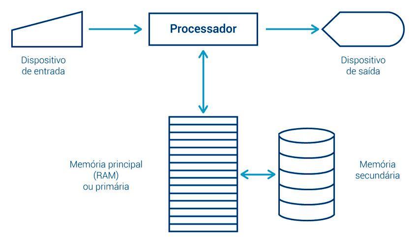

> Componentes de um sistema de computação

Iremos analisar a arquitetura desenvolvida por John Von Neumann, matématico húngaro, considerado um dos grandes gênios da humannidade, sua arquiteturas foi desenvolvida em 1946, precursora da arquitetura que conhecemos hoje. Ela possibilita a uma máquina digital armazenar seus programas no mesmo espaço de memória que os dados, permitindo, assim, a manipulação de tais programas.

--- 

A arquitetura a seguir é um projeto modelo de um computador digital de programa armazenado que utiliza uma unidade de processamento (CPU) e uma de armazenamento (memória) para comportar, respectivamente, instruções e dados, conforme ilustrado.

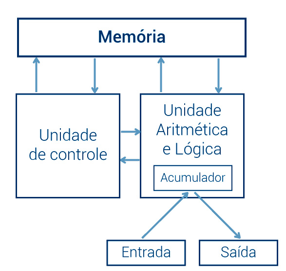

### 📍 Barramento

De forma menos técnica possivel de se explicar algo, **barramento** seria os encaixes localizado em uma placa para você conectar os componentes do hardware

Fundamentalmente, todo sistema de computação (computador) é organizado (funcionalmente) em três grandes módulos ou subsistemas:

1. Processador
2. Memória 
3. Entrada/Saída (ES)

Como se trata de componentes eletrônicos, a comunicação e o controle entre eles realiza-se por sinais elétricos que percorrem fios. Estes fios são chamados, em conjunto, de barramento, que seriam comumente conhecidos como os soquetes da placa-mãe.

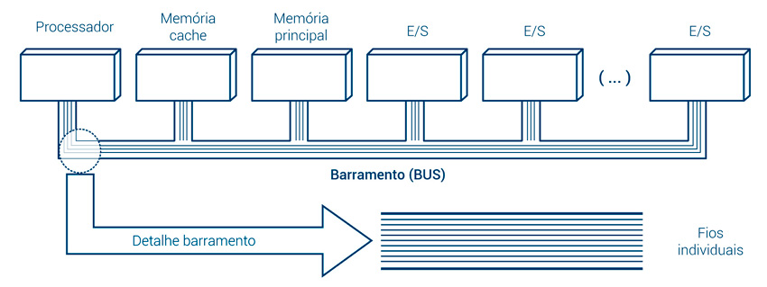

> Resumindo:
>
>Barramento é um conjunto de fios que têm por função transportar sinais de informação e sinais de controle e comunicação entre os componentes interligados. Famosamente conhecido como o soquete da placa.

Portanto, podemos edificar que o barramento é um conjunto de fios que têm por função transportar **sinais de informação** e **sinais de controle e comunicação** entre os componentes interligados.

Dentro dos barramentos teremos vários tipos, mas retrataremos alguns mais importantes:

1. Barramento de Dados (BD)
    - São bidirecionais, transportam bits de dados entre o processador e outro componente, vice-versa.

2. Barramento de Endereços (BE)
    - São unidirecionais, transportam bits de um endereço de acesso de memória ou de um dispositivo de E/S, do processador para o controlador do barramento.
    - Podemos calcular também a largura de um barramento de endereço, que consiste em 22 bits

3. Barramento de Controle (BC)
    - Possuem fios que enviam sinais específicos de controle e comunicação durante uma determinada operação, sendo então um programa sendo utilizado no momento ele é responsável por garantir que os dados que trafegam dentro do processador e entre a memória, ocorra de maneira correta.
    

A soma dos fios do BC, do BD e do BE é igual ao total de pinos do processador ou total de furos do soquete, ou seja: Totalpinos = BD + BE + BC.

Em uma operação de transferência ou acesso seja para leitura ou para escrita, exemplificado na (figura A), o barramento é único, embora dividido em grupos de fios que realizam funções diferentes (figura B):

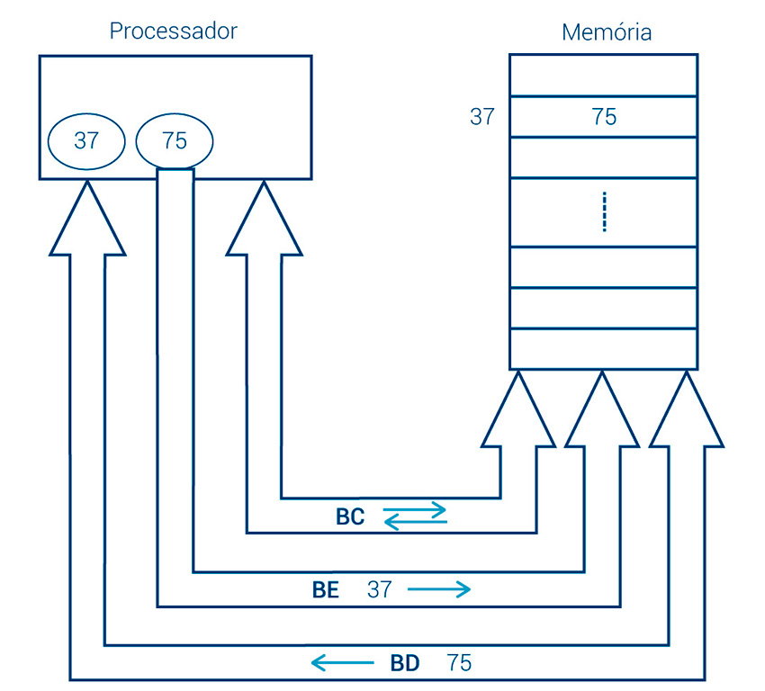

> Operação de Transferência

Se o processador precisar de um dado específico ao longo da execução de uma instrução, ele saberá o endereço dele, que, por exemplo, é o endereço 37 em decimal, 0000100101 em binário [com o barramento de endereços (BE) possuindo 10 fios]. Ao acessar o endereço especificado através do barramento de endereços, o processador, então, realizará uma operação de leitura, transferindo o dado, por exemplo, 7510, que se encontra no interior da célula de memória, pelo barramento de dados (BD). O barramento de controle (BC) será responsável pelos sinais de controle (exemplificados a seguir).

Após o dado chegar ao processador e ser processado, um dado resultante desse processamento poderá agora seguir pelo BD, para ser armazenado em um endereço de memória, em uma operação denominada operação de escrita. O exemplo aqui descrito encontra-se ilustrado na figura a seguir:


--- 

### 📍 Funções básicas dos Processadores 

Apenas retratando as funções básicas do processadores, eles são projetados com a capacidade de realizar diretamente no hardware pequenas e primitivas operações, como por exemplo executar operações aritméticas, sendo elas somas, subtrações, divisões e multiplicações, apenas reforçando, suas funcionalidades básicas são:

- Executar operações aritméticas com 2 números (somar, subtrair, multiplicar, dividir)
- Mover um número (dado) de um local para outro
- Mover um número (dado) de dispositivo de entrada ou de saída
- Desviar a sequência de controle

A execução de um comando em linguagem de alto nível (por exemplo, Pascal), como X = A + B requer, primeiro, sua conversão para instruções de máquina e, em seguida, sua execução propriamente dita (figura), ou seja, somar o valor indicado por A com o valor indicado por B e armazenar o resultado no local indicado por A.

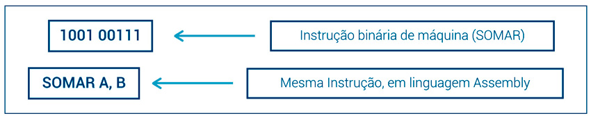

> Uma mesma instrução em linguagens diferentes.

Então os processadores interpretam oque fazer como por exemplo qual a operação requisitada e executa, como fazer.

Uma instrução de máquina consiste no conjunto de bits que identifica uma determinada operação primitiva a ser realizada diretamente pelo hardware, por exemplo, 1001 00111 00001.

Podemos citar como exemplos de operações primitivas:

- Operações aritméticas– Somar, subtrair, multiplicar e dividir;
- Operações lógicas– AND, OR, XOR;
- Operações de entrada e saída de dados;
- Operações de desvio de controle;
- Operações de movimentação de dados.

### ➜ Ciclo de Instruções

Você sabe a diferença entre conjunto de instrução e ciclo de instrução?

Conjunto de instruções são todas as possíveis instruções que podem ser interpretadas e executadas por um processador. Por exemplo, o Intel 8080 tinha 78 instruções de máquina, o Pentium 4 tinha 247;

Ciclo de instruções é um conjunto de instruções de máquina sequencialmente organizadas para a execução de um programa.

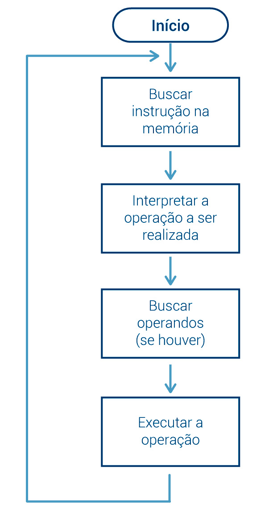

> Ciclo de Introdução

O formato básico de uma instrução de máquina é constituído de duas partes. Vamos conferir!

Código de operação (C.Op.): Identificação da operação a ser realizada.
Operando(s) (Op.): Pode ter 1, 2 ou 3.

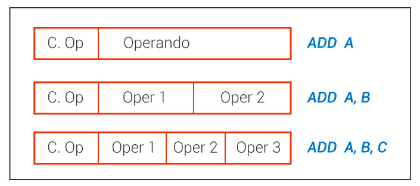

> Introduções de máquinas com um dois e três operando.

### 📍 Aprofudamento dos Processadores 

Enterdemos quais as funções básicas e primitivas do processador, entretanto, entederemos como ele de fato funciona dentro do nosso sistema. Primeiramente, a Unidade de Processamento (UCP) possui basicamente duas funções principais, sendo elas:

- Função de Processamento
    - Responsável pelo processamento dos dados referentes as requisições dos clientes
    - São constistuidas pelo **Registradores de Dados** que cuidará de gravar os dados para assim serem processados

- Função de Controle
    - É a parte funcional que realiza as atividades de buscar a instrução; interpretar as ações; gerar os sinais de controle para ativar as atividades requeridas (dentro ou fora do processador).
    - Quando trabalhamos enviando requisições para o processador estamos lidando com bits sendo encaminhados que precisam ser decodificados para o funcionamento, para tanto, existe o **Decodificador de instrução**, que vai interpretar a o pedido dos bits
    
### 📍 Memórias

A memória é um sistema constituído de vários componentes, cada um com velocidades, custos e capacidades diferentes. Todos, no entanto, com mesma função – armazenar e recuperar valores, quando desejado.

Existem diferentes tipos de memória, para diferentes finalidades, no que é conhecido como **hierarquia de memórias**:

- Registradores;
- Memória cache;
- Memória principal (RAM);
- Memória secundária (HD e SSD);
- Memória virtual.

### ➜ Registradores

Os registradores são memórias com as características do topo da pirâmide, localizadas dentro do processador, ou seja, acabam sendo os primeiros a ter contato com os dados que serão processados na UCP, visto que, ela está mais próxima dele e que a distância menor comparada as outras memórias faz o registrador ser mais rápido.

1. Registradores de Dados
    - Armazenam os dados que serão processados pelas unidades de cálculo, separados em unidades para números inteiros e números de ponto flutuante.

2. Registrador de Dados de Memória - RDM (Memoru Buffer Registrer - MBR)
    - Para transferências externas de dados.

3. Registrador de Endereço - REM (Memory Address Register - MAR)
    - Para transferências externas de endereços de memória.

4. Contador de Intrução ou Contador de Programa - CI (Program Counter - PC)
    - Para buscar a próxima instrução.

5. Registrador de Intrução - RI (Instruction Register - IR)
    - Armazena instrução.

6. Segmentos
    - Para armazenar endereços de Segmentos [apontam para determinados segmentos (programa, dados, pilha, etc.)].

7. Flags
    - Podem ser usadas para indicar o resultado de certas instruções.

### ➜ Princípio da localidade

O princípio da localidade é um princípio de programação que determina o modo de como as instruções são executadas (em sequência, durante certo tempo), ele, os programas são organizados de modo que as linhas de código costumam ser executadas em sequência. Apenas em alguns momentos a sequência é interrompida e o processo desvia da sequência, sendo esta retomada em seguida.

Utilizado principalmente nesse sistema de memórias, devido a localidade que cada componente de memória, que estão mais próximos nessas ordem:

1. Registradores
2. Memória Cache
3. Memória Principal

Portanto, quanto mais próximo do processador, mais rápido teremos uma resposta.

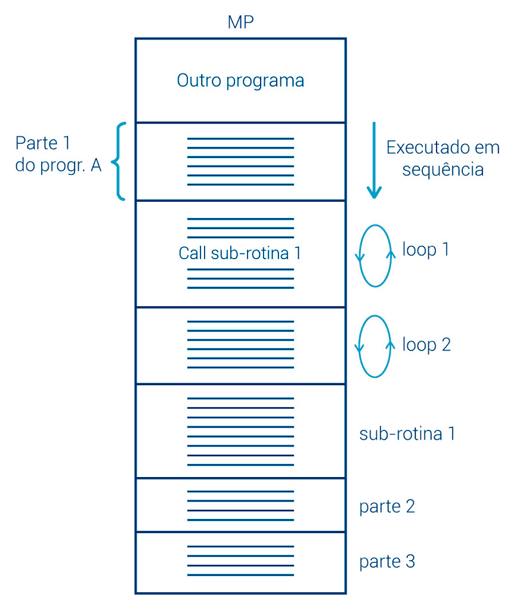

### ➜ Memória Cache

A memória cache é uma memória de pequena capacidade, situada entre a memória principal (MP) e o processador. Essa memória armazena certa quantidade dos dados que estão sendo utilizados no momento, e que são transferidos para o processador em alta velocidade.

Explicando para um exemplo mais relacionado ao cotidiano, seria todos os dados que são rodados a partir de um acesso a um determinado programa, mas ele cria alguns dados tempórarios que são usualmente utlizados, como: navegadores, calculadoras, jogos... Resultando assim, em dados que já são "gravados" para assim que usamos novamente os aplicativos, parte do seu processamento já esteja encaminhado.

> Você deve está se perguntando por que existe diversas memórias, para exemplificar melhor:
>
>1. Tempo de Acesso muito curto (semelhante ao processador)
    - Estamos falando em uma placa que pode ser considerada pequena, mas para o processador que está funcionando calculando e realizando requisições em questões de nanosegundos, é preciso que o tempo de reação das memórias seja rápido igual, para tanto, existem diversas memórias, que estão localizadas em áreas diferentes, então as diversas memórias, servem para sanar a questão do distaciamento.
>
>2. Grande Capacidade de Armazenamento
    - Com os HD e até mesmo os SSD's é capaz de armazenas muitos gigabytes de dados
>
>3. Armazenamento Permamente (Não Volátil)
    - Diferentemente das memórias principais, é preciso ter um HD ou SSD's, para aqueles clientes que querem armazenar dados, mas sem a memória principal, não é possível o tratamento desses dados, portanto, todas possuem sua função.
>
>4. Baixo Custo

Como, em termos práticos, hoje ainda não é possível a existência desse tipo de memória, faz-se necessária a adoção de soluções mais viáveis para compensar a diferença de velocidades que existe entre o processador e a Memória Principal.

A figura ao lado ilustra a comparação de velocidades que existem entre o processador e a MP (apenas processador e MP).

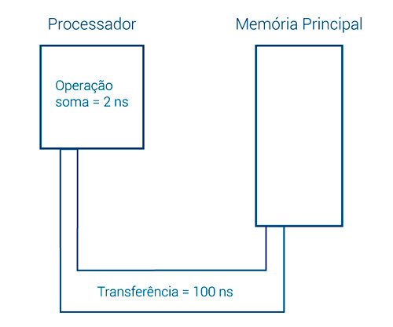

Há uma grande diferença de tempo entre a transferência da MP para o processador e este usar os dados. No exemplo, o processador gasta 2 nanosegundos para somar e espera 100 nanosegundos para receber novos dados.

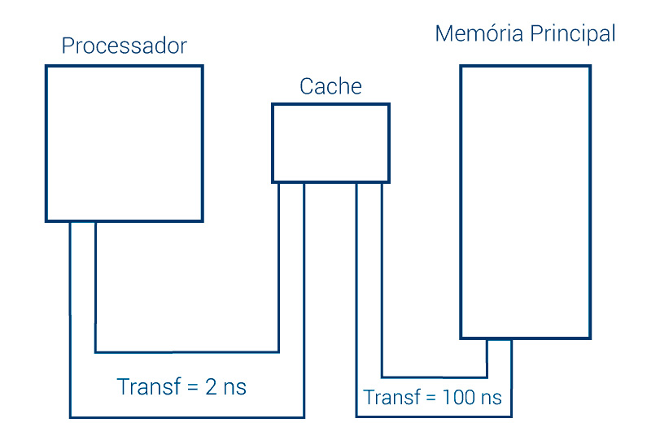

### ➜ Memória Principal

A memória principal (MP) é a memória básica, na qual o programa que será executado e seus dados são armazenados, para que o processador busque cada instrução ao longo do tempo de processamento. 

Memórias muito antigas usavam o método de acesso sequencial, em que o endereço de cada acesso era sempre relativo ao endereço inicial. Exemplo de acesso sequencial é o dos sistemas VHS (videocassete) e das fitas magnéticas.

> Em 1968, um cientista da IBM criou uma memória constituída apenas de componentes eletrônicos e cujo acesso dependia apenas de seu endereço, sendo independente dos demais. Por isso, ele chamou-a de memória de acesso aleatório ou RAM (Ramdom-Access Memory). Estas memórias (logo chamadas de DRAM, cujo D vem da palavra dinâmica) passaram progressivamente a ser o tipo usado para acesso pelo processador e, daí, tornaram-se a memória principal de praticamente todos os sistemas de computação.

A memória é organizada como um conjunto de N partes iguais, com cada parte possuindo um conteúdo fixo de M bits.

O valor de M depende do tipo de memória. Usualmente é 8 bits (1 Byte) nas memórias RAM, mas existem valores maiores para outras memórias.

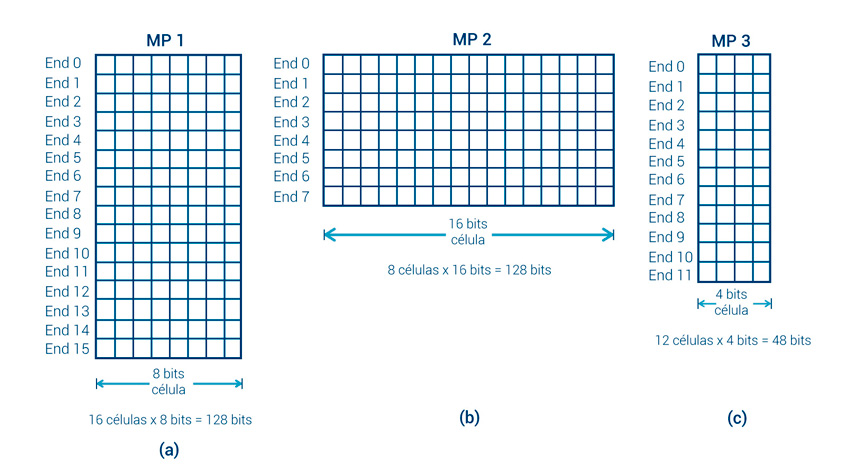

Cada parte (chama-se célula ou, em alguns casos, palavra nas memórias RAM, linha nas memórias cache, setor nos HDs etc.) é identificada por um número, chamado endereço. Todos os N endereços têm mesma largura de endereço, de E bits. Vejamos um breve exemplo.

> Exemplo:
>
> Para o endereço 1011101, a largura de endereço E será 7 bits.

Uma memória com N partes também possui N endereços. O cálculo de N no endereçamento pode ser realizado da seguinte maneira:

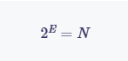

Onde:
</br>
E = Largura de cada endereço;
</br>
N = Quantidade de endereços (partes endereçáveis).

> Exemplo: 
>
> Se a largura de endereços é igual a 6 bits, a quantidade de endereços N será: 26 = 64 endereços

Esta figura esquematiza simplificadamente os termos apresentados anteriormente:

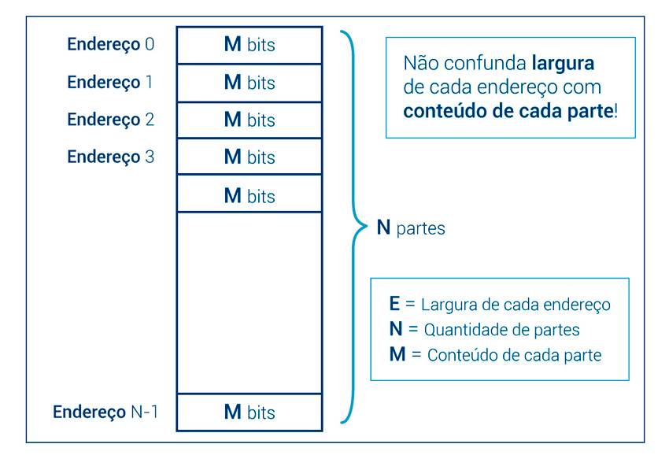

> Organização básica de uma memória.

As memórias RAM são constituídas de dois tipos:

1. SRAM (Static Random-Acess Memory)
    - Cada bit é constituído de 5 a 7 transístores;
    - Não requer recarregamento, sendo, por isso, mais rápidas, mas ocupam mais espaço e são mais caras;
    - Usadas como memória cache.

2. DRAM (Dynamic Random-Acesso Memory)
    - Cada bit é constituído por 1 capacitor e 1 transístor;
    - O capacitor serve para representar o valor do bit e o transístor para ser usado nas leituras/escritas;
    - Como o capacitor se descarrega, é preciso recarregar periodicamente (sinal de refresh – gasta tempo);
    - Usadas como memória principal.
        - Dentro das Memorias Dinâmicas teremos ainda dois tipos:
            - **Memórias Dinâmicas Assíncronas:**
                - Não são sincronizadas com o processador, por exemplo, Dynamic RAM (DRAM), Fast Page Mode (FPM), Extended Data Out DRAM (EDO), Burst Extended Data Out DRAM (BEDO).
            - **Memórias Dinâmicas Síncronas:**
                - Sincronizadas com o processador, evitam que o processador espere os dados, por exemplo, Synchronous DRAM (SDRAM), Double Data Rate (DDR), Double Data Rate 2 (DDR2).

> Hoje em dia, é comum o uso de memórias DDR SDRAM, pois as memórias Single Data Rate (SDRAM) só transferem dados na subida do sinal de clock; Já as memórias Double Data Rate (DDR-SDRAM) transferem dados na subida e na descida do sinal de clock, dobrando a taxa de transferência de dados (data rate); Assim, uma memória DDR-SDRAM operando num clock de 100MHz (real) consegue desempenho equivalente a 200MHz (efetivo).

Também existe a classificação quanto ao tipo de encapsulamento das memórias (formatos dos módulos):

1. SIMM (Single In Line Memory Module)
    - O contato elétrico de um lado é igual ao do outro lado.

2. DIMM (Dual In Line Memory Module)
    - Os contatos dos dois lados são independentes.

### ➜ Memória Secundária

Terminando a pirâmide da hierarquia de memória, a memória secundária objetiva o armazenamento persistente aos programas de usuário e seus dados, pois até o momento nenhuma memória ficou responsável pelo armazenamento de dados de forma permamente, além de serem dados com um grande volume, ou seja, não são voláteis.

Vale ressaltar que memórias secundárias não são somente os HD's e SSD's, mas também se enquadram:

- PenDrive
- Cartões de Memória (SD, MicroSD)
- CD/DVD/BluRay
- HD Externo

Todo componente que possa guardar dados de forma não volátil

---

Finalizando, para os tipos de memória da hierarquia, podem ser exemplificados alguns parâmetros de análise, conforme exibido na tabela:


|                              | Registrador(es) | Cache L1       | Cache L2      | Memória principal (RAM)             | Memória secundária                                |
| ---------------------------- | --------------- | -------------- | ------------- | ----------------------------------- | ------------------------------------------------- | 
| **Tecnologia de fabricação** | Eletrônica      | Eletrônica     | Eletrônica    | Eletrônica                          | Várias tecnologias (ótica, magnética, eletrônica) |
| **Volatilidade**             | Volátil         | Volátil        | Volátil       | Volátil (parte é não volátil ‒ ROM) | Não volátil                                       |
| **Tempo de acesso**          | Ex.: 1 a 2ns    | Ex.: 2 a 6ns   | Ex.: 2 a 6ns  | Ex.: 5 a 10ns                       | Ex.: de 8ns até alguns segundos                   |
| **Capacidade**               | 32 ou 64 bits   | 8KB, 256KB, ...| 2MB, 8MB, ... | 4GB, 8GB, 12GB, 32GB, ...           | Depende da mídia (500GB, 1TB, 5TB)                |

A sequência de transferência de dados realizada entre o processador e as memórias em um sistema computacional é hierárquica, conforme mostrado na imagem a seguir.

Ou seja, grosso modo, em uma operação de leitura, o processador:

1. Irá verificar primeiro se o dado está localizado na cache L1.
2. Caso não esteja, verificará se o dado se encontra na cache L2 e L3 (se houver).
3. Finalmente, irá buscar o dado na memória principal, caso o dado não esteja localizado em nenhuma das memórias cache consultadas.

O mesmo raciocínio pode ser aplicado na operação de escrita, na qual o processador escreverá sempre na cache mais próxima dele, mas o dado precisa estar atualizado na memória principal (RAM) para, em seguida, ser armazenado na memória permanente (HD, por exemplo).

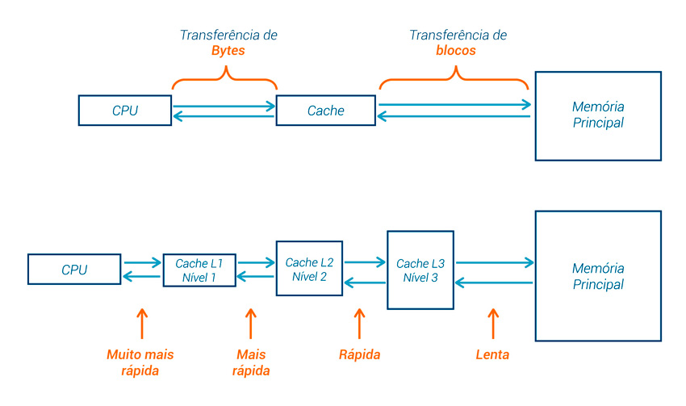

### 📍 Subsistemas de Entrada e Saída (E/S)

O subsistema de entrada e saída (E/S) tem por função interligar o mundo exterior (o nosso mundo) ao mundo interior (processador-memória). Os dispositivos de entrada e saída também são chamados periféricos, pois estão na periferia do núcleo processador/memória principal.

São funções do subsistema de E/S:

1. Receber ou enviar informações do/para o meio exterior.
2. Converter as informações (de entrada ou de saída) em uma forma inteligível para a máquina (se estiver recebendo) ou para o operador (estar enviando).

Dentre o Subsistemas de E/S, teremos separadamente os de Entrada e Saída, sendo assim:

### ➜ Dispositivos de Entrada

São usados para capturar dados do ambiente externo e convertê-los em dados digitais:

- **Teclado**: Entrada de texto e comandos, converte teclas em códigos binários (ex: ASCII).  
- **Mouse**: Dispositivo apontador para interação gráfica, traduz movimentos e cliques em comandos digitais.  
- **Scanner**: Digitaliza imagens ou documentos físicos para formato digital.  
- **Microfone**: Converte ondas sonoras em sinais digitais para gravação ou comunicação.  
- **Sensores**: Incluem câmeras, sensores de temperatura, acelerômetros, usados em sistemas embarcados e IoT.

### ➜ Dispositivos de Saída

Convertem dados digitais em formas interpretáveis pelo usuário:

- **Monitor**: Exibe imagens, texto e vídeos (LCD, LED, OLED).  
- **Impressora**: Converte dados em documentos físicos (jato de tinta, laser, matricial).  
- **Caixas de Som / Headset**: Convertem dados digitais em som para entretenimento ou comunicação.  
- **Projetores**: Ampliam imagens para telas grandes.


### ➜ Interface

Interface é o ponto de contato onde dois sistemas, componentes ou módulos trocam informações e comandos. Ela define as regras e protocolos para essa comunicação, garantindo que as partes diferentes “conversem” e trabalhem juntas sem erros. No contexto de hardware, uma interface é o conjunto de sinais, conexões, comandos e protocolos usados para permitir que componentes diferentes se comuniquem, por exemplo, entre a CPU e a memória, ou entre o processador e um dispositivo de entrada/saída. Por que a Interface é importante?

- **Padronização:** Permite que diferentes dispositivos e componentes possam se conectar e operar juntos, mesmo se forem de fabricantes diferentes.  
- **Modularidade:** Facilita a substituição, atualização e manutenção dos componentes sem alterar todo o sistema.  
- **Comunicação eficiente:** Controla o fluxo de dados, comandos e sinais de controle para evitar conflitos e garantir integridade.

### Tipos de Interface

### A) Interface de Hardware

- **Barramentos:** Conjunto de linhas elétricas que transportam dados, endereços e sinais de controle entre componentes.  
  - Exemplo: Barramento PCI, USB, SATA.  
- **Portas de Entrada/Saída:** Interfaces físicas onde dispositivos se conectam (USB, HDMI, Ethernet).  
- **Controladores de Dispositivos:** Hardware intermediário que gerencia a comunicação entre o dispositivo e o processador.

### B) Interface de Software

- **APIs (Application Programming Interfaces):** Conjunto de rotinas e protocolos que permitem que programas se comuniquem com hardware ou entre si.  
- **Drivers:** Software que atua como tradutor entre o sistema operacional e o hardware.

### Características principais de uma Interface

- **Velocidade:** A taxa com que os dados podem ser transmitidos.  
- **Formato dos dados:** Como os dados são organizados e enviados.  
- **Protocolo:** Regras para iniciar, manter e encerrar a comunicação.  
- **Sincronização:** Coordenação temporal entre emissor e receptor para evitar erros.


# 📌 Representação de Dados

A representação de dados é fundamental para a ciência da computação, pois tudo o que um computador processa, armazena e transmite deve estar codificado em um formato binário. Entender os diferentes métodos e padrões de representação é crucial para o design de sistemas, linguagens, arquiteturas de hardware e algoritmos eficientes.

- Um conjunto ordenado de bytes, que representa uma informação útil para os computadores, constitui uma **palavra**.
- Um conjunto estruturado de palavras forma um **registro**.
- Um conjunto organizado de registros forma um **arquivo**.
- Um conjunto organizado de arquivos forma um **banco de dados**.

Dentre essas afirmações podemos comprender como trabalharemos com a quantidade de Bits e Bytes, como médidas iguais a da matemática fundamental de Metros e Kilometros. Portanto, primeriramente entederemos que tudo se baseia em 8 bits, assim, podemos afirmar que:

``8 Bits`` equivale a ``1 Byte``

| Unidade    | Simbolo | Valor         |
| ---------- | ------- | ------------- |
| 1 Bit      | 1 b     | (0 ou 1)      |
| 1 Byte     | 1 B     | 8 Bits        |
| 1 Kilobyte | 1 KB    | 1024 Bytes    |
| 1 Megabyte | 1 MB    | 1024 Kilobyte |
| 1 Gigabyte | 1 GB    | 1024 Megabyte |
| 1 Terabyte | 1 TB    | 1024 Gigabyte |
| 1 Petabyte | 1 PB    | 1024 Terabyte |
| 1 Exabyte  | 1 EB    | 1024 Petabyte |

Para não termos que aprender a tabela completa, podemos tratar com uma regra de 3 simples para entender quantos bytes seriam:

``8 Bits`` equivale a ``1 Byte``
</br>
``X Bits`` equivale a ``100 Byte``

``8 * 100 = 1 * X => X / 800 => X = 800`` ou seja ``800 Bits``

E digamos que precisaremos tratar com grandes valores, para encurtarmos trabalhos, utilizaremos de notações cientificas. Trataremos esses dados em sistemas de numerações; Decimais, Binários, Octagonais e Hexadecimais.

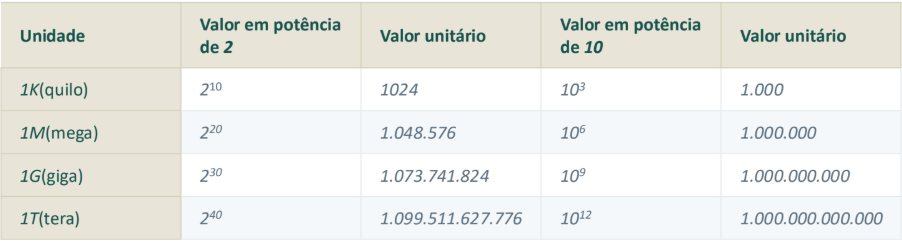


terminar de estudar essa bagaça depois menino.....
