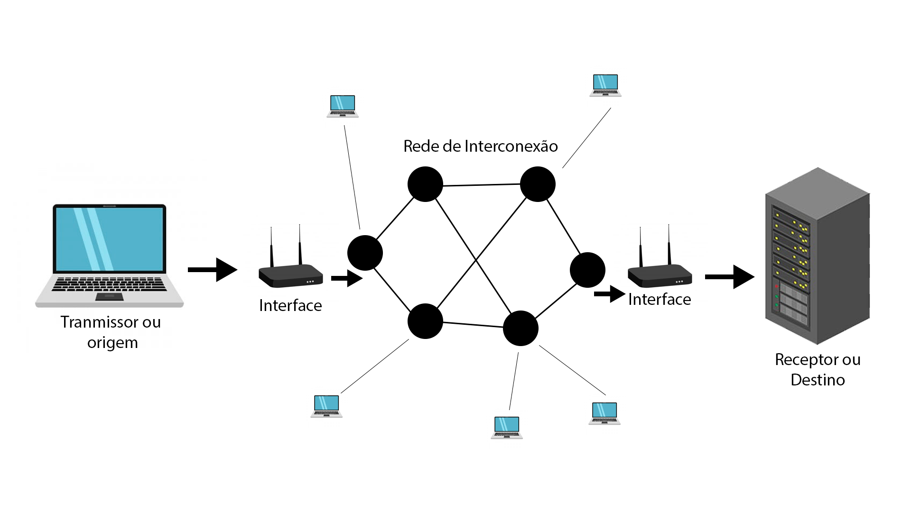
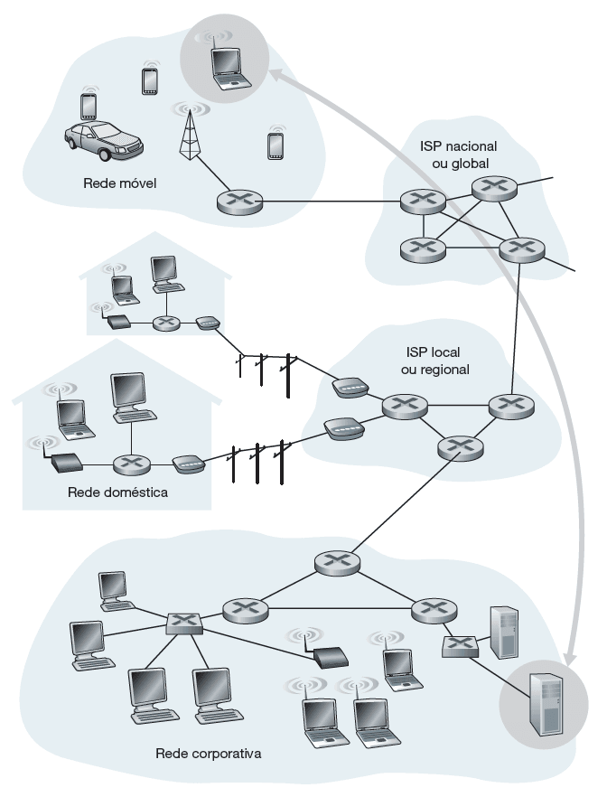
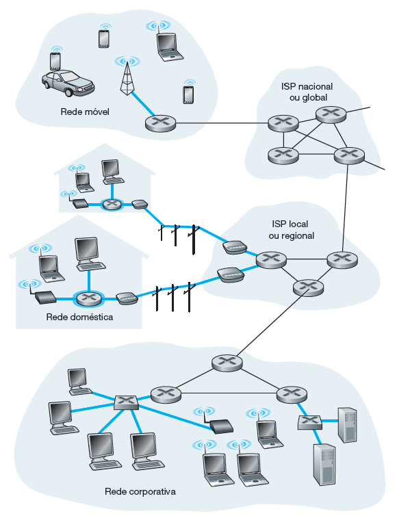
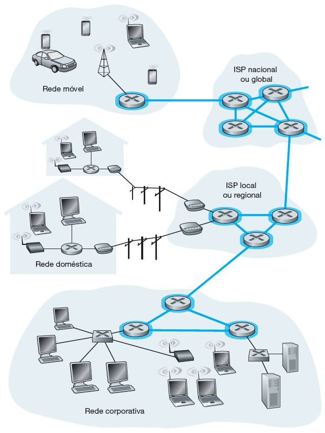
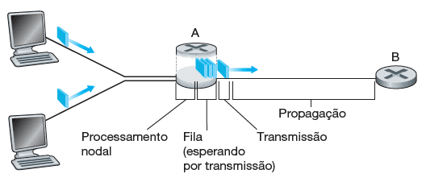
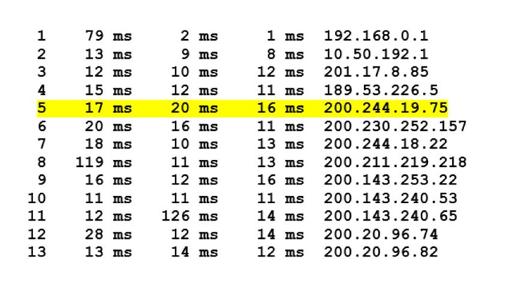

# 🌐 Fundamentos e Redes de Computadores

A organização das redes de computadores é essencial para os profissionais de Tecnologia da Informação (TI) utilizarem os serviços oferecidos por uma ou mais camadas de um modelo de arquitetura de redes.

Objetivos desse módulo:

- Reconhecer os conceitos básicos de redes de computadores e a internet;
- Descrever os parâmetros de avaliação de redes;
- Identificar a arquitetura de redes de de computadores como um modelo de camadas;
- Descrever os aspectos da evolução das redes e a internet.

## 📌 Introdução:

A internet, nos modelos atuais, possui bilhões de usuários conectados, dispositivos e enlaces de comunicação, além de uma quantidade enorme de computadores. Os usuários podem conectar uma alta gama de aparelhos, tais como: notebooks, smart TVs, smartphones, sensores, webcams, console de jogos, utensílios domésticos, telefones, impressoras, câmeras, aparelhos de limpezas... Portanto, fica evidente que quase todos os aparelhos do cotidiano precisam de uma conexão direta com a internet, visto que, com os avanços tecnológicos cada vez mais, estamos sendo ligados constantemente aos meios de redes, pois nenhum tipo de aparelho acaba tendo 100% da sua funcionalidade a partir de apenas os dados que estão nele, é preciso, entrar em contato com um servidor, por meio de uma rede, para termos acesso as essas funcionalidades.

Nesses diversos dispositivos, são executadas várias aplicações de redes que revolucionaram a forma como vivemos, seja no trabalho, no comércio, nas relações interpessoais, como também na forma como nos divertimos.

Não tem como negarmos a importância da internet para todos nós, mas para quem estuda computação vai muito além do simples uso. É importante compreender os conceitos de organização das redes de computadores e internet, necessários para utilização nas redes de hoje e do futuro.

## Conceitos Básicos

### 📍 O que é a internet e redes de computadores?

As **redes de computadores** podem ser definidas como um conjunto de módulos processadores interligados por um sistema de comunicação, capazes de trocar informações e compartilhar recursos. Ou seja, temos um transmissor ou origem que é conectado a uma interface que se liga a uma **rede de interconexão**, que é recebido por outra interface ligada ao receptor ou destino, para exemplificar, faria da seguinte manteira:

> Por final, na rede de interconexão também teremos demais dispositivos utilizando da rede para mandar e receber dados.

Já a **internet** pode ser definida como um conjunto de rede de computadores que opera, basicamente, utilizando os protocolos TCP e IP, e interconecta bilhões de dispositivos de computação ao redor do mundo. No entanto, a internet não é apenas um conjunto de redes interligadas. Há diversas formas de utilização para definir o que é a internet e como ela está organizada. Por exemplo, podemos defini-la de acordo com os componentes de software e hardware básicos que a formam.

> ❗️ Tradução:
>
>TCP (Transmission Control Protocol): Protocolo de Controle de Transmissão.
É responsável por garantir que os dados enviados por uma rede cheguem ao destino de forma correta e na ordem certa. Ele cria uma conexão confiável entre os dispositivos que estão se comunicando.
>
>IP (Internet Protocol): Protocolo da Internet.
É responsável por endereçar e rotear os dados para o destino certo na rede. Cada dispositivo tem um endereço IP único para identificar onde os dados devem ser enviados.

Podemos considerar que a internet é formada por três grandes partes:

- Sistemas finais (Bordas da Rede).
- Núcleo da rede.
- Redes de acesso.

> Sistemas finais ou Bordas da Rede: são os aplicativos que os usuário utilizaram (notebook, pc, smartphone...).
>
> Núcleo da Rede: Elementos intermediários, ou seja, os elementos de interconexão.
>
> Redes de Acesso: Realizar a conexão dos sistemas finais ao destino.

A junção dessas três partes permite que você use seu smartphone, acesse um aplicativo e utilize um serviço hospedado em qualquer dataCenter no mundo.

Outra forma de enxergar a internet é como uma infraestrutura de redes que fornece diversos serviços para que as aplicações de rede possam trocar informações. Alguns dos serviços oferecidos pela internet são: definir o caminho da origem até o destino; corrigir os erros que possam ocorrer no trajeto; evitar que haja sobrecarga dos componentes.

Os serviços fornecidos pela internet permitem que os desenvolvedores das aplicações possam se preocupar com suas funcionalidades apenas, não somente com diversos detalhes de como a informação será propagada. Basta o aplicativo enviar os dados para essa infraestrutura de serviços que ela fará o maior esforço para que a informação seja entregue ao destino.

## 📌 As três partes da Internet:

Vamos agora analisar de separadamente quais são as três partes da internet.

### 📍 Sistemas Finais (Borda da Rede):

Os dispositivos que utilizamos e que estão conectados à internet são chamados de sistemas finais, ou hosts (hospedeiros) ou borda de rede, pois se encontram no entorno, ou periferia, da internet e são nesses dispositivos que executamos as aplicações de rede. Ou seja, são os aparelhos que rodam definitivamente os serviços que são prestados pela rede, por exemplo, digamos que você precisa fazer uma pesquisa de uma receita de bolo, você utiliza seu smartphone para entrar em um navegador e realizar uma pesquisa na internet.

Então teremos dois lados principais no nosso sistemas finais, que seriam os clientes e os servidores.

- Clientes: São os desktops, notebooks, smartphones, tablets... dispositivos que, normalmente estão de posse de um usuário, e pede alguma requisição para um servidor.

- Servidores: São maquinas mais poderosas, que armazenam e distribuem os dados, tais quais: páginas webs, vídeo em tempo real, retransmissão de e-mails, entre outros...

Sobre os servidores, é comum chamarmos de máquinas grandes, poderosas, mas, na realidade, o que define a máquina ser servidora não é o hardware, e sim o software executado por ela. Como o nome diz, o servidor será o dispositivo que contém o software, servindo alguma coisa ou algum serviço para um cliente que faz um pedido ou requisição.

A imagem a seguir ilustra a localização dos sistemas finais em uma infraestrutura de redes de computadores. Confira!

### 📍 Redes de Acesso:

A rede de acesso é uma rede física que conecta os sistemas finais ao primeiro roteador (conhecido como “roteador de borda”) de um caminho partindo de um sistema final até outro qualquer. Podemos dizer que a rede de acesso é o meio físico, ou enlace, que faz a ligação dos sistemas finais ao núcleo da rede.

Veja abaixo as diferentes redes de acesso (linhas em azul):

Redes que são dividos em duas maneiras de conexão:

1.  Meios guiados
    - São as redes com fio, ou seja, os sinais são dirigidos ao longo de um meio sólido, tal como um cabo de fibra ótica, que propaga sinais luminosos; um par de fios de cobre trançado ou um cabo coaxial, que propaga sinais elétricos.
2. Meios não guiados
    - São as famosas redes wireless. Nestes meios, os sinais se propagam pelo espaço aberto, como é o caso de canais de rádio empregados em redes domésticas sem fio, os sinais da telefonia celular, ou de um canal digital de satélite. Nesses tipos de redes, dizemos que são propagados sinais eletromagnéticos.

As redes de acesso também podem ser divididas em duas categorias, de acordo com a finalidade a que se destina: redes residenciais ou institucionais.

### ➜ Redes de acesso residenciais:

Os tipos de acesso residenciais bastante conhecidos são a linha digital de assinante (DSL), através de cabo coaxial, e a fibra ótica.

Para o DSL, são utilizados os modems DSL que utilizam a linha telefônica existente fornecida pela mesma empresa fornecedora do serviço de telefonia fixa. Já para o acesso através de cabo coaxial, a infraestrutura utilizada é a mesma oferecida pela empresa que fornece o serviço de televisão a cabo.

> ❗️ Comentário:
>
> Para o acesso através da fibra ótica, utilizamos o conceito chamado FTTH (fiber to the home), um caminho de fibra ótica diretamente até a residência. Convém ressaltar que FTTH não é um padrão ou protocolo em si, mas apenas um conceito indicando que a fibra ótica chega até a residência ou empresa.

Em geral, uma fibra que sai da central de telecomunicações é compartilhada por várias residências; ela é dividida em fibras individuais do cliente apenas após se aproximar relativamente das casas.

Em locais onde DSL, cabo e FTTH não estão disponíveis (por exemplo, em locais rurais), um enlace de satélite pode ser empregado para conexão (em velocidades mais baixas que as tecnologias tipicamente usadas).

E ainda existe o acesso discado por linhas telefônicas tradicionais, que são os precursores das redes de acesso, no qual um modem doméstico se conecta por uma linha telefônica a um modem no provedor de acesso, ocupando a linha telefônica e com baixas velocidades. Esse tipo de acesso era o mais comum até a década de 1990 e início dos anos 2000.

### ➜ Redes de acesso institucionais:
Algumas das soluções residenciais também podem ser utilizadas para as redes de acesso institucionais, mas as chamadas redes locais (LANs) costumam ser usadas nos ambientes universitários, corporativos e residenciais, para conectar sistemas finais ao roteador de borda da rede, com o uso predominante de um padrão conhecido como ethernet que, tipicamente, emprega cabos metálicos, ou através das redes sem fio, ou wi-Fi, que empregam o padrão IEEE 802.11.

> ❗️ Comentário:
>
> É cada vez mais comum utilizarmos as redes de telefonia celular como rede de acesso para acessar a internet, comumente chamando de 4G/3G. Possuem alcance bem maior que o wi-fi e as empresas de telecomunicação têm investido na quinta geração (5G), que oferece redes de acesso remotas de maior velocidade.

### 📍 Núcleo da Rede

O núcleo da rede consiste em uma rede de dispositivos, por exemplo, roteadores e switches, os enlaces, normalmente de alta velocidade, que interligam esses dispositivos. O núcleo da rede oferece os possíveis caminhos que permitem a interconexão dos sistemas finais, conforme mostrado na imagem (destaque em azul). Confira!

O núcleo da rede é organizado pelos diversos provedores de serviços de internet (Internet Service Providers — ISPs), pelos quais nós, usuários, contratamos serviços para nos conectarmos à internet. Conectar usuários finais e provedores de conteúdo a um provedor de acesso (ISP) é apenas uma parte de todo o desafio: interligar os bilhões de sistemas finais que compõem a internet. Isso é feito a partir da criação de uma rede de redes.

Existem centenas de milhares de ISPs, com diferentes portes, abrangência e finalidades. Por exemplo, ISPs que têm por finalidade oferecer serviço de conexão dos usuários à internet. Outros são conhecidos por serem ISPs de trânsito, que realizam a interligação de ISPs, sem oferecer acesso direto aos usuários. Normalmente, os ISPs de trânsito são responsáveis pela administração dos famosos cabos submarinos.

> Resumidamente, ISP é uma empresa ou organização que fornece acesso à internet para usuários e empresas, eles podem oferecer uma variedade de serviços, como:
>
> - Conexão à Internet: Pode ser via DSL, fibra ótica, cabo, satélite, 4G, 5G, entre outros.
> - Serviços de e-mail: Muitos ISPs fornecem contas de e-mail.
> - Hospedagem de sites: Alguns ISPs oferecem servidores e serviços de hospedagem de sites.
> - Suporte técnico: Atendimento para resolver problemas relacionados à conexão.
>
> Exemplos de ISPs incluem empresas como Claro, Vivo, Oi, Tim, entre outras no Brasil, que fornecem acesso à internet para os consumidores.

Para facilitar a interconexão dos diversos provedores, existe o chamado ponto de presença (PoP — Point of Presence), que é um grupo de um ou mais roteadores (no mesmo local) na rede do provedor, onde os ISPs clientes podem se conectar para poderem acessar outras redes.

Qualquer ISP (exceto os de nível 1) pode efetuar o multi-homing, ou seja, conectar-se a dois ou mais ISPs provedores para terem redundância. Por exemplo, um ISP local pode efetuar multi-home com dois ISPs regionais, ou então com dois ISPs regionais e também com um ISP de nível 1.

>❗️ Comentário:
>
> Os ISPs clientes pagam aos seus ISPs provedores para obter interconectividade global com a internet. Um ISP cliente paga a um ISP provedor conforme a quantidade de tráfego que ele troca com o provedor.

Para reduzir custos, um par de ISPs próximos no mesmo nível de hierarquia pode emparelhar, ou seja, conectar diretamente suas redes, de modo que todo o tráfego entre elas passe pela conexão direta, em vez de passar por intermediários mais à frente. Isso em geral é feito em acordo, ou seja, nenhum ISP paga ao outro.

Os ISPs de nível 1 também são emparelhados uns com os outros, sem taxas. Assim, uma empresa de terceiros pode criar um ponto de troca da internet (internet exchange point — IXP), que quase sempre é em um prédio à parte, com seus próprios comutadores. O IXP é um ponto de encontro onde vários ISPs podem se emparelhar e permitir que haja conexão direta entre os diversos provedores que utilizam essa infraestrutura.

### 📍 Rede como Serviço:

Podemos também descrever a internet como uma infraestrutura provedora de serviços a aplicações.

Existe uma quantidade grande de aplicações para internet (“aplicações distribuídas”), como correio eletrônico, navegadores da web, redes sociais, mensagem instantânea, voz sobre IP (VoIP), vídeo em tempo real, jogos distribuídos, compartilhamento de arquivos peer-to‑peer (P2P), televisão pela internet, login remoto, entre outros...

As aplicações da internet são executadas nos sistemas finais, e não nos comutadores localizados no núcleo da rede. Você precisará criar programas que sejam executados em sistemas finais, utilizando uma ou mais linguagens de programação, como Java, C ou Python.

Utilizando essa API, o desenvolvedor não precisa se preocupar em como as informações serão entregues ao destino, nem se sofreram algum tipo de erro no meio do caminho, muito menos como fazer para transformar os bits em sinais elétricos, pulsos de luz ou ondas eletromagnéticas para serem propagadas pelo espaço.

A infraestrutura de rede se encarrega de realizar todas essas ações que estarão distribuídas nos diversos componentes de rede, desde o sistema operacional existente no seu computador ou smartphone, passando pelos roteadores, switches, entre outros componentes.

## 📌 Parâmetros de Avaliação:

Um parâmetro muito importante quando estamos trabalhando com redes são seus parâmetros de avaliação, ou seja, analisar como está a qualidade de uma rede, portanto, é preciso entender como podemos realizar essa verificação. Entretanto, o ideal seria que os serviços da internet transferissem dados entre sistemas finais, de modo instantâneo e sem nenhuma perda. Porém, as redes de computadores restringem a quantidade de dados que podem ser transferidos entre sistemas finais, apresentam atrasos entre sistemas finais e ainda podem perder pacotes. As leis da física introduzem atraso e perda.

Para ser possível a formulação de propostas de soluções para os problemas encontrados no funcionamento das redes de computadores, é recomendável examinar e quantificar esse contexto como parâmetros para avaliação das redes. Por isso, estudaremos os parâmetros relacionados ao atraso, à perda e vazão em redes de computadores.

### 📍Tipos de Atraso:

Considere um pacote enviado de um nó por meio do roteador A até o roteador B. Um pacote somente pode ser transmitido do roteador A ao B, se não houver nenhum outro pacote sendo transmitido pelo enlace e se não houver outros à sua frente na fila. Se o enlace estiver ocupado, ou com pacotes à espera, o recém-chegado entrará na fila (buffer, ou memória, do roteador). A imagem a seguir ilustra os elementos citados:

> Processamento Nodal: Atraso no processamentos dos equipamentos locais, por exemplo: o atraso de um roteador no processamento para enviar os dados
>
>Fila: Espaço dedicado para as requisições que foram desenvolvidas por todos os sistemas finais que enviaram algum tipo de dado.

Um pacote começa em um sistema final de origem, passa por vários roteadores até ser entregue em outro sistema final de destino. Quando um pacote viaja de um dispositivo ou um nó (sistema final ou roteador) ao nó subsequente (sistema final ou roteador), sofre, ao longo desse caminho, diversos tipos de atraso em cada nó. Os mais importantes deles são o atraso de processamento nodal, o atraso de fila, o atraso de transmissão e o atraso de propagação. Eles formam o atraso total.

1. Atraso de Processamento:
    - Tempo gasto em um dispositivo para examinar o cabeçalho do pacote e determinar por qual saída deve encaminhá-lo.
2. Atraso de Fila
    - Tempo decorrido enquanto um pacote espera para ser transmitido no enlace. Se a fila (buffer) estiver vazia, e nenhum outro pacote estiver sendo transmitido naquele momento, então o tempo de fila de nosso pacote será zero. Por outro lado, se o tráfego estiver intenso e houver muitos pacotes também esperando para serem transmitidos, o atraso de fila será longo.
3. Atraso de Transmissão:
    - Tempo exigido para empurrar (isto é, transmitir) todos os bits do pacote para o enlace. É uma função do comprimento do pacote e da taxa de transmissão do enlace, mas nada tem a ver com a distância entre os roteadores.
4. Atraso de Propagação:
    - Tempo exigido para empurrar (isto é, transmitir) todos os bits do pacote para o enlace. É uma função do comprimento do pacote e da taxa de transmissão do enlace, mas nada tem a ver com a distância entre os roteadores.

Importante ressaltar que os tipos de atraso se refletem nas aplicações de maneira diferente. As aplicações de tempo real, que tem interatividade, com jogos interativos, vídeo e áudio conferências, são mais suscetíveis ao atraso de propagação. Por outro lado, as aplicações que transferem um grande volume de dados, como transferências de arquivos, têm o atraso de transmissão como o ponto crítico.

Essa variação do atraso de fila causa um efeito chamado jitter (variação de atraso), que impacta significativamente as aplicações de streaming (multimídia), as quais precisam reproduzir os pacotes em intervalos regulares. Portanto, a variação do atraso impactará a reprodução em intervalos regulares, tendo em vista que os pacotes não chegarão com atrasos regulares.

### 📍 Perda, Atraso fim a fim e Vazão

### ➜ Perdas:

Além disso também falaremos da qualidade de uma rede, existem momentos que ocorre a perda de pacotes, ou seja, no processo de transmissão de dados acontece que algum pacote não consegue concluir o encaminhamento para o destino, que pode ou não ser prejudicial para nossa aplicação. No caso de sistema de streaming, como: Youtube, Netflix, Prime Video, que temos os videos com áudios sendo apresentados para o usuário, muito comum serem arquivos pesados, pela sua qualidade e audio existe a **perda de pacote**, que seria a fragmentação de alguma parte do arquivo, entretanto, não é algo tão ofensivo para o usuário, visto que dentro de um filme, a perda de alguns pixels não muda o resultado final e muitas vezes é até imperceptível. Por conseguinte, caso estivermos trabalhando com o envio de e-maisl queremos que no processo de encaminhamento, nossa mensagem segue completamente integrá da mesma maneira que enviamos. 

Alguns fatores que podem causar perdas:

- Se a intensidade de tráfego for próxima a zero, as chegadas de pacotes serão poucas e bem espaçadas, sendo improvável que um pacote que esteja chegando encontre outro na fila. Com isso, o atraso de fila médio será próximo a zero e todos os pacotes serão processados, sem perdas. Agora, imagine a situação na qual a intensidade de tráfego é próxima da capacidade de transmissão. Com certeza, haverá intervalos de tempo em que a velocidade de chegada excederá a capacidade de transmissão (por causa das variações na taxa de chegada do pacote) e uma fila será formada durante esses períodos.

- Se você aumentar a taxa de chegada do pacote o suficiente, de forma que a intensidade do tráfego exceda capacidade de transmissão, verá a fila aumentar ao longo do tempo.
Como a capacidade da fila (buffer) é finita, logo um pacote pode chegar ao roteador e encontrar o buffer cheio. Sem espaço disponível para armazená-lo, o roteador terá que descartá-lo, isto é, ele será perdido.

Um sistema final considera que o fenômeno da perda é um pacote que foi transmitido para o núcleo da rede, sem nunca ter emergido dele no destino.

Vamos analisar o impacto da perda na aplicação. Se a aplicação que estiver sendo utilizada não admitir perda, como uma transferência de arquivos, o pacote perdido irá impactar o funcionamento da aplicação e, portanto, esse problema deve ser corrigido, normalmente, retransmitindo o pacote faltante.

Mas existem aplicações que toleram perda, tipicamente, as aplicações de streaming. Nesse tipo de serviço, se alguns pacotes forem perdidos, a aplicação não terá prejuízos. Sabe por quê? Os pacotes de dados de uma aplicação de streaming carregam, por exemplo, um conjunto de pixels de um dos frames do vídeo. Se esse pacote não chegar, apenas alguns pixels deixarão de ser reproduzidos e dificilmente o usuário perceberá.

Voltemos ao caso da aplicação que não tolera perda. O desenvolvedor da aplicação precisa implementar alguma técnica de controle de perdas? A resposta é não! Lembra que comentamos que a rede oferece uma infraestrutura de serviços? Então, utilizando a API (socket) correta para a aplicação, os serviços existentes na rede corrigirão a perda de pacotes, assim, o desenvolvedor pode focar na lógica da aplicação porque a rede cuidará da entrega dos pacotes.

### ➜ Atrasos fim a fim (ou Atraso Total):

Anteriormente, comentamos sobre os diversos tipos de atrasos, porém, analisamos de forma isolada, pensando no que ocorre entre um nó e outro. Bom, mas é fácil imaginar que entre os sistemas finais, existem vários equipamentos intermediários (roteadores e switches), por onde o pacote trafegará e terá algum tipo de processamento.

Portanto, o pacote transitando do sistema final de origem para o de destino terá levado determinado tempo, que é o atraso fim a fim, ou seja, a soma de todos os atrasos que o pacote ficou sujeito ao longo do caminho

Se os atrasos de fila forem desprezíveis, não existirá congestionamento e a aplicação poderá funcionar corretamente. Mas, se os atrasos de fila não forem desprezíveis, os atrasos nos nós se acumulam e resultam em um atraso fim a fim significativo que poderá impactar o funcionamento da aplicação, em especial àquelas que são sensíveis ao atraso.

O usuário especifica um nome de hospedeiro de destino, e o programa envia vários pacotes em direção ao destino. Durante o caminho, esses pacotes passam por vários roteadores. Quando um deles recebe o pacote, envia de volta à origem uma mensagem contendo o nome e o endereço do roteador. Quando o destino recebe o pacote, também envia uma mensagem à origem, que registra o tempo transcorrido entre o envio e o recebimento da mensagem de retorno correspondente.

A origem registra também o nome e o endereço do roteador, ou do hospedeiro de destino, que retorna a mensagem. Desse modo, a origem pode reconstruir a rota tomada pelos pacotes que vão da origem ao destino e pode determinar os atrasos de ida e volta para todos os roteadores no caminho. Observe a imagem a seguir retirado do aplicativo **Traceroute**:

No exemplo mostrado, existem 12 roteadores entre a origem e o destino. Vamos pegar o Roteador 5, que tem o endereço 200.244.19.75. Examinando seus dados, vemos que na primeira das três tentativas, o atraso de ida e volta entre a origem e o roteador foi 17ms. Os atrasos de ida e volta para as duas tentativas seguintes foram 20 e 16ms, e incluem os atrasos que foram abordados, que são o atraso de transmissão, o atraso de propagação, o atraso de processamento do roteador e o atraso de fila.

Como o atraso de fila varia com o tempo, o atraso de ida e volta do pacote n enviado a um roteador n pode, às vezes, ser maior do que o do pacote n+1 enviado ao roteador n+1. Verificando os tempos apresentados na imagem, é possível verificar que isso ocorreu em alguns momentos.

Também é fácil verificar a variação de atraso com o Traceroute. Como o programa dispara três pacotes para cada destino, percebemos que dificilmente teremos os três pacotes com o mesmo atraso.

### ➜ Vazão

Outra medida de desempenho é a vazão fim a fim. Considere a transferência de um arquivo grande do hospedeiro A para o hospedeiro B. A vazão instantânea a qualquer momento é a taxa (em bits/s) em que o hospedeiro B está recebendo o arquivo. Se o arquivo consistir em F bits e a transferência levar T segundos para o hospedeiro B receber todos os F bits, a vazão média da transferência do arquivo é F/T bits/s.

A vazão depende não somente das taxas de transmissão dos enlaces ao longo do caminho, mas também do tráfego oriundo de outras sistemas finais. Pode acontecer de um enlace com uma alta taxa de transmissão, como um cabo submarino, ser o gargalo para uma transferência de arquivo, considerando que, no mesmo momento que você está realizando um download, muitos outros tráfegos estão passando pelo mesmo cabo submarino, sobrecarregando o enlace e os equipamentos que controlam a entrada dos dados no enlace.

## 📌 Camadas de protocolo e modelos de serviço

### ➜ Arquitetura de Camadas

Todas as atividades na internet que envolvem duas ou mais entidades remotas que se comunicam são governadas por um protocolo.

Um protocolo define o formato e a ordem das mensagens trocadas entre duas ou mais entidades comunicantes, bem como as ações realizadas na transmissão e/ou no recebimento de uma mensagem ou outro evento. Um protocolo de rede e um protocolo humano são muito semelhantes. Quando nos encontramos com outra pessoa, segundo as regras da boa educação, devemos fazer um cumprimento antes de fazer uma pergunta, ou pedir uma ajuda.

Outro fator importante ressaltar dos protocolos, são a sua importância dentro do âmbito de desenvolvimento, visto que, se não fosse estabelecido protocolos para serem seguidos dentro da internet, ela não seria padronizada, desenvolvendo uma necessidade de em todo desenvolvimento de algum sistema, o programador teria que criar todas as camadas a mão dentro do sistema.

> Comentário:
>
>❗️ Inicialmente, fazemos um cumprimento, como um “oi” e esperamos receber outro “oi” como resposta, ou, por exemplo, falando um “bom dia” e esperando receber um “bom dia” de volta. A partir desse ponto, podemos perguntar as horas, por exemplo. Ou seja, existem mensagens específicas que enviamos e ações específicas que realizamos em reação às respostas recebidas. Também podemos realizar outros eventos quando a resposta é diferente da esperada.

O mesmo é válido para as redes de computadores. Para que determinada ação seja realizada entre dois componentes de rede, eles devem utilizar o mesmo protocolo.

Para facilitar o desenvolvimento e evolução das redes, os projetistas de rede organizaram os protocolos, e o hardware e o software de rede que os executam, em camadas.

Em um modelo de serviço:

- Cada protocolo é executado em uma camada.
- Cada camada oferece seus serviços à camada acima dela, executando certas ações dentro dela, e utilizando os serviços da camada diretamente abaixo dela.
- O ponto de ligação entre uma camada e outra camada é denominado interface.