# 🌐 Fundamentos e Redes de Computadores

### 📍 Introdução:

A organização das redes de computadores é essencial para os profissionais de Tecnologia da Informação (TI) utilizarem os serviços oferecidos por uma ou mais camadas de um modelo de arquitetura de redes.

Objetivos desse módulo:

- Reconhecer os conceitos básicos de redes de computadores e a internet;
- Descrever os parâmetros de avaliação de redes;
- Identificar a arquitetura de redes de de computadores como um modelo de camadas;
- Descrever os aspectos da evolução das redes e a internet.

A internet, nos modelos atuais, possui bilhões de usuários conectados, dispositivos e enlaces de comunicação, além de uma quantidade enorme de computadores. Os usuários podem conectar uma alta gama de aparelhos, tais como: notebooks, smart TVs, smartphones, sensores, webcams, console de jogos, utensílios domésticos, telefones, impressoras, câmeras, aparelhos de limpezas... Portanto, fica evidente que quase todos os aparelhos do cotidiano precisam de uma conexão direta com a internet, visto que, com os avanços tecnológicos cada vez mais, estamos sendo ligados constantemente aos meios de redes, pois nenhum tipo de aparelho acaba tendo 100% da sua funcionalidade a partir de apenas os dados que estão nele, é preciso, entrar em contato com um servidor, por meio de uma rede, para termos acesso as essas funcionalidades.

Nesses diversos dispositivos, são executadas várias aplicações de redes que revolucionaram a forma como vivemos, seja no trabalho, no comércio, nas relações interpessoais, como também na forma como nos divertimos.

Não tem como negarmos a importância da internet para todos nós, mas para quem estuda computação vai muito além do simples uso. É importante compreender os conceitos de organização das redes de computadores e internet, necessários para utilização nas redes de hoje e do futuro.

## 📌 Conceitos Básicos

### 📍 O que é a internet e redes de computadores?

As **redes de computadores** podem ser definidas como um conjunto de módulos processadores interligados por um sistema de comunicação, capazes de trocar informações e compartilhar recursos. Ou seja, temos um transmissor ou origem que é conectado a uma interface que se liga a uma **rede de interconexão**, que é recebido por outra interface ligada ao receptor ou destino, para exemplificar, faria da seguinte manteira:

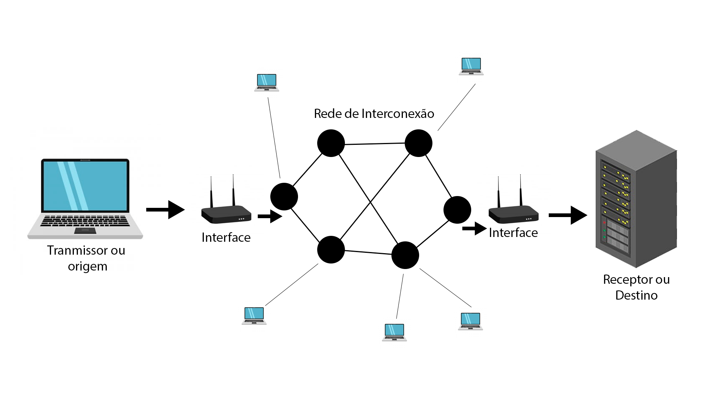

> Por final, na rede de interconexão também teremos demais dispositivos utilizando da rede para mandar e receber dados.

Já a **internet** pode ser definida como um conjunto de rede de computadores que opera, basicamente, utilizando os protocolos TCP e IP, e interconecta bilhões de dispositivos de computação ao redor do mundo. No entanto, a internet não é apenas um conjunto de redes interligadas. Há diversas formas de utilização para definir o que é a internet e como ela está organizada. Por exemplo, podemos defini-la de acordo com os componentes de software e hardware básicos que a formam.

> ❗️ Tradução:
>
>TCP (Transmission Control Protocol): Protocolo de Controle de Transmissão.
É responsável por garantir que os dados enviados por uma rede cheguem ao destino de forma correta e na ordem certa. Ele cria uma conexão confiável entre os dispositivos que estão se comunicando.
>
>IP (Internet Protocol): Protocolo da Internet.
É responsável por endereçar e rotear os dados para o destino certo na rede. Cada dispositivo tem um endereço IP único para identificar onde os dados devem ser enviados.

Podemos considerar que a internet é formada por três grandes partes:

- Sistemas finais (Bordas da Rede).
- Núcleo da rede.
- Redes de acesso.

> Sistemas finais ou Bordas da Rede: são os aplicativos que os usuário utilizaram (notebook, pc, smartphone...).
>
> Núcleo da Rede: Elementos intermediários, ou seja, os elementos de interconexão.
>
> Redes de Acesso: Realizar a conexão dos sistemas finais ao destino.

A junção dessas três partes permite que você use seu smartphone, acesse um aplicativo e utilize um serviço hospedado em qualquer dataCenter no mundo.

Outra forma de enxergar a internet é como uma infraestrutura de redes que fornece diversos serviços para que as aplicações de rede possam trocar informações. Alguns dos serviços oferecidos pela internet são: definir o caminho da origem até o destino; corrigir os erros que possam ocorrer no trajeto; evitar que haja sobrecarga dos componentes.

Os serviços fornecidos pela internet permitem que os desenvolvedores das aplicações possam se preocupar com suas funcionalidades apenas, não somente com diversos detalhes de como a informação será propagada. Basta o aplicativo enviar os dados para essa infraestrutura de serviços que ela fará o maior esforço para que a informação seja entregue ao destino.

## 📌 As três partes da Internet:

Vamos agora analisar de separadamente quais são as três partes da internet.

### 📍 Sistemas Finais (Borda da Rede):

Os dispositivos que utilizamos e que estão conectados à internet são chamados de sistemas finais, ou hosts (hospedeiros) ou borda de rede, pois se encontram no entorno, ou periferia, da internet e são nesses dispositivos que executamos as aplicações de rede. Ou seja, são os aparelhos que rodam definitivamente os serviços que são prestados pela rede, por exemplo, digamos que você precisa fazer uma pesquisa de uma receita de bolo, você utiliza seu smartphone para entrar em um navegador e realizar uma pesquisa na internet.

Então teremos dois lados principais no nosso sistemas finais, que seriam os clientes e os servidores.

- Clientes: São os desktops, notebooks, smartphones, tablets... dispositivos que, normalmente estão de posse de um usuário, e pede alguma requisição para um servidor.

- Servidores: São maquinas mais poderosas, que armazenam e distribuem os dados, tais quais: páginas webs, vídeo em tempo real, retransmissão de e-mails, entre outros...

Sobre os servidores, é comum chamarmos de máquinas grandes, poderosas, mas, na realidade, o que define a máquina ser servidora não é o hardware, e sim o software executado por ela. Como o nome diz, o servidor será o dispositivo que contém o software, servindo alguma coisa ou algum serviço para um cliente que faz um pedido ou requisição.

A imagem a seguir ilustra a localização dos sistemas finais em uma infraestrutura de redes de computadores. Confira!

### 📍 Redes de Acesso:

A rede de acesso é uma rede física que conecta os sistemas finais ao primeiro roteador (conhecido como “roteador de borda”) de um caminho partindo de um sistema final até outro qualquer. Podemos dizer que a rede de acesso é o meio físico, ou enlace, que faz a ligação dos sistemas finais ao núcleo da rede.

Veja abaixo as diferentes redes de acesso (linhas em azul):

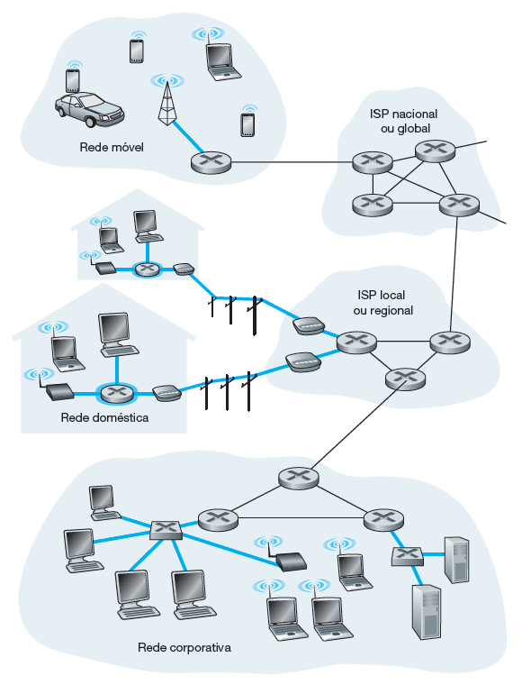

Redes que são dividos em duas maneiras de conexão:

1.  Meios guiados
    - São as redes com fio, ou seja, os sinais são dirigidos ao longo de um meio sólido, tal como um cabo de fibra ótica, que propaga sinais luminosos; um par de fios de cobre trançado ou um cabo coaxial, que propaga sinais elétricos.
2. Meios não guiados
    - São as famosas redes wireless. Nestes meios, os sinais se propagam pelo espaço aberto, como é o caso de canais de rádio empregados em redes domésticas sem fio, os sinais da telefonia celular, ou de um canal digital de satélite. Nesses tipos de redes, dizemos que são propagados sinais eletromagnéticos.

As redes de acesso também podem ser divididas em duas categorias, de acordo com a finalidade a que se destina: redes residenciais ou institucionais.

### ➜ Redes de acesso residenciais:

Os tipos de acesso residenciais bastante conhecidos são a linha digital de assinante (DSL), através de cabo coaxial, e a fibra ótica.

Para o DSL, são utilizados os modems DSL que utilizam a linha telefônica existente fornecida pela mesma empresa fornecedora do serviço de telefonia fixa. Já para o acesso através de cabo coaxial, a infraestrutura utilizada é a mesma oferecida pela empresa que fornece o serviço de televisão a cabo.

> ❗️ Comentário:
>
> Para o acesso através da fibra ótica, utilizamos o conceito chamado FTTH (fiber to the home), um caminho de fibra ótica diretamente até a residência. Convém ressaltar que FTTH não é um padrão ou protocolo em si, mas apenas um conceito indicando que a fibra ótica chega até a residência ou empresa.

Em geral, uma fibra que sai da central de telecomunicações é compartilhada por várias residências; ela é dividida em fibras individuais do cliente apenas após se aproximar relativamente das casas.

Em locais onde DSL, cabo e FTTH não estão disponíveis (por exemplo, em locais rurais), um enlace de satélite pode ser empregado para conexão (em velocidades mais baixas que as tecnologias tipicamente usadas).

E ainda existe o acesso discado por linhas telefônicas tradicionais, que são os precursores das redes de acesso, no qual um modem doméstico se conecta por uma linha telefônica a um modem no provedor de acesso, ocupando a linha telefônica e com baixas velocidades. Esse tipo de acesso era o mais comum até a década de 1990 e início dos anos 2000.

### ➜ Redes de acesso institucionais:
Algumas das soluções residenciais também podem ser utilizadas para as redes de acesso institucionais, mas as chamadas redes locais (LANs) costumam ser usadas nos ambientes universitários, corporativos e residenciais, para conectar sistemas finais ao roteador de borda da rede, com o uso predominante de um padrão conhecido como ethernet que, tipicamente, emprega cabos metálicos, ou através das redes sem fio, ou wi-Fi, que empregam o padrão IEEE 802.11.

> ❗️ Comentário:
>
> É cada vez mais comum utilizarmos as redes de telefonia celular como rede de acesso para acessar a internet, comumente chamando de 4G/3G. Possuem alcance bem maior que o wi-fi e as empresas de telecomunicação têm investido na quinta geração (5G), que oferece redes de acesso remotas de maior velocidade.

### 📍 Núcleo da Rede

O núcleo da rede consiste em uma rede de dispositivos, por exemplo, roteadores e switches, os enlaces, normalmente de alta velocidade, que interligam esses dispositivos. O núcleo da rede oferece os possíveis caminhos que permitem a interconexão dos sistemas finais, conforme mostrado na imagem (destaque em azul). Confira!

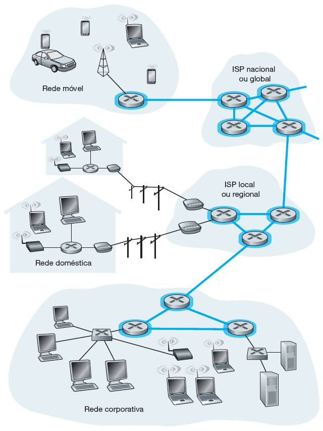

O núcleo da rede é organizado pelos diversos provedores de serviços de internet (Internet Service Providers — ISPs), pelos quais nós, usuários, contratamos serviços para nos conectarmos à internet. Conectar usuários finais e provedores de conteúdo a um provedor de acesso (ISP) é apenas uma parte de todo o desafio: interligar os bilhões de sistemas finais que compõem a internet. Isso é feito a partir da criação de uma rede de redes.

Existem centenas de milhares de ISPs, com diferentes portes, abrangência e finalidades. Por exemplo, ISPs que têm por finalidade oferecer serviço de conexão dos usuários à internet. Outros são conhecidos por serem ISPs de trânsito, que realizam a interligação de ISPs, sem oferecer acesso direto aos usuários. Normalmente, os ISPs de trânsito são responsáveis pela administração dos famosos cabos submarinos.

> Resumidamente, ISP é uma empresa ou organização que fornece acesso à internet para usuários e empresas, eles podem oferecer uma variedade de serviços, como:
>
> - Conexão à Internet: Pode ser via DSL, fibra ótica, cabo, satélite, 4G, 5G, entre outros.
> - Serviços de e-mail: Muitos ISPs fornecem contas de e-mail.
> - Hospedagem de sites: Alguns ISPs oferecem servidores e serviços de hospedagem de sites.
> - Suporte técnico: Atendimento para resolver problemas relacionados à conexão.
>
> Exemplos de ISPs incluem empresas como Claro, Vivo, Oi, Tim, entre outras no Brasil, que fornecem acesso à internet para os consumidores.

Para facilitar a interconexão dos diversos provedores, existe o chamado ponto de presença (PoP — Point of Presence), que é um grupo de um ou mais roteadores (no mesmo local) na rede do provedor, onde os ISPs clientes podem se conectar para poderem acessar outras redes.

Qualquer ISP (exceto os de nível 1) pode efetuar o multi-homing, ou seja, conectar-se a dois ou mais ISPs provedores para terem redundância. Por exemplo, um ISP local pode efetuar multi-home com dois ISPs regionais, ou então com dois ISPs regionais e também com um ISP de nível 1.

>❗️ Comentário:
>
> Os ISPs clientes pagam aos seus ISPs provedores para obter interconectividade global com a internet. Um ISP cliente paga a um ISP provedor conforme a quantidade de tráfego que ele troca com o provedor.

Para reduzir custos, um par de ISPs próximos no mesmo nível de hierarquia pode emparelhar, ou seja, conectar diretamente suas redes, de modo que todo o tráfego entre elas passe pela conexão direta, em vez de passar por intermediários mais à frente. Isso em geral é feito em acordo, ou seja, nenhum ISP paga ao outro.

Os ISPs de nível 1 também são emparelhados uns com os outros, sem taxas. Assim, uma empresa de terceiros pode criar um ponto de troca da internet (internet exchange point — IXP), que quase sempre é em um prédio à parte, com seus próprios comutadores. O IXP é um ponto de encontro onde vários ISPs podem se emparelhar e permitir que haja conexão direta entre os diversos provedores que utilizam essa infraestrutura.

### 📍 Rede como Serviço:

Podemos também descrever a internet como uma infraestrutura provedora de serviços a aplicações.

Existe uma quantidade grande de aplicações para internet (“aplicações distribuídas”), como correio eletrônico, navegadores da web, redes sociais, mensagem instantânea, voz sobre IP (VoIP), vídeo em tempo real, jogos distribuídos, compartilhamento de arquivos peer-to‑peer (P2P), televisão pela internet, login remoto, entre outros...

As aplicações da internet são executadas nos sistemas finais, e não nos comutadores localizados no núcleo da rede. Você precisará criar programas que sejam executados em sistemas finais, utilizando uma ou mais linguagens de programação, como Java, C ou Python.

Utilizando essa API, o desenvolvedor não precisa se preocupar em como as informações serão entregues ao destino, nem se sofreram algum tipo de erro no meio do caminho, muito menos como fazer para transformar os bits em sinais elétricos, pulsos de luz ou ondas eletromagnéticas para serem propagadas pelo espaço.

A infraestrutura de rede se encarrega de realizar todas essas ações que estarão distribuídas nos diversos componentes de rede, desde o sistema operacional existente no seu computador ou smartphone, passando pelos roteadores, switches, entre outros componentes.

## 📌 Parâmetros de Avaliação:

Um parâmetro muito importante quando estamos trabalhando com redes são seus parâmetros de avaliação, ou seja, analisar como está a qualidade de uma rede, portanto, é preciso entender como podemos realizar essa verificação. Entretanto, o ideal seria que os serviços da internet transferissem dados entre sistemas finais, de modo instantâneo e sem nenhuma perda. Porém, as redes de computadores restringem a quantidade de dados que podem ser transferidos entre sistemas finais, apresentam atrasos entre sistemas finais e ainda podem perder pacotes. As leis da física introduzem atraso e perda.

Para ser possível a formulação de propostas de soluções para os problemas encontrados no funcionamento das redes de computadores, é recomendável examinar e quantificar esse contexto como parâmetros para avaliação das redes. Por isso, estudaremos os parâmetros relacionados ao atraso, à perda e vazão em redes de computadores.

### 📍Tipos de Atraso:

Considere um pacote enviado de um nó por meio do roteador A até o roteador B. Um pacote somente pode ser transmitido do roteador A ao B, se não houver nenhum outro pacote sendo transmitido pelo enlace e se não houver outros à sua frente na fila. Se o enlace estiver ocupado, ou com pacotes à espera, o recém-chegado entrará na fila (buffer, ou memória, do roteador). A imagem a seguir ilustra os elementos citados:

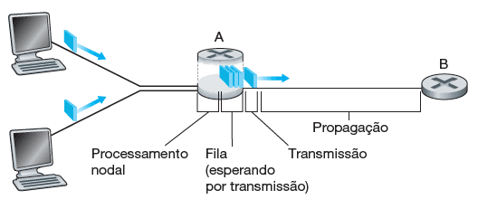

> Processamento Nodal: Atraso no processamentos dos equipamentos locais, por exemplo: o atraso de um roteador no processamento para enviar os dados
>
>Fila: Espaço dedicado para as requisições que foram desenvolvidas por todos os sistemas finais que enviaram algum tipo de dado.

Um pacote começa em um sistema final de origem, passa por vários roteadores até ser entregue em outro sistema final de destino. Quando um pacote viaja de um dispositivo ou um nó (sistema final ou roteador) ao nó subsequente (sistema final ou roteador), sofre, ao longo desse caminho, diversos tipos de atraso em cada nó. Os mais importantes deles são o atraso de processamento nodal, o atraso de fila, o atraso de transmissão e o atraso de propagação. Eles formam o atraso total.

1. Atraso de Processamento:
    - Tempo gasto em um dispositivo para examinar o cabeçalho do pacote e determinar por qual saída deve encaminhá-lo.
2. Atraso de Fila
    - Tempo decorrido enquanto um pacote espera para ser transmitido no enlace. Se a fila (buffer) estiver vazia, e nenhum outro pacote estiver sendo transmitido naquele momento, então o tempo de fila de nosso pacote será zero. Por outro lado, se o tráfego estiver intenso e houver muitos pacotes também esperando para serem transmitidos, o atraso de fila será longo.
3. Atraso de Transmissão:
    - Tempo exigido para empurrar (isto é, transmitir) todos os bits do pacote para o enlace. É uma função do comprimento do pacote e da taxa de transmissão do enlace, mas nada tem a ver com a distância entre os roteadores.
4. Atraso de Propagação:
    - Tempo exigido para empurrar (isto é, transmitir) todos os bits do pacote para o enlace. É uma função do comprimento do pacote e da taxa de transmissão do enlace, mas nada tem a ver com a distância entre os roteadores.

Importante ressaltar que os tipos de atraso se refletem nas aplicações de maneira diferente. As aplicações de tempo real, que tem interatividade, com jogos interativos, vídeo e áudio conferências, são mais suscetíveis ao atraso de propagação. Por outro lado, as aplicações que transferem um grande volume de dados, como transferências de arquivos, têm o atraso de transmissão como o ponto crítico.

Essa variação do atraso de fila causa um efeito chamado jitter (variação de atraso), que impacta significativamente as aplicações de streaming (multimídia), as quais precisam reproduzir os pacotes em intervalos regulares. Portanto, a variação do atraso impactará a reprodução em intervalos regulares, tendo em vista que os pacotes não chegarão com atrasos regulares.

### 📍 Perda, Atraso fim a fim e Vazão

### ➜ Perdas:

Além disso também falaremos da qualidade de uma rede, existem momentos que ocorre a perda de pacotes, ou seja, no processo de transmissão de dados acontece que algum pacote não consegue concluir o encaminhamento para o destino, que pode ou não ser prejudicial para nossa aplicação. No caso de sistema de streaming, como: Youtube, Netflix, Prime Video, que temos os videos com áudios sendo apresentados para o usuário, muito comum serem arquivos pesados, pela sua qualidade e audio existe a **perda de pacote**, que seria a fragmentação de alguma parte do arquivo, entretanto, não é algo tão ofensivo para o usuário, visto que dentro de um filme, a perda de alguns pixels não muda o resultado final e muitas vezes é até imperceptível. Por conseguinte, caso estivermos trabalhando com o envio de e-maisl queremos que no processo de encaminhamento, nossa mensagem segue completamente integrá da mesma maneira que enviamos. 

Alguns fatores que podem causar perdas:

- Se a intensidade de tráfego for próxima a zero, as chegadas de pacotes serão poucas e bem espaçadas, sendo improvável que um pacote que esteja chegando encontre outro na fila. Com isso, o atraso de fila médio será próximo a zero e todos os pacotes serão processados, sem perdas. Agora, imagine a situação na qual a intensidade de tráfego é próxima da capacidade de transmissão. Com certeza, haverá intervalos de tempo em que a velocidade de chegada excederá a capacidade de transmissão (por causa das variações na taxa de chegada do pacote) e uma fila será formada durante esses períodos.

- Se você aumentar a taxa de chegada do pacote o suficiente, de forma que a intensidade do tráfego exceda capacidade de transmissão, verá a fila aumentar ao longo do tempo.
Como a capacidade da fila (buffer) é finita, logo um pacote pode chegar ao roteador e encontrar o buffer cheio. Sem espaço disponível para armazená-lo, o roteador terá que descartá-lo, isto é, ele será perdido.

Um sistema final considera que o fenômeno da perda é um pacote que foi transmitido para o núcleo da rede, sem nunca ter emergido dele no destino.

Vamos analisar o impacto da perda na aplicação. Se a aplicação que estiver sendo utilizada não admitir perda, como uma transferência de arquivos, o pacote perdido irá impactar o funcionamento da aplicação e, portanto, esse problema deve ser corrigido, normalmente, retransmitindo o pacote faltante.

Mas existem aplicações que toleram perda, tipicamente, as aplicações de streaming. Nesse tipo de serviço, se alguns pacotes forem perdidos, a aplicação não terá prejuízos. Sabe por quê? Os pacotes de dados de uma aplicação de streaming carregam, por exemplo, um conjunto de pixels de um dos frames do vídeo. Se esse pacote não chegar, apenas alguns pixels deixarão de ser reproduzidos e dificilmente o usuário perceberá.

Voltemos ao caso da aplicação que não tolera perda. O desenvolvedor da aplicação precisa implementar alguma técnica de controle de perdas? A resposta é não! Lembra que comentamos que a rede oferece uma infraestrutura de serviços? Então, utilizando a API (socket) correta para a aplicação, os serviços existentes na rede corrigirão a perda de pacotes, assim, o desenvolvedor pode focar na lógica da aplicação porque a rede cuidará da entrega dos pacotes.

### ➜ Atrasos fim a fim (ou Atraso Total):

Anteriormente, comentamos sobre os diversos tipos de atrasos, porém, analisamos de forma isolada, pensando no que ocorre entre um nó e outro. Bom, mas é fácil imaginar que entre os sistemas finais, existem vários equipamentos intermediários (roteadores e switches), por onde o pacote trafegará e terá algum tipo de processamento.

Portanto, o pacote transitando do sistema final de origem para o de destino terá levado determinado tempo, que é o atraso fim a fim, ou seja, a soma de todos os atrasos que o pacote ficou sujeito ao longo do caminho

Se os atrasos de fila forem desprezíveis, não existirá congestionamento e a aplicação poderá funcionar corretamente. Mas, se os atrasos de fila não forem desprezíveis, os atrasos nos nós se acumulam e resultam em um atraso fim a fim significativo que poderá impactar o funcionamento da aplicação, em especial àquelas que são sensíveis ao atraso.

O usuário especifica um nome de hospedeiro de destino, e o programa envia vários pacotes em direção ao destino. Durante o caminho, esses pacotes passam por vários roteadores. Quando um deles recebe o pacote, envia de volta à origem uma mensagem contendo o nome e o endereço do roteador. Quando o destino recebe o pacote, também envia uma mensagem à origem, que registra o tempo transcorrido entre o envio e o recebimento da mensagem de retorno correspondente.

A origem registra também o nome e o endereço do roteador, ou do hospedeiro de destino, que retorna a mensagem. Desse modo, a origem pode reconstruir a rota tomada pelos pacotes que vão da origem ao destino e pode determinar os atrasos de ida e volta para todos os roteadores no caminho. Observe a imagem a seguir retirado do aplicativo **Traceroute**:

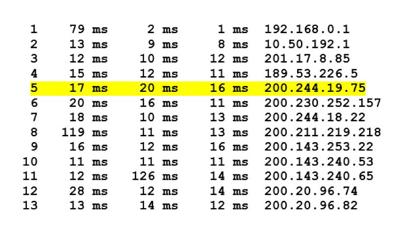

No exemplo mostrado, existem 12 roteadores entre a origem e o destino. Vamos pegar o Roteador 5, que tem o endereço 200.244.19.75. Examinando seus dados, vemos que na primeira das três tentativas, o atraso de ida e volta entre a origem e o roteador foi 17ms. Os atrasos de ida e volta para as duas tentativas seguintes foram 20 e 16ms, e incluem os atrasos que foram abordados, que são o atraso de transmissão, o atraso de propagação, o atraso de processamento do roteador e o atraso de fila.

Como o atraso de fila varia com o tempo, o atraso de ida e volta do pacote n enviado a um roteador n pode, às vezes, ser maior do que o do pacote n+1 enviado ao roteador n+1. Verificando os tempos apresentados na imagem, é possível verificar que isso ocorreu em alguns momentos.

Também é fácil verificar a variação de atraso com o Traceroute. Como o programa dispara três pacotes para cada destino, percebemos que dificilmente teremos os três pacotes com o mesmo atraso.

### ➜ Vazão

Outra medida de desempenho é a vazão fim a fim. Considere a transferência de um arquivo grande do hospedeiro A para o hospedeiro B. A vazão instantânea a qualquer momento é a taxa (em bits/s) em que o hospedeiro B está recebendo o arquivo. Se o arquivo consistir em F bits e a transferência levar T segundos para o hospedeiro B receber todos os F bits, a vazão média da transferência do arquivo é F/T bits/s.

A vazão depende não somente das taxas de transmissão dos enlaces ao longo do caminho, mas também do tráfego oriundo de outras sistemas finais. Pode acontecer de um enlace com uma alta taxa de transmissão, como um cabo submarino, ser o gargalo para uma transferência de arquivo, considerando que, no mesmo momento que você está realizando um download, muitos outros tráfegos estão passando pelo mesmo cabo submarino, sobrecarregando o enlace e os equipamentos que controlam a entrada dos dados no enlace.

## 📌 Camadas de protocolo e modelos de serviço

### 📍 Arquitetura de Camadas

Todas as atividades na internet que envolvem duas ou mais entidades remotas que se comunicam são governadas por um protocolo.

Um protocolo define o formato e a ordem das mensagens trocadas entre duas ou mais entidades comunicantes, bem como as ações realizadas na transmissão e/ou no recebimento de uma mensagem ou outro evento. Um protocolo de rede e um protocolo humano são muito semelhantes. Quando nos encontramos com outra pessoa, segundo as regras da boa educação, devemos fazer um cumprimento antes de fazer uma pergunta, ou pedir uma ajuda.

Outro fator importante ressaltar dos protocolos, são a sua importância dentro do âmbito de desenvolvimento, visto que, se não fosse estabelecido protocolos para serem seguidos dentro da internet, ela não seria padronizada, desenvolvendo uma necessidade de em todo desenvolvimento de algum sistema, o programador teria que criar todas as camadas a mão dentro do sistema.

>❗️ Comentário:
>
> O envio de dados segue uma série de camadas responsáveis por instruir um padrão sobre como é feito o encaminhamento de dados, ou seja, exemplificando de uma uma forma menos tecnológica, digamos que precisamos enviar uma carta para um amigo, primeiro teremos a camada 1, que seria a nossa, de escrever a carta e enviaremos para a camada 2 que seria responsável por envelopar essa carta para assim chegar na camada 3, a saída que faria a entrega para o meio de transporte. Afinal, o transporte levaria para a entrada do dado que seria a camada 3 do outro lado, que passaria pela camada 2 para abrir os dados e entregar a camada 1 que seria o amigo.

O mesmo é válido para as redes de computadores. Para que determinada ação seja realizada entre dois componentes de rede, eles devem utilizar o mesmo protocolo.

Para facilitar o desenvolvimento e evolução das redes, os projetistas de rede organizaram os protocolos, e o hardware e o software de rede que os executam, em camadas.

Em um modelo de serviço:

- Cada protocolo é executado em uma camada.
- Cada camada oferece seus serviços à camada acima dela, executando certas ações dentro dela, e utilizando os serviços da camada diretamente abaixo dela.
- O ponto de ligação entre uma camada e outra camada é denominado interface.

### 📍 O primeiro modelo de camadas:

No final dos anos 1970, a Organização Internacional para Padronização (International Organization for Standardization – ISO) propôs que as redes de computadores fossem organizadas em camadas, sendo cada camada responsável por realizar determinado serviço.

Esse esforço fez surgir um modelo de camadas que ficou conhecido como modelo RM-OSI (Reference Model Open Systems Interconnection), ou simplesmente modelo OSI, utilizado até hoje e composto por sete camadas, numeradas de cima para baixo: aplicação, apresentação, sessão, transporte, rede, enlace e física, conforme mostrado na imagem a seguir:

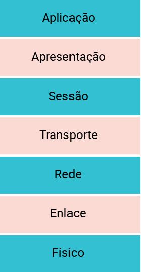

Importante ressaltar que o modelo OSI é utilizado como uma referência para o estudo e funcionamento das redes, entretanto, não é utilizado em si, principalmente porque ele não definiu protocolos, mas sim os serviços que cada camada oferece. Vamos detalhar essas camadas:

1. Aplicação
    - Nesta camada, residem as aplicações de rede que implementam os serviços de redes, como para transferir arquivos, enviar mensagens, entre outros. Um protocolo de camada de aplicação é executado nos sistemas finais, permitindo que as aplicações executadas nesses sistemas finais possam trocar informações por meio de mensagens.
2. Apresentação:
    - Nesta camada, provê serviços que permitam às aplicações de comunicação interpretarem o significado dos dados trocados, ou seja, ela é responsável por garantir que sistemas diferentes possam trocar informações, como faz um tradutor. Entre esses serviços estão a compressão, criptografia e a codificação de dados.
3. Sessão:
    - Nesta camada, há a delimitação e sincronização da troca de dados. É a camada que seria responsável, por exemplo, por permitir que, se você estivesse realizando um download de um arquivo e a conexão caísse, você retomasse a transferência a partir do último ponto de sincronização.
4. Transporte: 
    - Nesta camada, são carregadas mensagens da camada de aplicação entre os sistemas finais, garantindo que todos dados sejam trocados de forma correta, ou seja, sem perda, em ordem, sem sobrecarregar a rede e as máquinas. Um pacote da camada de transporte é denominado segmento.
5. Rede:
    - Nesta camada, há a responsabilidade por determinar o caminho de um hospedeiro para outro. Para que esse serviço seja possível, os endereços lógicos são definidos na camada de rede, que identificam unicamente uma máquina na rede, e a função de roteamento. Os pacotes da camada de rede são conhecidos como datagramas.
6. Enlace:
    - Nesta camada, leva-se um pacote, denominado quadro, de um nó ao nó seguinte, no caminho entre origem e destino. Em cada nó, a camada de rede passa o datagrama para a camada de enlace, que fica responsável por encaminhar o pacote de dados até o próximo nó, de forma confiável, ou seja, sem erros.
7. Físico:
    - Nesta camada, os bits individuais que estão dentro do quadro de um nó para o seguinte são movimentados, transformando-os em algum tipo de sinal adequado a ser transmitido pelo meio de transmissão utilizado, por exemplo, fios de cobre ou fibra ótica.

### 📍 Arquitetura TCP/IP ou Internet:

Conforme comentamos, o modelo OSI é um modelo de referência e não é utilizado na prática.

O Modelo TCP/IP é o utilizado atualmente.

As redes que utilizamos empregam a arquitetura TCP/IP ou arquitetura internet. Originalmente, a arquitetura TCP/IP emprega quatro camadas (aplicação, transporte, inter-rede e intrarrede). Entretanto, por fins didáticos, utilizaremos um modelo formado por cinco camadas: aplicação, transporte, rede, enlace e físico, como mostra a imagem a seguir. No modelo de cinco camadas, a camada de intrarrede é dividida em camada de enlace e física. Confira!

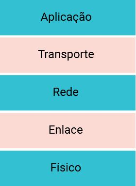

Conforme podemos observar, a diferença que temos entre o modelo OSI e a arquitetura de cinco camadas é a ausência das camadas de apresentação e sessão. As funções dessas duas camadas são absorvidas pela camada de aplicação. Um detalhe que você deve ter percebido é que, quando falamos do OSI, sempre falamos sobre modelo e agora no TCP/IP estamos usando a expressão arquitetura. Por que essa diferença?

Essa diferença ocorre pelo fato de o OSI não definir protocolos. Já no TCP/IP, temos um conjunto de protocolos associados, conhecidos como a pilha de protocolos TCP/IP, que nada mais são do que o conjunto de protocolos implementados por todas as camadas da arquitetura.

A camada de aplicação tem a mesma função da camada do modelo OSI, acrescido das funções da apresentação e sessão. Nessa camada, estão definidos alguns dos principais protocolos utilizados atualmente, como o HTTP (HyperText Transfer Protocolo), DNS (Domain Name Server), SMTP (Simple Mail Transfer Protocolo), entre muitos outros.

A camada de transporte tem a responsabilidade de garantir a confiabilidade das informações trocadas pelas aplicações. Há dois protocolos de transporte na internet, vejamos a seguir:

1. TCP:
    - Provê serviços orientados à conexão para suas aplicações. Alguns serviços são: entrega garantida de mensagens, controle de fluxo (compatibilização das velocidades do remetente e do receptor), controle de congestionamento (uma origem reduz sua velocidade de transmissão quando a rede está congestionada) e garantia da ordem das mensagens.

2. UDP:
    - Provê serviço não orientado à conexão para suas aplicações. É um serviço econômico sem controle de fluxo e de congestionamento adequado para as aplicações que toleram perda de pacotes, mas não toleram atrasos.
    - Comumente utilizado em sistemas de Streaming, pelo motivo mencionado antes, de que pequenas perdas de pacotes nos filmes não acarretá em um problema realmente impactante

A camada de rede segue a mesma função da camada de rede do modelo OSI, mas agora são definidos o formato do endereço e as regras de encaminhamento. Essa definição é feita pelo protocolo IP (Internet Protocol).

As camadas de enlace físicas não são definidas de forma explícita na arquitetura internet, mas elas executam o mesmo papel previsto no modelo OSI. Alguns dos padrões utilizados nessas camadas de enlace são o ethernet, wi-fi e bluetooth.

### 📍 Encapsulamento (Fragmentação):

Para compreender o conceito de encapsulamento, considere uma mensagem da camada de aplicação na máquina emissora que é passada para a camada de transporte. Essa camada pega a mensagem e anexa as informações de cabeçalho de camada de transporte. Essas informações serão usadas pela camada de transporte do lado receptor.

>❗️ Comentário:
>
> A mensagem da camada de aplicação e as informações de cabeçalho da camada de transporte, juntas, formam o que é chamado de Unidade de Dados de Protocolo, ou PDU (Protocol Data Unit), que, nesse caso, é chamado de segmento da camada de transporte, que encapsula a mensagem da camada de aplicação.

A camada de transporte então passa o segmento à camada de rede, que adiciona informações de cabeçalho de camada de rede, como endereços de sistemas finais de origem e de destino, criando um datagrama de camada de rede. Este é então passado para a camada de enlace, que adicionará suas próprias informações de cabeçalho e criará um quadro de camada de enlace. Finalmente, os dados são passados para a camada física, que transmite os dados na forma de bits pelo meio físico.

Em cada camada, um PDU possui campos de cabeçalho e um campo de carga útil. A carga útil é, em geral, um pacote da camada acima. Quando o pacote chega no sistema final destino, o processo de desencapsulamento se inicia. Na extremidade receptora, cada segmento deve ser reconstruído a partir dos datagramas que o compõem. O conceito de encapsulamento está ilustrado na imagem que veremos a seguir.

Quando um sistema final envia pacotes para outro sistema final, o caminho físico que os dados percorrem é o seguinte:

1. Sentido para baixo na pilha de protocolos de um sistema final emissor.
2. Sentido para cima e para baixo nas pilhas de protocolos de um comutador e roteador de camada de enlace que estejam no caminho.
3. Depois para cima na pilha de protocolos do sistema final receptor.

Os roteadores e comutadores de camada de enlace não implementam todas as camadas da pilha de protocolos. Por exemplo, os roteadores da internet são capazes de executar o protocolo IP (da camada 3), mas comutadores de camada de enlace não (só até a camada 2, de enlace). Os hospedeiros implementam todas as cinco camadas.

Resumidamente, para melhor encaminhamento de pacotes ele é divido em partes, enviado ao mesmo tempo e assim que chegar ao destino, o pacote será remontando para assim ser entregue o dado com integridade.

## 📌 Um pouco sobre a história da Internet:

**Anos 1960**

No início da década de 1960, a rede de telefonia, que usa comutação de circuitos para transmitir informações de uma origem a um destino, era a rede de comunicação dominante no mundo. A comutação de circuitos foi escolhida, pois a voz é transmitida a uma taxa constante entre os pontos. Com a importância cada vez maior dos computadores no início da década de 1960, foi considerada a questão de como interligar computadores para que pudessem ser compartilhados entre usuários geograficamente dispersos.

A comutação de pacotes foi inventada como uma alternativa poderosa e eficiente à comutação de circuitos. O programa de ciência de computadores na ARPA (Advanced Research Projects Agency, ou Agência de Projetos de Pesquisa Avançada), nos Estados Unidos, publicou um plano geral para a ARPAnet, a primeira rede de computadores por comutação de pacotes e uma ancestral direta da internet pública de hoje.

Em 1969, foi instalado o primeiro comutador de pacotes na UCLA (Universidade da Califórnia em Los Angeles). O primeiro protocolo fim a fim entre sistemas finais da ARPAnet foi o protocolo de controle de rede (Network Control Protocol – NCP). Com um protocolo fim a fim à disposição, a escrita de aplicações tornou-se possível, e em 1972, foi escrito o primeiro programa de e-mail.

**Anos 1970**

O trabalho de interconexão de redes realizado pela DARPA (Defense Advanced Research Projects Agency, ou Agência de Projetos de Pesquisa Avançada de Defesa), criou uma rede de redes e foi realizado por Vinton Cerf e Robert Kahn.

>❗️ Comentário
>
> Esses princípios de arquitetura foram incorporados ao TCP. As primeiras versões desse protocolo combinavam uma entrega sequencial confiável de dados via retransmissão por sistema final (que ainda faz parte do TCP de hoje) com funções de envio (que hoje são desempenhadas pelo IP). Os três protocolos fundamentais da internet que temos hoje — TCP, UDP e IP — estavam conceitualmente disponíveis no final da década de 1970.

Anos 1980

Em 1983, o TCP/IP foi adotado oficialmente como o novo padrão de protocolo de máquinas para a ARPAnet (em substituição ao protocolo NCP). Foi desenvolvido o sistema de nomes de domínios (DNS) utilizado para mapear nomes da internet fáceis de entender.

Anos 1990

Na década de 1990, a ARPAnet, a progenitora da internet, deixou de existir. O principal evento foi o surgimento da World Wide Web, que levou a internet para os lares e as empresas de milhões de pessoas no mundo inteiro. A web serviu como plataforma para a habilitação e a disponibilização de centenas de novas aplicações, como sites de busca (por exemplo, Google), comércio pela internet (por exemplo, Amazon, eBay) e redes sociais (por exemplo, Facebook).

> A web foi inventada por Tim Berners-Lee, entre 1989 e 1991, no CERN (European Center for Nuclear Physics, ou Centro Europeu para Física Nuclear), com base em ideias originadas de trabalhos sobre hipertexto.

Em 1995, empresas começaram a operar servidores e a realizar transações comerciais pela web. A segunda metade da década de 1990 foi um período de tremendo crescimento e inovação, com grandes corporações e milhares de novas empresas criando produtos e serviços para a internet.

De 1995 a 2001, a internet realizou uma viagem vertiginosa pelos mercados financeiros. Antes mesmo de se mostrarem lucrativas, centenas de novas empresas faziam suas ofertas públicas iniciais de ações e começavam a ser negociadas em bolsas de valores. Muitas empresas eram avaliadas em bilhões de dólares, sem ter nenhum fluxo significativo de receita. As ações da internet sofreram uma queda também vertiginosa entre 2000 e 2001, e muitas novas empresas fecharam.

Anos 2000 até o presente

Desde o início do milênio, vimos a implementação do acesso à internet por banda larga nos lares – modems a cabo, DSL, FTTH. Esse acesso à internet de alta velocidade possibilitou a aparição de várias aplicações de vídeo, como a distribuição de vídeo gerado pelo usuário (por exemplo, YouTube), fluxo contínuo por demanda de filmes e shows de televisão (por exemplo, Netflix) e videoconferência entre várias pessoas (por exemplo, Skype).

>❗️ Comentário
>
> A onipresença cada vez maior das redes Wi-Fi e de telefonia celular 4G e 5G públicas está possibilitando permanecer constantemente conectado enquanto se desloca, e também permitindo novas aplicações inerentes à localização.

O número de dispositivos sem fio conectados ultrapassou o número de dispositivos com fio. Muitas empresas de comércio na internet agora estão rodando suas aplicações na “nuvem” — como na EC2 da Amazon, ou na Azure da Microsoft.

 

---
### Passando para o Módulo 02
---
 

# Modelo de Referências OSI e Arquitetura de TCP/IP

## 📌 Divisão da estrutura das rede em camadas

A Internet funciona em um modelo de camadas. Esse modelo é baseado na divisão das funções e responsabilidade em diferentes níveis para facilitar a comunicação, padronizar protocolos e garantir a interoperabilidade entre sistemas de diferentes fabricantes. O modelo mais conhecido que descreve essa arquitetura é o **Modelo OSI (Open Systems Interconnection)**, que possui sete camadas, e o **Modelo TCP/IP**, que é mais simplificado e possui quatro ou cinco camadas, dependendo da abordagem.

### 📍 Modelo em camadas:

A internet é um conjunto de redes de computadores que permite a troca de informações entre dispositivos computacionais. Para que essa troca seja realizada de forma eficiente, devem ser estabelecidas regras de comunicação. Essas regras são os protocolos de rede, que devem garantir que a comunicação ocorra de forma confiável, segura, eficaz, no momento certo e para a pessoa certa. De maneira intuitiva, percebemos que satisfazer a todos esses requisitos não é uma tarefa fácil. São muitas regras que devem ser implementadas para garantir a efetividade da comunicação, tornando o processo de troca de dados entre computadores uma tarefa extremamente complexa.

Por causa dessa complexidade, os engenheiros e projetistas de redes do passado pensaram em formas de facilitar o desenvolvimento das regras nos dispositivos computacionais. Eles utilizaram um princípio básico de resolução de diversos outros problemas: a técnica de dividir para conquistar.

> ❗️ Comentário
>
> Na técnica dividir para conquistar, os projetistas dividem o problema em problemas menores e resolvem cada um de forma isolada. Se cada pequeno problema for resolvido, o grande problema será resolvido.

Para que essa divisão ocorresse de forma simplificada, os projetistas dividiram a organização das redes de computadores em **camadas**, sendo cada camada responsável por cuidar de determinada regra ou protocolo necessário ao processo de comunicação. A quantidade de camadas utilizadas depende de como as funcionalidades são divididas. Quanto maior a divisão, maior o número de camadas que serão empilhadas, numerando da mais baixa, camada 1, para a mais alta, camada n.

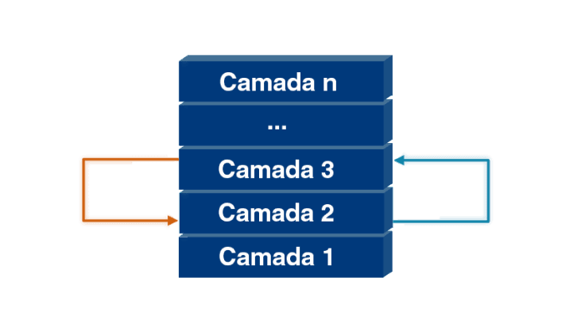

> As camadas se inter-relacionam da seguinte maneira: a camada superior utiliza os serviços oferecidos por outra imediatamente inferior, portanto, a **camada 3** utiliza os serviços oferecidos pela **camada 2**, e assim em seguinte.
>
>De forma contrária, podemos dizer que a camada inferior oferece serviços para outra imediatamente superior, logo, a camada 2 oferece serviços para a camada 3.

### ➜ Elementos da Camada

As camadas são formadas por três elementos principais:

1. Serviço
    - É o conjunto de funcionalidades que uma determinada camada oferece. Por exemplo, uma camada pode ser responsável pela verificação de erros na transmissão, por determinar o endereço de um computador, entre outras funcionalidades. O serviço diz o que a camada faz e não como ela faz.
2. Protocolo
    - Responsável por como a camada faz. Assim, o protocolo é a implementação do serviço da camada, ou seja, executa as regras para que os erros possam ser corrigidos ou para que um computador possa ser identificado.
    - "Um conjunto de camadas e protocolos é a arquitetura de rede e o conjunto de protocolos utilizados por determinado sistema é uma pilha de protocolos." (TANENBAUM, 2011, p. 38)
3. Interface
    - Para que uma camada possa utilizar a camada imediatamente inferior, é necessário que haja um ponto de comunicação entre ambas, chamado interface. Por meio dela, uma camada pode utilizar o serviço de outra, passando informações para a camada vizinha.

Onde, exatamente, tudo isso é implementado no computador?

O que está implementado são os **protocolos e interfaces**, que podem estar desenvolvidos em um hardware, como uma placa de rede, ou em um software, como no sistema operacional da máquina.

Agora que os elementos da camada foram apresentados, é possível entender dois conceitos importantes da arquitetura de redes: **Comunicação Vertical e Comunicação Horizontal**.

### ➜ Comunicações Horizontal e Vertical

Já vimos que uma camada utiliza os serviços de outra imediatamente inferior, sucessivamente, até chegar à camada mais baixa. Como estão empilhadas, podemos fazer analogia à comunicação vertical, uma vez que o dado original, no topo do conjunto de camadas, desce até a camada 1, caracterizando a verticalidade desse processo.

> Na origem:
 Na origem, o dado a ser transmitido desce pelas camadas até o nível mais baixo, a camada 1. Essa camada está conectada ao meio de transmissão, por exemplo, uma fibra ótica, um cabo de rede metálico ou o ar, possíveis caminhos para o dado fluir até o destino.

> No destino:
No destino, o processo ocorrerá de modo contrário, pois o dado sobe pelas camadas até o nível mais alto da arquitetura. Podemos, assim, associar a comunicação vertical aos serviços das camadas.

Conforme o dado passa por determinada camada, o hardware ou o software, responsável por implementar o protocolo, irá preparar esse dado para que a regra (para a qual ele foi projetado) possa ser executada.

Se a camada 2 é responsável pela verificação de erro, o dado será preparado na origem por essa camada para que, ao passar pela camada 2 do destino, seja verificado se houve erro ou não.

No exemplo anterior, vimos que a camada 2 de origem preparou o dado para que a camada 2 de destino verificasse se a informação está correta, caracterizando a existência de uma conversa entre as duas camadas de mesmo nível em computadores distintos. Essa conversa é a comunicação horizontal, realizada pelos protocolos que implementarão a regra.

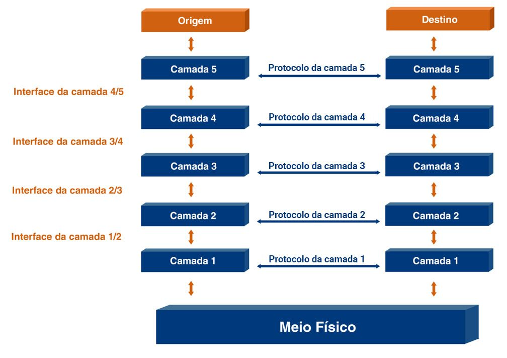

Ainda pode estar um pouco abstrata a forma como realmente a comunicação vertical e, principalmente, a horizontal funcionam.

Como a camada 2 da máquina de origem consegue conversar com a mesma camada na máquina de destino?

A comunicação horizontal ocorre de forma virtual. A camada 2 da máquina de origem, ao preparar o dado para ser enviado, adiciona informações que serão lidas e tratadas única e exclusivamente pela mesma camada do dispositivo de destino. Essas informações são denominadas cabeçalhos.

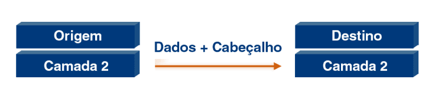

Cada camada adicionará um novo cabeçalho ao dado que será enviado, e esse processo é chamado de encapsulamento.

Cada camada receberá o dado da camada superior, através da interface, e adicionará seu próprio cabeçalho, encapsulando o dado recebido.

Nesse processo, quando determinada camada recebe os dados, ela não se preocupa com o conteúdo que recebeu, apenas adiciona o seu cabeçalho para permitir que o protocolo execute as regras necessárias à comunicação.

Esse procedimento acontece, repetidamente, até alcançar a camada 1 e a informação ser transmitida ao destino, onde ocorrerá o processo inverso. A informação subirá, desencapsulando as informações, da camada 1 até o usuário do serviço.

> Atenção
>
>Ao realizar o encapsulamento, a unidade de dados do protocolo ou PDU (Protocol Data Unit, na sigla em inglês) é criada.
>
> A PDU é constituída pela informação que vem da camada superior (PDU da camada superior) e o cabeçalho da própria camada.

## 📌 Camadas do modelo OSI

Na década de 1970, a International Organization for Standardization (ISO), um órgão que desenvolve padrões internacionais, criou um modelo de referência de camadas denominado OSI **(Open System Interconnection - ISO/IEC 7498-1:1994)**. 

O objetivo foi elaborar um modelo que permitisse a comunicação entre sistemas diferentes, independentemente de suas arquiteturas, facilitando a comunicação, sem a necessidade de realizar mudanças na lógica do hardware ou software (FOROUZAN, 2010).

> Observe que o modelo OSI propriamente dito não é uma arquitetura de rede, pois não especifica os serviços e protocolos exatos que devem ser usados em cada camada. Ele apenas informa o que cada camada deve fazer. No entanto, a ISO também produziu padrões para todas as camadas, embora esses padrões não façam parte do próprio modelo de referência. Cada um foi publicado como um padrão internacional distinto. O modelo (em parte) é bastante utilizado, embora os protocolos associados há muito tempo tenham sido deixados de lado.
>
> (TANENBAUM, 2011, p. 45)

O que utilizamos hoje do modelo OSI é a referência para as funções das camadas. Então, quando ouvimos falar que determinado protocolo é da camada X (1, 2, 3, ...), esse X se refere ao OSI, tanto que é encontrada, em diversos livros e artigos, a expressão modelo de referência OSI (RM-OSI em inglês).

O modelo OSI possui sete camadas, de cima para baixo: aplicação, apresentação, sessão, transporte, rede, enlace e física.

De acordo com o conceito de camadas que estudamos, cada uma delas é responsável por determinada tarefa no processo de transmissão de dados. Entretanto, já sabemos que, por mais que tenham sido especificados protocolos para cada camada, na prática, eles não são utilizados.De acordo com o conceito de camadas que estudamos, cada uma delas é responsável por determinada tarefa no processo de transmissão de dados. Entretanto, já sabemos que, por mais que tenham sido especificados protocolos para cada camada, na prática, eles não são utilizados.

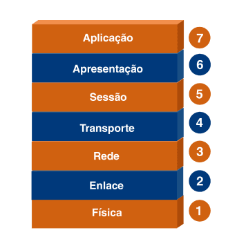

Os conceitos estudados de comunicação vertical, comunicação horizontal e encapsulamento são válidos nesse modelo. Portanto, um dado transmitido por um dispositivo de origem será inserido na estrutura de rede a partir da camada de aplicação e descerá até a camada física, quando será enviado pelo meio de transmissão. Cada camada adicionará o seu próprio cabeçalho, encapsulando a PDU da camada superior e permitindo a comunicação horizontal entre camadas de mesmo nível.

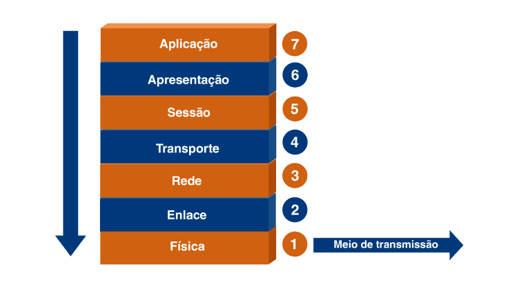

É possível dividir as sete camadas em três subgrupos.

> ### Camadas mais altas:
>
> As três camadas mais altas (aplicação, apresentação e sessão) estão relacionadas a funções que dão suporte para que os usuários possam acessar os diversos serviços de redes, garantindo a interoperabilidade de sistemas heterogêneos (FOROUZAN, 2010).
>
> ### Camadas mais inferiores:
>
> As três camadas mais inferiores (rede, enlace e física) estão relacionadas às operações ligadas aos aspectos da movimentação dos dados de um dispositivo para o outro, dando suporte às operações de rede (FOROUZAN, 2010).
>
> ### Camadas de transporte:
>
> A camada de transporte faz a interligação entre o suporte ao usuário e o suporte de rede. Ela vai permitir que os dados que chegaram das camadas mais baixas estejam em condições de serem utilizados pelas camadas mais altas (FOROUZAN, 2010).

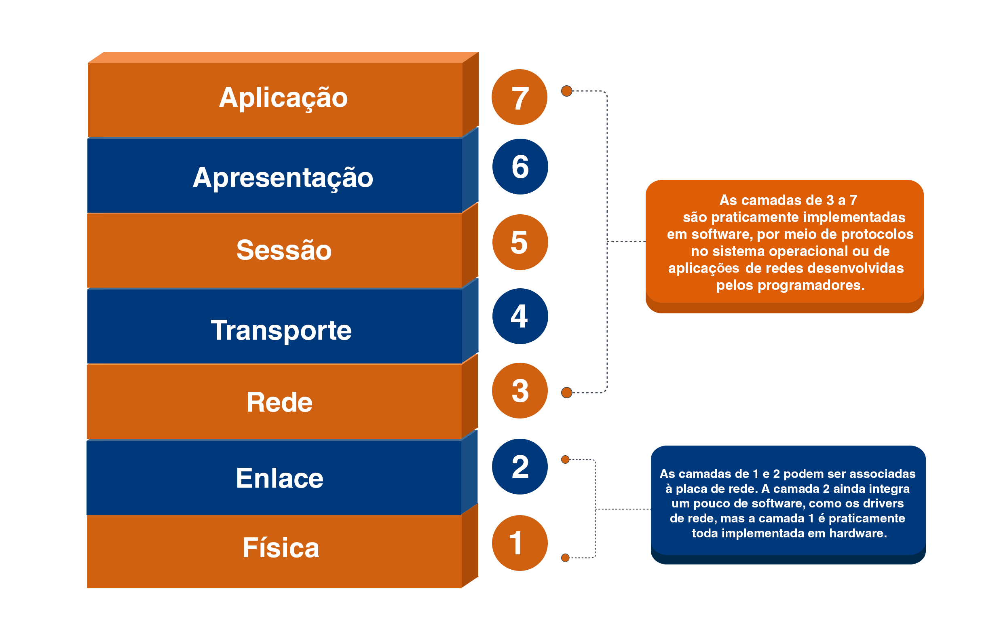

Portanto, iremos analisar cada camada separadamente

### 📍 Camadas mais altas:

### ➜ Aplicação

A camada de aplicação é a que está mais próxima de nós, usuários da rede. Podemos citar algumas das aplicações oferecidas por essa camada:

1. Serviço web.
2. Serviço de correio eletrônico.
3. Serviço de transferência de arquivos.
4. Serviço de streaming de áudio e vídeo.
5. Serviço de compartilhamento de arquivos

Os serviços citados acima ou quaisquer outros oferecidos pela camada de aplicação são executados por processos dos usuários que estão em andamento em determinado dispositivo.

Sua **segunda tarefa** será traduzir, criptografar e comprimir dados. Organização é a palavra-chave!

### ➜ Apresentação

A camada de apresentação é responsável por **garantir a interoperabilidade dos sistemas** heterogêneos, ou seja, permitir que, independentemente do dispositivo que você esteja utilizando (computador, smartphone, televisão, carro etc.) e do sistema operacional (MS Windows, Apple IOS, Linux etc.), seja possível acessar qualquer tipo de serviço disponibilizado pela rede.

Para que haja essa interoperabilidade, a camada de apresentação é responsável por fazer a transformação dos dados, por isso, podemos chamá-la de **tradutor da rede**. Ela será responsável pela conversão entre formatos, compressão de dados e criptografia.

Sua **terceira tarefa** será estabelecer, gerenciar e encerrar sessões, garantindo a sincronia da comunicação.

### ➜ Apresentação

Essa camada é responsável por organizar a comunicação entre os dispositivos e permitirá que os usuários, em diferentes máquinas, possam estabelecer sessões de comunicação; cada sessão terá dois serviços básicos: **controle de diálogo e sincronização**.

> Controle de diálogo: Define quem transmitirá em determinado momento. Considerando a existência de dois usuários, A e B, a camada de sessão determinará se eles podem transmitir simultaneamente, caracterizando a comunicação full duplex, ou de forma intercalada, em um sentido por vez, a exemplo da comunicação half duplex.

> Sincronização: Permite que sejam estabelecidos pontos de controle em determinado fluxo de dados. Esses pontos permitem que, se houver uma perda de comunicação, a transmissão de dados seja restabelecida a partir daquele ponto e não desde o início da transmissão.]

Sua **quarta tarefa** será prover a entrega confiável de mensagens processo a processo e a recuperação de erros. Fique atento ao fluxo de informações!

### 📍 Camada de Transporte

Essa camada tem por finalidade garantir a entrega de processo a processo de todos os dados enviados pelo usuário. Podemos dizer que a camada de transporte é responsável por entregar os dados corretamente para os processos que estão em execução na camada de aplicação, além do mais, caso tivermos alguma divergência de dados e precisarmos realizar a correção, a camada de transporte fica responsável por isso também.

Esse papel da camada de transporte a torna uma das mais complexas dentro da estrutura do modelo OSI. Para garantir que as mensagens da camada de aplicação sejam entregues corretamente, diversas funções são necessárias:

1. Segmentação e Remontagem
    - A camada de transporte receberá os dados originados na camada de sessão (PDU da camada de sessão) e irá dividi-los em pedaços, segmentos de dados (PDU da camada de transporte), que possam ser enviados e, na camada de transporte de destino, irá remontá-los na ordem correta. Para isso, será necessário estabelecer números de sequência para garantir que, independentemente da ordem de chegada, os dados sejam remontados na ordem correta.
2. Controle de erros fim a fim
    - A camada de transporte verificará se ocorreram erros na comunicação fim a fim, ou seja, entre os processos da camada de aplicação. Na origem, serão adicionadas informações que permitam identificar no destino se durante o tráfego pela rede ocorreu algum erro e, possivelmente, corrigi-lo.
3. Controle de fluxo
    - A camada de transporte será encarregada de evitar que o processo na origem sobrecarregue o processo no destino.
4. Controle de conexão:
    - A camada de transporte pode ser orientada ou não à conexão. No serviço orientado à conexão, a camada de transporte será responsável por estabelecer a conexão entre os processos de origem e destino.
5. Endereçamento do ponto de acesso ao serviço: 
    - Em um dispositivo, normalmente, estão em andamento diversos tipos de serviços executados por vários processos e não apenas um. A camada de transporte será responsável por fazer a entrega para o processo correto e, para isso, será utilizado o chamado endereço de porta. Ele indicará o serviço correto que deverá receber os dados.
6. Controle de congestionamento
    - No mundo real, as máquinas não estão diretamente conectadas, ou seja, não há uma comunicação ponto a ponto direta. Entre a máquina de origem e de destino existem diversos outros dispositivos cuja finalidade é fazer a informação ir de um ponto a outro. Como esses equipamentos transmitirão dados de diversas outras origens, poderá haver uma sobrecarga desses dispositivos. A camada de transporte será responsável por monitorar esse congestionamento e, possivelmente, tratá-lo.

Sua **quinta tarefa** será transferir pacotes da origem ao destino, permitindo a ligação entre as redes. Cuidado para não tomar uma rota errada!

### 📍 Camadas mais baixas

### ➜ Rede

A camada de rede é responsável por **determinar o caminho da origem até o destino**. Ela receberá os segmentos gerados pela camada de transporte e, no cabeçalho da camada de rede, irá inserir o endereço da máquina de destino para que seja enviado pela rede por meio dos diversos dispositivos intermediários. Enquanto a camada de transporte é responsável pela comunicação processo a processo, a camada de rede é encarregada da **comunicação máquina a máquina**.

Veja a representação desse fluxo a seguir:

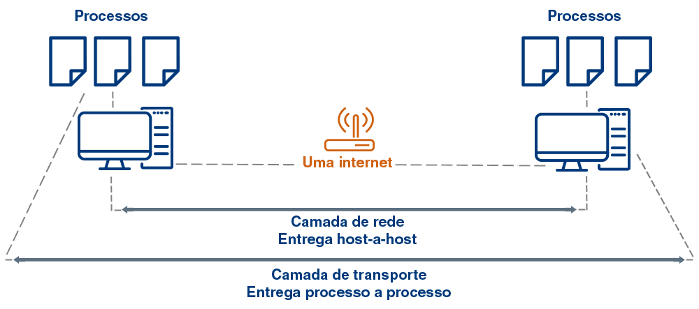

Para cumprir nosso objetivo, duas funcionalidades principais devem ser estabelecidas:

1. Endereço lógico
    - O endereço da porta, definido pela camada de transporte, permitirá a entrega no processo de destino. Mas, para que isso aconteça, é necessário que os segmentos cheguem à máquina de destino. Por isso, são empregados endereços lógicos a fim de permitir que os dispositivos intermediários encaminhem os dados pelas redes e alcancem o destino.

2. Roteamento
    - A função de roteamento permite estabelecer um caminho entre origem e destino. Os dispositivos intermediários verificarão o endereço lógico de destino e, com base nas informações de caminho que eles possuem, farão o processo de encaminhamento para outros dispositivos intermediários a fim de alcançar o destino da informação.

Sua **sexta tarefa** será organizar os bits em quadros, fornecendo a entrega nó a nó. Tenha atenção aos erros no caminho!

### ➜ Enlace

A camada de enlace é responsável por garantir a comunicação entre dispositivos adjacentes. Ela corrigirá quaisquer problemas que tenham ocorrido no meio físico de transmissão e entregará para a camada de rede um serviço de transmissão de dados aparentemente livre de erros.

> Pode ser confundido com a camada de transporte, entretanto a sua diferença está onde elas estão sendo executadas. A camada de elance cuida apenas do controle de erro dentro da comunicação direta entre máquinas adjacentes, nó a nó.

Por esse motivo, muitas das funções existentes na camada de transporte também estarão presentes na de enlace:

1. Controle de erros:
    - Os meios de transmissão não são livres de erro; portanto, os dados que trafegam através deles estão sujeitos a erros. A camada de enlace pode implementar mecanismos de controle de erro com a finalidade de agregar confiabilidade ao serviço de transmissão.

2. Controle de acesso ao meio:
    - Como alguns meios de transmissão são compartilhados, ou seja, mais de um dispositivo pode transmitir pelo mesmo meio, é necessário um mecanismo para controlar qual dos dispositivos pode transmitir naquele momento.

3. Endereçamento físico:
    - Enquanto o endereço de porta indica o processo na máquina de destino e o endereço lógico indica o dispositivo de destino, o endereço físico indicará qual será o próximo dispositivo no caminho origem-destino. Ao chegar à rede de destino, o endereço físico será o do dispositivo final.

4. Controle de fluxo:
    - Semelhante ao que acontece na camada de transporte, o controle de fluxo evitará que o nó de origem sobrecarregue o nó de destino.

5. Enquadramento:
    - A camada de enlace receberá os dados da camada de rede (PDU da camada de rede), encapsulando-os em quadros (PDU da camada de enlace). Os quadros criados pela camada de enlace terão uma função importante, que será a adição de delimitadores de início e fim do quadro na origem, para permitir que, no nó vizinho, a camada de enlace possa ver o fluxo de bits e definir corretamente onde inicia e termina o quadro.

Sua **sétima tarefa** será transmitir bits através de um meio físico, promovendo especificações mecânicas e elétricas. Garanta a estabilidade do sinal!

### ➜ Física

Essa camada é responsável por transmitir os dados pelo meio de transmissão. Ela receberá os quadros da camada de enlace, que serão formados por uma sequência de bits, e irá codificar corretamente para que sejam enviados pelo meio de transmissão.

A camada física será responsável pela representação dos bits, ou seja, de acordo com o meio de transmissão, ela irá definir se essa representação ocorrerá por pulsos de luz, no caso da fibra ótica, ou pulsos elétricos, no caso de empregar cabos de par trançado. Além disso, a camada física é responsável por:

1. Taxa de dados
    - A velocidade em que os bits são inseridos no meio de transmissão é responsabilidade da camada física. Quando ouvimos a expressão megabits por segundo (Mbps), que define a taxa de transmissão de determinado enlace, é responsabilidade da camada física estabelecer esse valor. Assim, a taxa de transmissão definirá a duração de um bit: quanto maior a taxa, menor a duração do bit, e vice-versa.

2. Sincronização dos bits
    - O nó transmissor e o receptor devem operar na mesma velocidade, ou seja, na mesma taxa de bits. Entretanto, os relógios (clocks) das camadas físicas têm pequenas diferenças; portanto, é possível que ocorram falhas de sincronismos. A camada física deve implementar algum tipo de mecanismo que permita o correto sincronismo dos bits entre origem e destino.

3. Topologia física
    - Define como os nós da rede estão interligados, podendo ser uma configuração de um enlace ponto a ponto, em que cada nó está diretamente conectado a outro, sem compartilhamento do meio, ou uma ligação ponto-multiponto, em que o enlace é compartilhado por diversos nós.

4. Modo de transmissão
    - A camada física definirá o modo de transmissão em um determinado meio: simplex, half duplex ou full duplex. Considerando dois dispositivos, A e B, no modo simplex só existe envio de dados em um sentido, por exemplo, de A para B; no modo half duplex, os dados podem ser enviados nos dois sentidos, mas não simultaneamente (de A para B em um momento e de B para A em outro momento); e no modo full duplex, os dados podem ser enviados simultaneamente por A e B.

### ➜ Resumidamente:

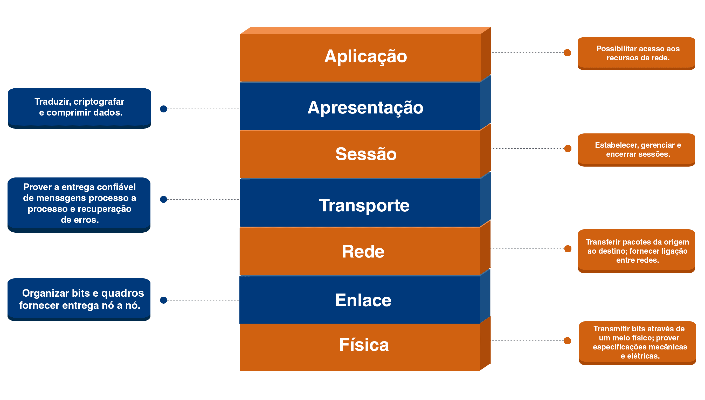

## 📌 Camadas do modelo TCP/IP

A arquitetura foi batizada por TCP/IP por causa dos seus dois principais protocolos: **Transmission Control Protocol (TCP)** e **Internet Protocol (IP)**. Ela foi apresentada pela primeira vez em 1974 (CERF, 1974) com o objetivo de criar uma arquitetura que permitisse a interligação de diversas redes de comunicação, sendo posteriormente adotada como padrão, de fato, para a comunidade internet.

A arquitetura foi criada utilizando quatro camadas: aplicação, transporte, internet e acesso à rede.

As duas últimas camadas podem ser encontradas com nomes diferentes na literatura. A camada de internet pode ser encontrada como rede e inter-rede e a camada de acesso à rede pode ser encontrada como camada de enlace, host-rede, intrarrede e host-network.

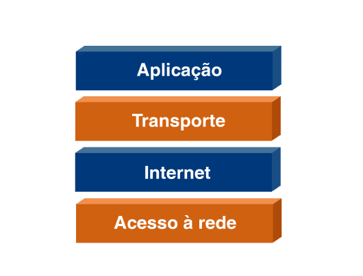

Após identificarmos que a arquitetura TCP/IP tem apenas quatro camadas, é possível imaginar que algumas das funções executadas pelas camadas de apresentação, sessão, enlace e rede, ausentes na arquitetura TCP/IP, serão acumuladas por outras camadas

As funções das camadas de apresentação e sessão serão acumuladas pela camada de aplicação e a funções das camadas de enlace e física serão executadas pela camada de acesso à rede. Observe a relação entre os dois modelos a seguir.

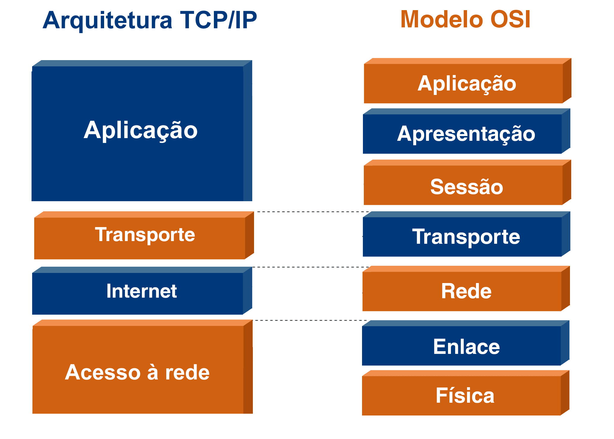

Uma grande diferença que temos entre o modelo de referência OSI e a arquitetura TCP/IP é:

- Modelo OSI
    - É baseado, principalmente, nas funcionalidades das camadas.
- Arquitetura TCP/IP
    - Não ficou presa apenas nas funcionalidades, mas ampliou para o desenvolvimento de protocolos relativamente independentes e hierárquicos. A hierarquia baseia-se em um protocolo de nível superior que é suportado pelos protocolos de nível inferior

É comum ouvirmos falar da pilha de protocolos TCP/IP. Agora que dominamos o conceito do modelo de camadas, como vimos no modelo OSI, fica fácil de entender que a pilha de protocolos TCP/IP é o conjunto de todos os protocolos implementados pela arquitetura. E não são poucos.

Os principais protocolos de padrão aberto da arquitetura Internet foram desenvolvidos pelo **IETF (The Internet Engineering Task Force)**, uma grande comunidade internacional aberta, composta por designers de rede, operadores, fornecedores e pesquisadores preocupados com a evolução da arquitetura da internet.

### 📍 Camadas do TCP/IP

### ➜ Aplicação:

A camada de aplicação da arquitetura TCP/IP nos engloba os serviços das camadas de aplicação, apresentação e sessão do modelo OSI. Através da camada de aplicação é possível acessar uma infinidade de serviços na internet. Desde os que são utilizados de forma direta pelos usuários, como o serviço Web, serviço de correio eletrônico, entre outros, bem como os que funcionam dando suporte à operação da rede, como o serviço de nomes (DNS).

Os serviços são implementados pelos diversos protocolos existentes. Correlacionamos, a seguir, alguns serviços e protocolos utilizados na camada de aplicação.

| Serviço                             | Protocolo         |
| ----------------------------------- | ----------------- |
| Web                                 | HTTP, HTTPS       |
| Correio Eletrônico                  | SMTP, POP E IMAP  |
| Nomes                               | DNS               |
| Transferência de arquivos           | FTP, TFTP         | 
| Áudio e video em tempo real         | RTP               |
| Configuração automática de estações | DHCP              |

Os protocolos apresentados são implementados por meio de softwares, que são executados nos diversos dispositivos computacionais, e podem estar associados a dois tipos principais de arquitetura:

1. Cliente-Servidor
    - Na arquitetura cliente-servidor, como já evidencia o nome, existirá um cliente e um servidor. O cliente será executado por um usuário como nós e irá requisitar um serviço do servidor. Por exemplo, para o serviço Web, o cliente é o navegador que acessa determinado servidor, por exemplo, o servidor que está disponibilizando esse conteúdo.
2. Par a par (peer-to-peer (P2P))
    - A arquitetura P2P foi pensada no emprego mínimo de servidores, caso exista algum. A ideia da arquitetura peer-to-peer é que os usuários possam trocar informações de forma direta. Esse tipo de arquitetura ficou muito conhecida com os programas de compartilhamento de arquivos, mas também pode ser utilizada em outras situações, como em um chat entre duas pessoas.

Independentemente da arquitetura utilizada, dizemos que os processos da camada de aplicação trocam mensagens, que é o nome da unidade de dados do protocolo (PDU) da camada de aplicação.

### ➜ Transporte

Tem a mesma funcionalidade da camada existente no modelo OSI: garantir a entrega de processo a processo de todos os dados enviados pelo usuário. Porém, na arquitetura TCP/IP, temos dois protocolos principais:

> **TCP (Transmission Control Protocol)**
> 
> - O protocolo TCP, efetivamente, confere confiabilidade.
> - O protocolo TCP é um protocolo orientado à conexão, com controle de erros, de congestionamento e de fluxo. Também define os endereços das portas e divide a mensagem (PDU-A) da camada de aplicação em segmentos (PDU-T), determinando números de sequência para cada um, para garantir a entrega dos dados na ordem correta para a aplicação. O TCP é adequado para as aplicações de rede que precisam de confiabilidade na troca de mensagens entre processos.

> **UDP (User Datagram Protocol)**
>
> - O protocolo UDP não confere confiabilidade.
> - O protocolo UDP é o oposto do TCP. Ele não é orientado à conexão e não faz a maioria das funções da camada de rede. Podemos dizer que o UDP existe apenas para permitir que uma mensagem (PDU-A) seja encapsulada em um datagrama (PDU-T) e entregue para o processo de destino correto, já que ele utiliza o endereço da porta para fazer a correta entrega na máquina de destino.
 
Então, por que usamos o UDP?

Ele é importante para as aplicações que demandam tempo de resposta baixo na comunicação, como em um áudio ou uma videoconferência, e nas aplicações que podem funcionar tolerando algum tipo de perda.

> ⚠️ Atenção:
>
> Além do protocolo IP, a camada internet emprega outros protocolos que dão suporte ao encaminhamento dos dados. Existem protocolos com o objetivo de fazer sinalização e avisos de erros, como o ICMP (Internet Control Message Protocol), tradução do endereço lógico para o físico, como o ARP (Address Resolution Protocol), e a chamada comunicação multicast, que permite o envio dos dados para um grupo de estações, como o protocolo IGMP (Internet Group Management Protocol).

### ➜ Acesso à rede

A camada de acesso à rede não foi bem definida pela arquitetura TCP/IP, nem define um protocolo específico a ser empregado. O que foi dito inicialmente é que a camada de acesso à rede seria qualquer coisa que pudesse ligar o dispositivo ao enlace de transmissão.

Mas, como para chegar até aqui já estudamos vários conceitos, sabemos que, apesar de não estar definida pela arquitetura TCP/IP, nessa camada encontraremos os serviços que são oferecidos pelas camadas de enlace e física do modelo OSI.

Embora não faça parte da arquitetura TCP/IP, a arquitetura desenvolvida pelo Instituto de Engenheiros Eletricistas e Eletrônicos (Institute of Electrical and Electronics Engineers – IEEE), denominada IEEE 802, é largamente utilizada na camada de acesso à rede. Ela define diversos padrões utilizados nas redes locais e metropolitanas, como o padrão Ethernet e o famoso WiFi, que provavelmente você está usando agora para acessar este conteúdo.

Agora que terminamos a apresentação dos principais protocolos da arquitetura TCP/IP, podemos fazer uma correlação entre a arquitetura internet e seus protocolos com o modelo OSI, conforme se vê a seguir:

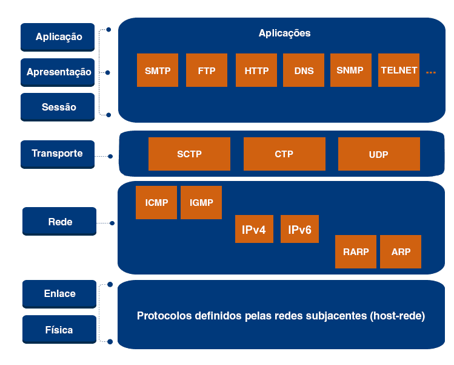

> Saiba mais!
>
>A arquitetura internet ou TCP/IP como uma estrutura de camadas não evoluiu ao longo dos anos. A grande evolução que tivemos foi nos protocolos empregados.
>
> Inicialmente, os protocolos da camada de aplicação eram concentrados nas aplicações textuais, com um pequeno volume de informação a ser trocado, como o Serviço Web criado por Sir Tim Berners-Lee (físico britânico, cientista da computação e professor do MIT. É o criador da World Wide Web (WWW)), com foco em páginas textuais para troca de informações entre os centros de pesquisa.
>
> Atualmente, os protocolos evoluíram significativamente para oferecer maior qualidade de serviço, suporte ao tráfego de vídeo, segurança, transações financeiras, entre outros. Falando novamente do serviço Web, o protocolo https:// evoluiu de um protocolo textual para binário, a fim de dar suporte aos diversos usos do serviço Web, como assistir a vídeos, CRMs, ERPs, entre muitos outros sistemas complexos.

 

---
### Passando para o Módulo 03
---
 

# Camadas de Aplicação e Transporte

