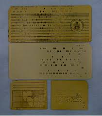
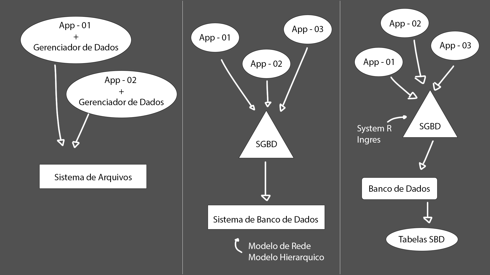

<link href="https://cdn.jsdelivr.net/npm/devicons@1.8.0/css/devicons.min.css" rel="stylesheet">

#  Banco de Dados (BD)

Antes de tentarmos entender oque é banco de dados precisamos entender o que significa organização. Na lingua portuguesa, organização é declarada como criar um sistema funcional e duradouro, além de pensar na praticidade e funcionalidade do dia-a-dia, ou até mesmo definir um local para cada coisa elaborando um planejamento estratégico com técnicas e metodologias, com foco em criar um sistema para atingir os resultados pretendidos, ou seja, organização significa você de fora racional desenvolver uma ideia de como dividir todas as coisas no seu devido lugar de forma que seja arrumado.

Caso não tenha ficado tão claro passaremos a falar de fato o que é um Banco de Dados. Seria um sistema que organiza, armazena e gerencia dados de maneira eficiente, ele permite que guardemos nossos dados de maneira estruturada e consiga acessá-las rapidamente, paralelamente, com segurança.

📌 Significado do que é Banco de Dados segundo algum nomes importantes

 
"Um banco de dados é um conjunto de arquivos relacionados entre sí (Chu, 1983)
 
 
"Um banco de dados é uma coleção de dados operacionais armazenados, sendo usados pelos sistemas de aplicação de uma determinada organização" (C.J Date, 1985)
 
 
"Um banco de dados é uma coleção de dados relacionais" (Elmasri & Navathe, 1989)
 
 
"Um banco de dados é um conjunto de dados armazenados, cujo conteúdo informativo representa, a cada instante, o estado atual de uma determinada aplicação" (Laender, 1990)

---

Algumas empresas ainda não utilizam Banco de Dados para guardar suas informações, então vamos analisar alguns motivos pelo quais devemos utilizar-lo?

1. **Organização e Estruturação:** Responsável por organizar as informações de maneira estruturada, tornando a gestão dos dados mais eficiente;
2. **Escalabilidade:** Permite que você gerencie uma grande quantidade de dados sem comprometer o processamento;
3. **Segurança:** Oferece varias camadas de proteção, como autenticação, criptografia e controle de acesso;
4. **Integridade de Dados:** Com BD relacionais, é possível definir regras (chaves primárias e estrangeiras) para garantir que os dados não possuam duplicatas;
5. **Facilidade de Consulta e Atualização:** Fácil de fazer consultas complexas e atualizações nos dados;
6. **Backup e Recuperação:** Oferece mecanismos de backup e recuperação de dados a partir da nuvem e outros métodos;
7. **Acesso Concurrente** Possibilidade de acesso por múltiplos usuários e manipulação de dados ao mesmo tempo;
8. **Eficiência:** Projetados para gerenciar dados de forma eficiente, com técnicas de indexação e otimização de consultas.

> __Dados ou Informação?__
 
 
> Uma questão muito retratada dentro desse estudo seria relacionado a diferenciar oque seria dados do que seria informação, portanto, vamos entender. Dados seria tudo aquilo com um valor bruto e absoluto, por exemplo: Lucas, 2005, Fortaleza, S.I, user. São dados que não possuem "sentido" de forma unitária, resumidamente, seriam dados absolutos.
 
 
Por conseguinte, a Informação, seria a ordenação e organização dos dados de forma a transmitir significado e compreensão dentro de um determinado contexto, ou seja, seria o conjunto ou consolidação dos dados de forma a fundamentar o conhecimento, por exemplo: "Lucas é user de S.I, com o telefone finalizando em 2005 e mora em Fortaleza"
 
 
Então assim, temos uma junção de dados formando uma informação.

## 📰 Historia do Banco de Dados

O conceito de bancos de dados sempre existiu em qualquer área que precisasse de algum nível de organização, principalmente em meios corporativos, devido a necessidade de guardar uma densa quantidade de dados de clientes por exemplo, entretanto, primordialmente era utilizado a ideia de organização, mas com meios físicos, que seria anotar os dados em papeis e organizar em pastas. Modelo muito utilizado até a modernização da ideia de banco de dados

Modelo que passava por sérios problemas, sendo os principais:

1. **Falta de Eficiência:** Era necessário muito tempo para buscar e manipular dados, além do mais, a organização não seguiam padrões, então seria de acordo com o responsável pelo setor e se caso ele não estivesse mais presente, não teria um modelo pré-definido;
2. **Falha na segurança:** Não existia um protocolo de segurança, pois qualquer pessoa presente dentro dos arquivos teria 100% de acesso a qualquer dado, sendo uma falha muito grave sobre a seguridade das informações;
3. **Brecha na Recuperação:** O índice de dados que acabavam sendo perdidos era muito alto, devido a falta de um método recuperatório.

Além de muitos outros motivos pelos quais não é recomendado o uso desse modelo de banco de dados, pelo menos agora na modernidade, e irresponsavelmente existem empresas que ainda seguem esse modelo. Entretanto, essa organização foi o alicerce para as ideias do novos bando de dados.

Então em meados dos anos 1900 até 1950 foi desenvolvido oque chamamos de **cartões perfurados**, que foi o principal meio de entrada, armazenamento e processamento de dados na computação institucional.

 

Geralmente tinham 80 coluna e cada coluna podia representar um caractere ou número, portanto, e armazenavam dados em formato binário, onde um furo indicava "1" e o outro "0", então era preciso analisar cada posição para conseguir formular um dado. Assim, os cartões eram lidos por máquinas chamadas **leitores de cartões perfurados** que usavam sensores mecânicos ou elétricos para detectar os furos, e a escrita era feita a partir da conhecida **perfuradora de cartões**, operada manualmente ou automaticamente, o operador usava um teclado para inserir os dados. Afinal, os cartões eram organizados em caixas ou gavetas e serviam como um banco de dados físico.

Com o desenvolvimento de novos métodos de armazenar dados foi criado o banco de dados de **fita magnética**, sendo um meio de armazenamento sequencial, ou seja, os dados eram gravados em sequência linear ao longo da fita, portanto, criava o acesso sequencial, que já seria considerado uma desvantagem, já que, os dados só seria mostrado seguindo até o fim da semana, portanto, caso necessário, era preciso rebobinar a fita até o ponto desejado, tornando um processo muito lento.

Foi um modelo muito promissor pelo seu baixo custo, durabilidade e capacidade, mas se tornou obsoleto com a criação dos discos rígidos E SSDs, que são os modelos de armazenamentos atuais que retrataremos agora, falando sobre a coexistência dos Bancos de Dados e os Computadores.

Mas antes, que o sistema de armazenamento era feito exclusivamente por meios externos se mesclou ao computador que foi invetado na década de 1940 ao fim da segunda guerra mundial, era usado primordialmente como uma máquina para cálculos matemáticos complexos, mas logo se percebeu que, graças a arquitetura criada pelo seu inventor, John Von Neumann, baseada na unidade central de processamento que armazena programas e dados, o computador também serve para o processamento de dados e não apenas cálculos.

Então, essa utilidade do computador foi impulsionada com a invenção do **disco magnético**, **pela International Business Machines Corporation (IBM)**, em 1957, que o denominou de **Dispositivo de Armazenamento de Acesso Direto** ou que foi declarado atualmente como **Hard-Disk** ou **HD**, que apresentou novidades, à época, foi a capacidade de leitura de dados externos à unidade central de processamento de forma direta, sem a necessidade de uma leitura sequencial em fitas magnéticas, e assim, nasceu a era do processamento de dados por computadores.

--- 

### Era do Processamento de Dados por Computadores

Já ouviu falar em Centro de Processamento de Dados (CPD), denominação ainda persistente em organizações tradicionais.

Mas para trabalhar com computadores foi preciso criar um meio de comunicação direta entre o desenvolvedor e o sistema, sendo criada a linguagem **COBOL** para trabalhar em aplicações empresarias, ou **Fortran**, em aplicações acadêmicas, que manipulavam dados armazenados em arquivos hospedados em disco magnéticos, utilizado pelo sistema operacional e formando o que se denomina **Sistema de Arquivos**

> Sistema de Arquivos:
É a forma de organização de dados em algum meio de armazenamento de dados em massa, frequentemente feito em discos magnéticos. As aplicações armazenavam seus dados através das interações com a aplicação, nos arquivos.

__Desvantagens dos Sistema de Arquivos:__

1. Redundância e inconsistência dos dados;
2. Dificuldade de acesso a dados;
3. Isolamento de dados;
4. Problemas de integridade;
5. Problemas de atomicidade;
6. Anomalias de acesso concorrente;
7. Problemas de segurança.

Um principal fator que devemos tratar é como ele funcionava de fato, digamos que temos uma loja, onde precisamos de uma série de aplicações funcionando ao mesmo tempo, ou seja, teremos uma aplicação exclusivamente para cadastros, login e compras, portanto, teremos que lidar com varias aplicações e um sistema de arquivos para guardar todos os dados. Primeiramente, era preciso criar um código para gerenciar os dados e colocar em todos as aplicações, criando uma repetição de códigos no sistema inteiro, além do problema de integridade, ou seja, cada aplicação criaria e manipularia seus próprios dados, criando a duplicidade de dados muitas vezes. Afinal, foi necessários novos avanços, pois como visto, esse é um sistema com muitas brechas de desenvolvimento.

Depois foi desenvolvido o **Sistema Gerenciador de Banco de Dados (SGBD)** que foi acrescentado no **Sistema de Banco de Dados (SBD)** que criou a independência de dados e programas, ou seja, não seria mais necessário um código para gerenciar os dados, já que foi estabelecido um software exclusivamente para realizar essa tarefa, além de adicionar dois modelos de armazenamento de dados.

> Modelo de Rede: É uma generalização do modelo hierárquico, permitindo que um registro tenha vários "pais" e vários "filhos". Ele é representado por um grafo onde os nós são registros e as conexões (arestas) representam os relacionamentos.
>
> Modelo Hierárquico: Organiza os dados em uma estrutura de árvore, com relações entre registros que seguem uma hierarquia (ou seja, de "pai para filho").

 

### Banco de Dados Relacional

Edgar Frank Codd, matemático pesquisador da International Business Machines Corporation (IBM), propõe o modelo de dados relacional, que se tornou