<link href="https://cdn.jsdelivr.net/npm/devicons@1.8.0/css/devicons.min.css" rel="stylesheet">

#  Banco de Dados (BD)

Antes de tentarmos entender oque é banco de dados precisamos entender o que significa organização. Na lingua portuguesa, organização é declarada como criar um sistema funcional e duradouro, além de pensar na praticidade e funcionalidade do dia-a-dia, ou até mesmo definir um local para cada coisa elaborando um planejamento estratégico com técnicas e metodologias, com foco em criar um sistema para atingir os resultados pretendidos, ou seja, organização significa você de fora racional desenvolver uma ideia de como dividir todas as coisas no seu devido lugar de forma que seja arrumado.

Caso não tenha ficado tão claro passaremos a falar de fato o que é um Banco de Dados. Seria um sistema que organiza, armazena e gerencia dados de maneira eficiente, ele permite que guardemos nossos dados de maneira estruturada e consiga acessá-las rapidamente, paralelamente, com segurança.

📌 Significado do que é Banco de Dados segundo algum nomes importantes

 
"Um banco de dados é um conjunto de arquivos relacionados entre sí (Chu, 1983)
 
 
"Um banco de dados é uma coleção de dados operacionais armazenados, sendo usados pelos sistemas de aplicação de uma determinada organização" (C.J Date, 1985)
 
 
"Um banco de dados é uma coleção de dados relacionais" (Elmasri & Navathe, 1989)
 
 
"Um banco de dados é um conjunto de dados armazenados, cujo conteúdo informativo representa, a cada instante, o estado atual de uma determinada aplicação" (Laender, 1990)

---

Algumas empresas ainda não utilizam Banco de Dados para guardar suas informações, então vamos analisar alguns motivos pelo quais devemos utilizar-lo?

1. **Organização e Estruturação:** Responsável por organizar as informações de maneira estruturada, tornando a gestão dos dados mais eficiente;
2. **Escalabilidade:** Permite que você gerencie uma grande quantidade de dados sem comprometer o processamento;
3. **Segurança:** Oferece varias camadas de proteção, como autenticação, criptografia e controle de acesso;
4. **Integridade de Dados:** Com BD relacionais, é possível definir regras (chaves primárias e estrangeiras) para garantir que os dados não possuam duplicatas;
5. **Facilidade de Consulta e Atualização:** Fácil de fazer consultas complexas e atualizações nos dados;
6. **Backup e Recuperação:** Oferece mecanismos de backup e recuperação de dados a partir da nuvem e outros métodos;
7. **Acesso Concurrente** Possibilidade de acesso por múltiplos usuários e manipulação de dados ao mesmo tempo;
8. **Eficiência:** Projetados para gerenciar dados de forma eficiente, com técnicas de indexação e otimização de consultas.

Entretanto, não teremos apenas vantagens de utilizar o Banco de Dados, visto que se fosse somente se existisse vantagens por que todas as empresas não aderem a ideia de ter um BD?

1. **Alto Custo**: É necessário um custo alto para manter um servidor físico, que seria uma máquina dentro da própria empresa, ou até mesmo um servidor na nuvem que consiste em alugar algum sistema online, que muitas vezes não é vantajoso para empresas que não precisam armazenar e lidar com uma grande base de dados;
2. **Mão de obra qualificada**: Além do mais, é preciso empregar uma equipe de T.I para a criação e manunteção do Banco de Dados, paralelamente, qualificar os funcionários da empresa para utilizar os novos sistemas.

Portanto, fica evidente que não temos somente qualidades para analisar, visto que, dentro do mercado de T.I não somos somente desenvolvedores, mas sim solucionadores de problemas, então precisamos entender todos as informações administrativas de criar um sistema.

> __Dados ou Informação?__
 
 
> Uma questão muito retratada dentro desse estudo seria relacionado a diferenciar oque seria dados do que seria informação, portanto, vamos entender. Dados seria tudo aquilo com um valor bruto e absoluto, por exemplo: Lucas, 2005, Fortaleza, S.I, user. São dados que não possuem "sentido" de forma unitária, resumidamente, seriam dados absolutos.
 
 
Por conseguinte, a Informação, seria a ordenação e organização dos dados de forma a transmitir significado e compreensão dentro de um determinado contexto, ou seja, seria o conjunto ou consolidação dos dados de forma a fundamentar o conhecimento, por exemplo: "Lucas é user de S.I, com o telefone finalizando em 2005 e mora em Fortaleza"
 
 
Então assim, temos uma junção de dados formando uma informação.

## 📰 Historia do Banco de Dados

O conceito de bancos de dados sempre existiu em qualquer área que precisasse de algum nível de organização, principalmente em meios corporativos, devido a necessidade de guardar uma densa quantidade de dados de clientes por exemplo, entretanto, primordialmente era utilizado a ideia de organização, mas com meios físicos, que seria anotar os dados em papeis e organizar em pastas. Modelo muito utilizado até a modernização da ideia de banco de dados

Modelo que passava por sérios problemas, sendo os principais:

1. **Falta de Eficiência:** Era necessário muito tempo para buscar e manipular dados, além do mais, a organização não seguiam padrões, então seria de acordo com o responsável pelo setor e se caso ele não estivesse mais presente, não teria um modelo pré-definido;
2. **Falha na segurança:** Não existia um protocolo de segurança, pois qualquer pessoa presente dentro dos arquivos teria 100% de acesso a qualquer dado, sendo uma falha muito grave sobre a seguridade das informações;
3. **Brecha na Recuperação:** O índice de dados que acabavam sendo perdidos era muito alto, devido a falta de um método recuperatório.

Além de muitos outros motivos pelos quais não é recomendado o uso desse modelo de banco de dados, pelo menos agora na modernidade, e irresponsavelmente existem empresas que ainda seguem esse modelo. Entretanto, essa organização foi o alicerce para as ideias do novos bando de dados.

Então em meados dos anos 1900 até 1950 foi desenvolvido oque chamamos de **cartões perfurados**, que foi o principal meio de entrada, armazenamento e processamento de dados na computação institucional.

 

Geralmente tinham 80 coluna e cada coluna podia representar um caractere ou número, portanto, e armazenavam dados em formato binário, onde um furo indicava "1" e o outro "0", então era preciso analisar cada posição para conseguir formular um dado. Assim, os cartões eram lidos por máquinas chamadas **leitores de cartões perfurados** que usavam sensores mecânicos ou elétricos para detectar os furos, e a escrita era feita a partir da conhecida **perfuradora de cartões**, operada manualmente ou automaticamente, o operador usava um teclado para inserir os dados. Afinal, os cartões eram organizados em caixas ou gavetas e serviam como um banco de dados físico.

Com o desenvolvimento de novos métodos de armazenar dados foi criado o banco de dados de **fita magnética**, sendo um meio de armazenamento sequencial, ou seja, os dados eram gravados em sequência linear ao longo da fita, portanto, criava o acesso sequencial, que já seria considerado uma desvantagem, já que, os dados só seria mostrado seguindo até o fim da semana, portanto, caso necessário, era preciso rebobinar a fita até o ponto desejado, tornando um processo muito lento.

Foi um modelo muito promissor pelo seu baixo custo, durabilidade e capacidade, mas se tornou obsoleto com a criação dos discos rígidos E SSDs, que são os modelos de armazenamentos atuais que retrataremos agora, falando sobre a coexistência dos Bancos de Dados e os Computadores.

Mas antes, que o sistema de armazenamento era feito exclusivamente por meios externos se mesclou ao computador que foi invetado na década de 1940 ao fim da segunda guerra mundial, era usado primordialmente como uma máquina para cálculos matemáticos complexos, mas logo se percebeu que, graças a arquitetura criada pelo seu inventor, John Von Neumann, baseada na unidade central de processamento que armazena programas e dados, o computador também serve para o processamento de dados e não apenas cálculos.

Então, essa utilidade do computador foi impulsionada com a invenção do **disco magnético**, **pela International Business Machines Corporation (IBM)**, em 1957, que o denominou de **Dispositivo de Armazenamento de Acesso Direto** ou que foi declarado atualmente como **Hard-Disk** ou **HD**, que apresentou novidades, à época, foi a capacidade de leitura de dados externos à unidade central de processamento de forma direta, sem a necessidade de uma leitura sequencial em fitas magnéticas, e assim, nasceu a era do processamento de dados por computadores.

--- 

### Era do Processamento de Dados por Computadores

Já ouviu falar em Centro de Processamento de Dados (CPD), denominação ainda persistente em organizações tradicionais.

Mas para trabalhar com computadores foi preciso criar um meio de comunicação direta entre o desenvolvedor e o sistema, sendo criada a linguagem **COBOL** para trabalhar em aplicações empresarias, ou **Fortran**, em aplicações acadêmicas, que manipulavam dados armazenados em arquivos hospedados em disco magnéticos, utilizado pelo sistema operacional e formando o que se denomina **Sistema de Arquivos**

> Sistema de Arquivos:
É a forma de organização de dados em algum meio de armazenamento de dados em massa, frequentemente feito em discos magnéticos. As aplicações armazenavam seus dados através das interações com a aplicação, nos arquivos.

__Desvantagens dos Sistema de Arquivos:__

1. Redundância e inconsistência dos dados;
2. Dificuldade de acesso a dados;
3. Isolamento de dados;
4. Problemas de integridade;
5. Problemas de atomicidade;
6. Anomalias de acesso concorrente;
7. Problemas de segurança.

Um principal fator que devemos tratar é como ele funcionava de fato, digamos que temos uma loja, onde precisamos de uma série de aplicações funcionando ao mesmo tempo, ou seja, teremos uma aplicação exclusivamente para cadastros, login e compras, portanto, teremos que lidar com varias aplicações e um sistema de arquivos para guardar todos os dados. Primeiramente, era preciso criar um código para gerenciar os dados e colocar em todos as aplicações, criando uma repetição de códigos no sistema inteiro, além do problema de integridade, ou seja, cada aplicação criaria e manipularia seus próprios dados, criando a duplicidade de dados muitas vezes. Afinal, foi necessários novos avanços, pois como visto, esse é um sistema com muitas brechas de desenvolvimento.

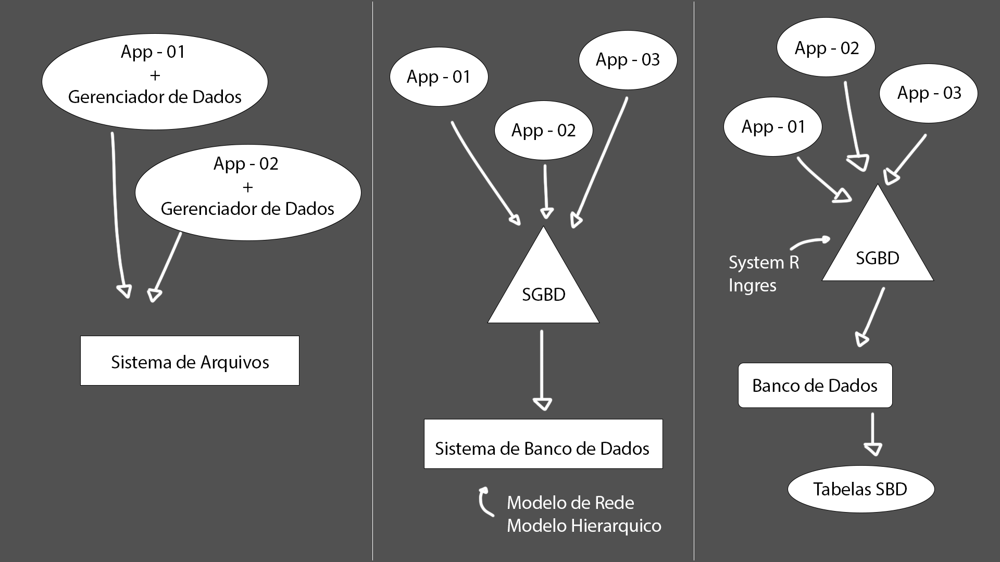

Depois foi desenvolvido o **Sistema Gerenciador de Banco de Dados (SGBD)** que foi acrescentado no **Sistema de Banco de Dados (SBD)** que criou a independência de dados e programas, ou seja, não seria mais necessário um código para gerenciar os dados, já que foi estabelecido um software exclusivamente para realizar essa tarefa, além de adicionar dois modelos de armazenamento de dados.

> Modelo de Rede: É uma generalização do modelo hierárquico, permitindo que um registro tenha vários "pais" e vários "filhos". Ele é representado por um grafo onde os nós são registros e as conexões (arestas) representam os relacionamentos.
>
> Modelo Hierárquico: Organiza os dados em uma estrutura de árvore, com relações entre registros que seguem uma hierarquia (ou seja, de "pai para filho").

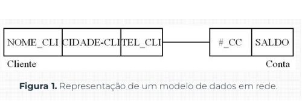 

### 📍 Banco de Dados Relacional

Edgar Frank Codd, matemático pesquisador da International Business Machines Corporation (IBM), propõe o modelo de dados relacional, que se tornou um marco em como pensar em banco de dados. Ele desconectou a estrutura lógica do banco de dados do método de armazenamento físico. Este sistema se tornou padrão desde então. Edgar criou uma Álgebra Relacional e um Cálculo Relacional, nos quais baseou toda a teoria matemática das relações em que fundamentou o modelo relacional. 

Apesar da base teórica do modelo, a estrutura de dados subjacente tem o mérito de ser muito simples, pois uma relação nada mais é do que uma tabela formada por colunas e linhas, em cujas células estão armazenados os dados, conceito compreensível pelo senso comum de qualquer leigo em Matemática ou computação.

| Linhas/Colunas  | Nome | Data de Nascimento | Sexo | Setor |
| -------- | ------ | ---------- | - | ------------- |
| Linha 1  | Lucas  | 28/06/2005 | M | Estudante de T.I |
| Linha 2  | Vitoria | 24/08/2005 | F | Psicologa | 
| Linha 3  | Paiva  | 11/03/1854 | M | Tech-Lead |

A solidez da fundamentação matemática do modelo relacional disparou uma série de iniciativas de implementação em empresas, como a própria IBM, e no meio acadêmico, principalmente nas universidades do estado da Califórnia, onde se localizava o centro de pesquisas da IBM

A partir de então, a IBM patrocinou o projeto System R (de Relational), enquanto a Universidade da Califórnia em Berkeley (UCB) deu início à implementação acadêmica de um SGBD relacional denominado de Ingres (Interactive Graphics Retrieval System), **Que serviram especialmente para dar início da novos SGBD's mais atuais e robustos.**

1. Ingres (Interactive Graphics Retrieval System): Desenvolvido pela UCB (Universidade da Califórnia, Berkeley). Que no final das contas serviu como base para Ingres Corp., Sybase, MS SQL Server, Britton-Lee, Wang PACE. Este sistema utilizava QUEL como linguagem de consulta;

2. System R (de Relational): Desenvolvido pela IBM e serviu de base para o IBM SQL/DS, IBM DB2, Oracle, todas os BD da HP, Tandem's Non-Stop SQL. Este sistema utilizava SEQUEL como linguagem de consulta.

Dr. Peter Chen propõe o modelo **Entidade-Relacionamento** (ER) para projetos de banco de dados dando uma nova e importante percepção dos conceitos de modelos de dados. Assim como as linguagens de alto nível, a modelagem ER possibilita ao projetista concentrar-se apenas na utilização dos dados, sem se preocupar com estrutura lógica de tabelas.

Afinal, a comercialização de sistemas relacionais começa a se torna evidente entre as organizações e na metade do anos 80 a Linguagem Estruturada de Consulta - SQL se torna um padrão mundial. Então, A IBM transforma o DB2 como carro chefe da empresa em produtos para BD. Os modelos em rede e hierárquico passam a ficar em segundo plano praticamente sem desenvolvimentos utilizando seus conceitos, porém vários sistemas legados continuam em uso.

Portanto, no inicio dos anos 90 temos a chamada loucura na internet, baseando-se na corrida para prover acesso remoto a sistemas de computadores com dados legados, além da tendência de evolução dos novos SGBD que surgiriam a partir do Ingres e System R, aumentando o uso de soluções de código aberto (open source) através de GCC, CGI, Apache, MySQL, etc... Surgimento dos bancos de dados XML e de suas linguagens de consulta XML: XPath e XQuery, crescimento das técnicas de computação para reduzir os esforços de administração dos sistemas de banco de dados.

Além de dar espaço para modelos que são utilizados hoje em dia, como

1. Web atual: fontes de dados abrangem volumes gigantescos em diversos formatos e localizações.
2. Big Data: conjuntos de dados extremamente grandes e complexos que não podem ser facilmente processados com métodos de processamento de dados tradicionais. 
3. Diversidade de plataformas digitais, que têm em comum a conexão com a internet e a computação em nuvem (Cloud Computing).

### 📍 NoSQL

NoSQL é uma categoria de sistemas de banco de dados que se diferencia dos bancos de dados relacionais tradicionais, surgindo a partir de todas essas mudanças tecnológicas. O termo "NoSQL" significa "Not Only SQL" (ou seja, "Não Somente SQL"), indicando que esses bancos de dados oferecem uma abordagem alternativa à organização e consulta de dados, não dependendo de tabelas e relações estruturadas. Tendo como principais pontos:

1. Modelos Flexíveis de Dados:
Diferentemente dos bancos de dados relacionais (que seguem esquemas fixos), o NoSQL é mais flexível e pode armazenar dados de diferentes formatos, como documentos JSON, pares chave-valor, grafos ou colunas.
Alta Escalabilidade:

2. Ideal para lidar com grandes volumes de dados (Big Data) e tráfego intenso, escalando horizontalmente ao adicionar mais servidores.
Desempenho Rápido:

3. Projetado para alta performance, especialmente em aplicações que exigem acesso rápido a dados.
Sem Esquema Rígido:

4. Não exige que os dados sigam uma estrutura fixa, permitindo a manipulação de informações não estruturadas ou semiestruturadas.

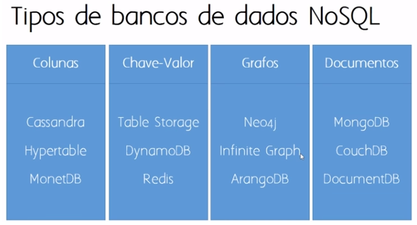

---

### 📍 SGBD's

SGBD significa Sistema de Gerenciamento de Banco de Dados. Ele é um software utilizado para criar, gerenciar e manipular bancos de dados, permitindo que você armazene, organize e acesse dados de maneira eficiente e segura.

1. Algumas funções principais de um SGBD:
2. Armazenamento de dados: Salva informações em tabelas, que podem ser acessadas e modificadas.
3. Manipulação de dados: Permite inserir, atualizar, deletar e consultar dados usando linguagens como SQL.
4. Segurança: Controla quem pode acessar e modificar os dados.
5. Backup e recuperação: Garante que os dados possam ser recuperados em caso de falhas.
6. Integridade dos dados: Mantém os dados consistentes e sem redundâncias desnecessárias.

__Alguns Exemplos:__

- ORACLE (documentos, grafos e RDF);

- MYSQL (documentos);

- MICROSOFT SQL SERVER (documentos e grafos);

- POSTGRESQL (documentos);

- IBM DB2 (documentos e RDF).

### 📍 Linguagem SQL

SQL (Structured Query Language) é uma linguagem de programação padrão desenvolvida para ser utilizada mundialmente por todos os desenvolvedores, usada para gerenciar e manipular bancos de dados relacionais. Com o SQL, é possível realizar diversas operações como consultar, inserir, atualizar e excluir dados armazenados em um banco de dados. A principal característica do SQL é que ele permite que os usuários interajam com os dados de forma estruturada e intuitiva, utilizando comandos bem definidos.

Os principais tipo são:

1. DDL (Data Definition Language ou Linguagem de Definição de Dados)
    - Grupo de comandos dentro da linguagem SQL que é utilziada paraa criação, alteração e exclusão de objetos em um banco de dados;
    - Principais comandos: **CREATE, ALTER, DROPE e TRUCANTE**.

2. DML (Data Manipulation Language ou Linguagem de Manipulação de Dados)
    - Permite aos usuários fazer o acesso aos dados ou manipulá-los, conforme modelos de dados apropriado;
    - Principais comandos: **SELECT, INSERT, UPDATE e DELETE**

3. DCL (Data Control Language ou Linguagem de Controle de Dados)
    - Comandos usados para o controle de acessos e gerenciamento de permissões para usuários no banco de dados. Com eles, pode-se facilmente permitir ou negar alguma ações para usuários nas tabelas ou registros;
    - Alguns Comandos: **GRANT, REVOKE e DENY**.

 
 

---
### Passando para o Módulo 02
---
 

## 📌 Projeto de Banco de Dados

Enterdemos um pouco sobre o que é Banco de Dados, como foi elaborado sua evolução e todos os processos ligados ao seu desenvolvimento, entretanto, precisamos entender como funciona o planejamento de um BD, mas agora de uma forma mais prática.

### 📍 Etapa da Modelagem de Banco de Dados

A construção de uma projeto de Banco de Dados é dado a partir de 3 fases:

### 📍 Modelagem Conceitual

Nessa primeira fase, é construído um modelo conceitual, na forma de um **Diagrama de Entidade-Relacionamento (DER)** realizando um processo de abstração, focando somente naquilo que será importante para o nosso BD. Esse modelo captura as necessidades da organização em termos de armazenamento de dados de forma independente de implementação, ou seja, **nessa fase não se importamos com o tipo de SGBD que utilizaremos** apenas e como vai funcionar a infraestrutura do nosso Banco de Dados. **Sendo projetado com: Entidades, Relaciomantos e Atributos**

- ### Entidades são representadas por **retângulos**
    - **Tipos de entidades:**
        - Forte: Entidade que não depende de outra para existir, ou seja, ela por si só já possui total sentido
        - Fraca: Entidade que depende de outra para existir, pos individualmente elas não fazem sentido

        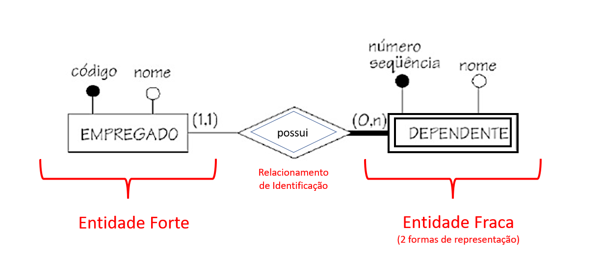

        > No exemplo acima temos uma entidade(forte), declarada como empregado em um relacionamento de possuir a uma entidade fraca, declarada dependente, caso não exista um empregado, não vai existir um filho, mas se existir um filho, vai existir um pai.

- ### Relacionamentos são representados por **losangos**
    - **Cardinalidade:** Ela define a quantidade de instâncias que uma tabela pode ter em relação a outra.
        - Relacionamento 1..1
        - Relacionamento 1..n ou 1..*
        - Relacionamento n..n ou * ..*

        

        > Um desenvolvedor de uma empresa precisa trabalhar no computador, mas só pode usar no máximo uma máquina, paralelamente, um computador pode ficar sem ser utilizada, mas só pode ser usada por um desenvolvedor

        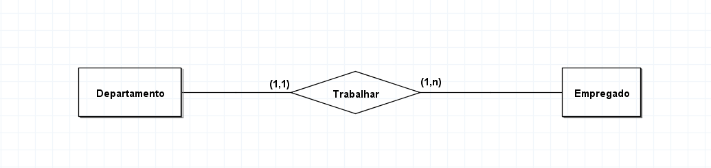
        
        > Um departamento pode possuir um ou mais empregados, mas um empregado só possui trabalhar em um departamento

        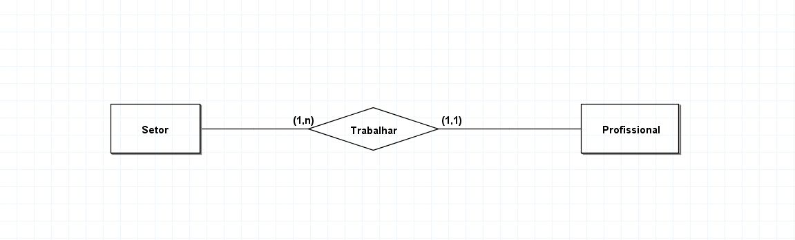

        > Um setor deve ter apenas um profissional trabalhando, mas um profissional pode trabalhar em mais de um setor

- ### Atributos são representados por meio de **setas com um circulo no final**
    - **Tipos de atributos:**
        - Simples: Valores simples
        - Composto: Mais de um valor para um dado (Endereço: CEP, Bairro, Rua, Número)
        - Multvalorado: Valores pré-definidos para um dado (Caixa de seleção)
        - Derivado: Dado aferido a partir de um valor, ou seja, dado calculado a parte de um valor dado pelo usúario (Date_birth: 28/06/2005 ; derivado: 19 anos)
        - Chave: Valor único (ID)

            - **Representação gráfica desses atributos:**
                    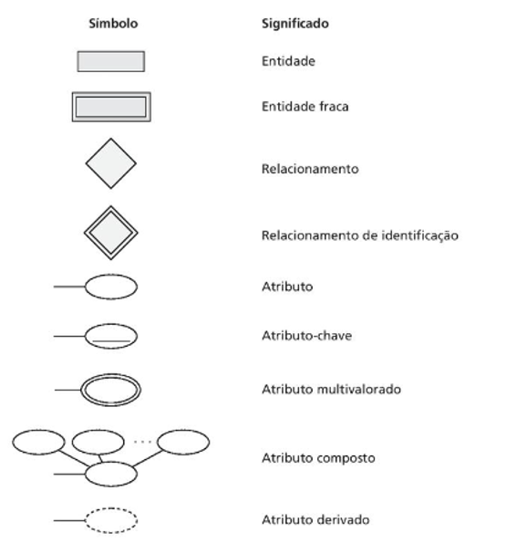
                    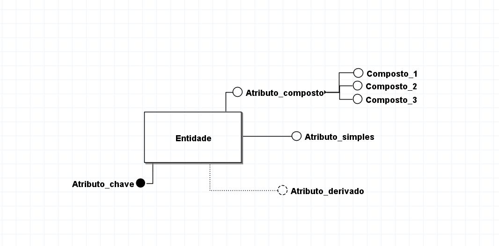

### 📍 Especialização/Generalização

Especialização e Generalização são conceitos relacionados ao modelo de banco de dados e ao design de esquemas, frequentemente utilizados em modelagem de dados no contexto de diagramas Entidade-Relacionamento Estendido (EER). Esses conceitos ajudam a organizar os dados de maneira hierárquica e são úteis para representar subclasses e superclasses.

### ➜ Generalização

Consiste no processo de abstrair características comuns de duas ou mais entidades e combiná-las em uma entidade mais genérica (superclasse).

- Ideia principal: Identificar semelhanças entre várias entidades para criar um modelo mais simplificado.
- Exemplo: As entidades "Carro" e "Moto" podem ser generalizadas em uma entidade genérica chamada "Veículo", porque ambas compartilham atributos como "Marca", "Modelo" e "Ano 
de Fabricação".

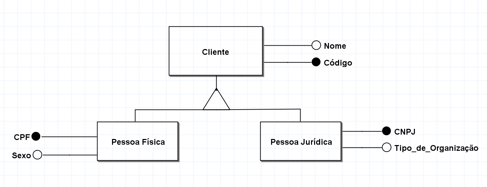

### ➜ Especialização 

É o processo inverso, ou seja, de criar subclasses a partir de uma entidade genérica (superclasse) com base em características específicas.

- Ideia principal: Destacar diferenças ou características únicas entre subconjuntos de uma entidade.
- Exemplo: A entidade genérica "Veículo" pode ser especializada em subclasses como "Carro", "Moto" e "Caminhão", onde cada uma tem atributos ou comportamentos específicos, como "Número de Portas" para "Carro".

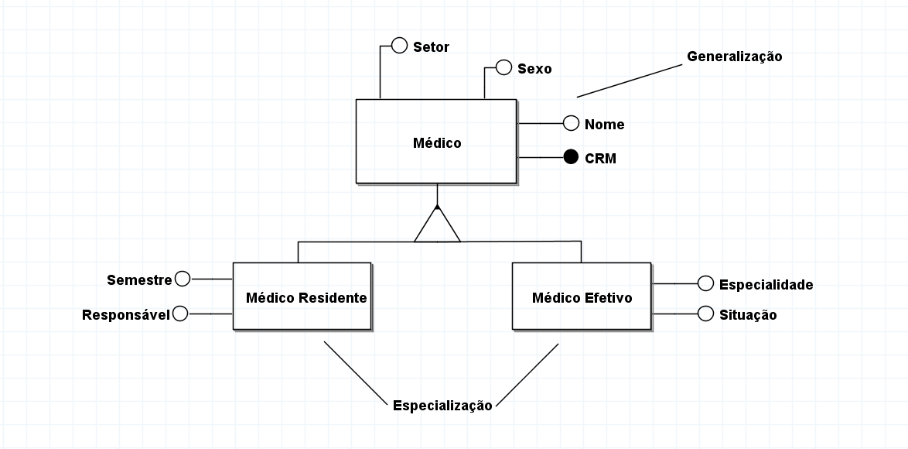

### ➜ Parcial e Total

Dentro da especialização/generalização temos duas classificações importantes, que seriam a ligação com entidade de forma **parcial** e **total**.

- **Parcial:** São entidades que indicam que não precisam fazer parte de nenhuma especialização/generalização

- **Total:** São entidades que indicam que que precisam necessariamente fazer parte de pelo menos alguma especialização/generalização.

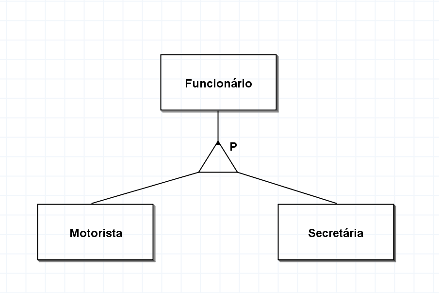

> Nesse exemplo, indica que nem todo **FUNCIONÁRIO** é **MOTORISTA** e nem **SECRETÁRIA**
>
> A ligação especialização/generalização parcial é definida por um P no seu relacionamento

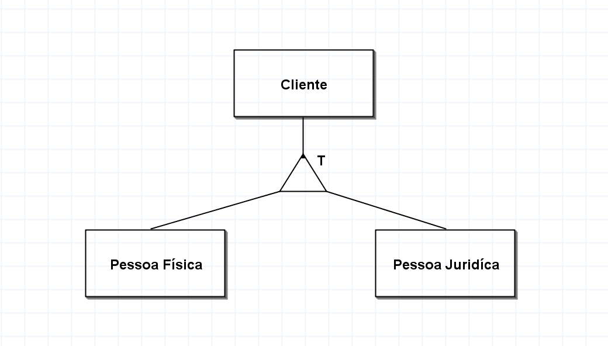

> Nesse exemplo, indica que **CLIENTE** é pelo menos **PESSOA FÍSICA** ou **PESSOA JURÍDICA**
>
> A ligação especialização/generalização total é definida por um T no seu relacionamento

### 📍 Projeto Lógico

A partir desse momento, a etapa de projeto lógico objetiva transformar o modelo conceitual obtido na primeira fase em um modelo lógico. O modelo lógico define como o banco de dados será implementado em um SGBD específico, portanto, **nessa fase se importamos com o tipo de SGBD que utilizaremos**, além do mais, nesse ponto do projeto não definiremos as características dos atributos, tais como tipos de dados e tamanho. Basta apenas que eles estejam vinculados às suas tabelas.

> Existem diversos modelos lógicos, por exemplo:
>
> Rede, hierárquico, relacional, orientado a objeto, grafos, chave-valor e XML. entretanto, o mais popular é o relacional, e também utilizaremos ele no nosso matérial.

- DT - Diagrama de Tabela
- Projetado com: Tabelas, Colunas e Chaves

    

**DIAGRAMA PENDENTE**

### 📍 Projeto Físico

Afinal, na etapa de projeto físico, o modelo do banco de dados é enriquecido com detalhes que influenciam no desempenho do banco de dados, mas não interfere em sua funcionalidade. O modelo obtido neste passo é o modelo físico do banco de dados. Afinal, definimos os detalhes de implementação dos objetos do banco de dados. No caso das tabelas, escolhemos os tipos de dados e tamanho das colunas, e especificamos se elas são opcionais ou obrigatórias.

**DIAGRAMA PENDENTE**

> ### Desafio da Addiante
>
> Digamos que trabalhamos na empresa "Addiante", que exercer a locação e venda de caminhões, tratores... que está passando pela implementação de um novo BD para cuidar de um projeto de divulgação dos produtos, localizado em uma feira de apresentações de negócios agropecuários. Afinal, você foi designado para criar o projeto do BD que será armazenado todas as informações dos clientes que estão interresados nos nossos serviços.
>
> Portanto, primeiramente, iremos exercer oque chamamos de **levamento de requisitos**, você precisa entender as necessidades do seu chefe, visto que, antes de iniciarmos um projeto precisamos entender a proposta que o cliente propôs, para assim ser cumprida, sendo uma das fases mais importante, já que, é nesse momento que teremos a parte inicial do projeto, que seria o esboço da modelagem principal.
>
> Digamos que nesse exemplo teremos que lidar com o cadastro de possíveis clientes interresados com os seguintes dados: **Nome, Idade, CPF e/ou CNPJ**. Além do mais, depois de apresentarmos os tipos de produtos em uma tabela que foi constituida por um BD de produto, que possui: **ID_product, Produto, Quantidade, Tipo e Valor** iremos solicitar ao usuário o preenchimento de um formulário para declarar interrese nos produtos, que pede: **ID_product, Quantidade, Tipo de contrato(compra ou aluguel) e Informações de entrega (Cidade, Rua e Número)**. Afinal, também teremos o setor de vendedores que serão a ponte do nosso sistema para o usuário, portanto, teremos que lidar com um espaço para declarar: **Nome e CPF** dos funcionários.
