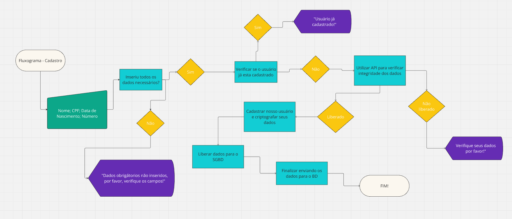
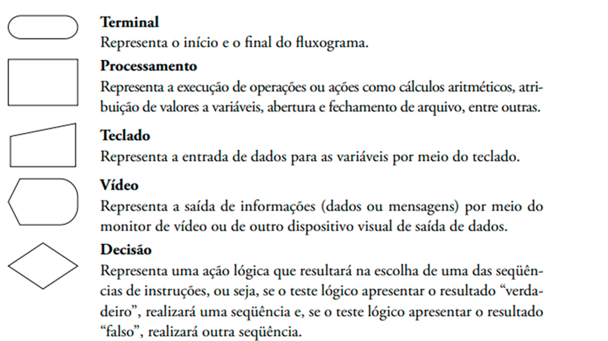
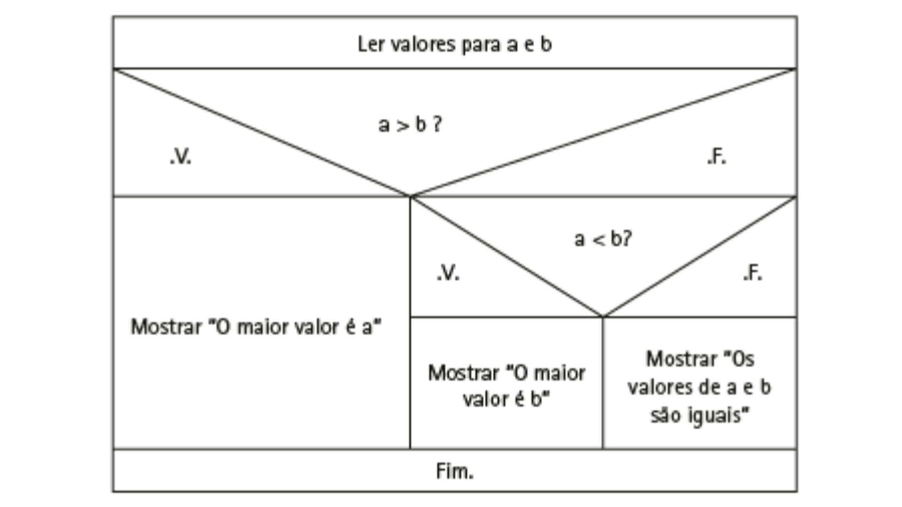

<link href="https://cdn.jsdelivr.net/npm/devicons@1.8.0/css/devicons.min.css" rel="stylesheet">

#  Introdução a Programação Estruturada em C


C é uma linguagem de programação poderosa e amplamente utilizada, conhecida por sua simplicidade, eficiência e flexibilidade, sendo uma ótima opção para a edificação de conhecimentos sobre como o desenvolvimento de fato funciona. 
</br>
</br>
Criada por Dennis Ritchioe em meados dos anos 1970, ela foi projetada inicialmente para o desenvolvimento no sistema operacional Unix, que seria um sistema multitarefa e multiusuário e uma das bases mais influentes na computação moderna, sendo o "pai" de muitos sistemas operacionais populares, como Linux, MacOS e até partes do Windows. 
</br>
</br>
C logo se tornou umas das linguagens mais populares do mundo da programação e aqui estão alguns pontos importantes sobre essa linguagem:

1. C oferece acesso direto à memória e controle sobre o hardware, permitindo que você escrava códigos eficientes e otimizados, além de ser frequentemente chamada de "linguagem de baixo nível de alto 

2. Suporta programação estruturada, permitindo que você divida problemas grandes em partes menores (funções);

3. O código escrito em C pode ser compilado em diferentes plataformas com poucas alterações, ou seja, boa portabilidade;

4. Rápida e eficiente, sendo ideal para sistemas embarcados, jogos, banco de dados e sistemas operacionais.

## 🔩 Solução de Problemas e Pensamento Computacional

### 📌 Lógica de Programação:

Antes de darmos inicio ao estudo aprofundado sobre essa introdução gostaria de apresentar o conceito de Lógica de Programação. Para exemplificar melhor, iremos analisar exclusivamente a ideia de "lógica".

Primeiramente, gostaria de expôs que o filósofo grego Aristóteles é considerado o criador da lógica, estabelecendo-a, na Grécia Antiga, como uma disciplina denominada "Razão".

> A Lógica é lida como raciocínios e argumentos
>
> Um argumento pode ser composto por uma ou várias premissas, as quais podem ser verdadeiras ou falsas e conduzem à conclusão, que também poderá ser verdadeira ou falsa. No argumento exemplificado a seguir, temos em 1 e 2 as premissas e em 3 a conclusão:
>
> 1. Paiva é mais velho que Lucas
> 2. Lucas é mais velho que Vitoria
> 3. Logo, Paiva é mais velho que Vitoria
>
>
>A lógica é aplicada a diversas ciências. Na informática a lógica é empregada em áreas que vão da construção de circuitos elétricos, que constituem o hardware dos dispositivos eletrônicos, ao software que permite seu funcionamento e uso.
>
> Ao pensar, muitas vezes efetuamos certas operações sobre proposições, chamadas de operações lógicas, que obedecem a regras de um cálculo, denominado “cálculo proposicional”, semelhante ao da aritmética sobre números.

__Lógica:__

Declarado na lingua portuguesa como modo de raciocinar de forma coerente e mais produtiva possível, ou seja, o ato de pensar e desenvolver essa lógica para constituir uma ação com uma finalidade que ocasionara em um resultado com maior qualidade possível. Caso não esteja tão claro tentarei exemplificar melhor:

> Digamos que você trabalha no setor de matriculas de novos alunos da faculdade Estacio - Via Corpus, e precisa fazer o cadastro de um novo aluno no curso de Sistemas de Informação, mas o computador nesse momento está indisponível e você terá que realizar tudo a mão. Sempre mantendo a ideia de agilidade e organização para armazenar dados importantes.
</br>
</br>
1 - Primeiro você irá destinar um espaço somente para anotar esses dados, que por enquanto será uma folha;
</br>
2 - Depois ira pegar um meio para escrever esses dados, que será uma caneta;
</br>
3 - Você precisaria dividir cada informação em uma tabela dentro do espaço destinado, para assim ter maior organização;
</br>
4 - Vai pedir os dados do novo aluno e anotara;
</br>
5 - Verificará se possui algum erro nos dados e arquivara em algum local seguro para depois colocar no banco de dados.
</br>
</br>
Afinal, você tem um modelo de lógica para anotar e guardar os dados desse aluno que foi matriculado na faculdade, assim, você seguiu uma lógica pre-estabelecida que supostamente você montou em sua cabeça e será a forma mais ágil de realizar essa tarefa.
</br>
</br>
Ficou mais claro?

Essa ideia de lógica, paralelamente, o proposto desafio de matricular um aluno é completamente a definição do que seria a lógica de programação, que seria montar e desenvolver o melhor método para executar uma tarefa.


### 📌 Solução Estruturada:

Abordagem de desenvolvimento de software e resolução de problemas que se baseia em dividir um problema complexo em partes menores e mais gerenciáveis. Esses pequenos desafios são resolvidos de forma independente, mas de maneira organizada, seguindo princípios de **programação estruturada**. Sendo esses princípios:

1. Divisão em Módulos:
    - O problema é dividido em partes menores chamadas de **módulos** ou **subprogramas** (funções/procedimentos).
    - Cada módulo resolve uma parte específica do problema.
2. Sequência Lógica:
    - O fluxo do programa segue uma ordem lógica com as três estruturas principais:
        - Sequência: Execução de instruções em ordem;
        - Decisão: Uso de condições para tomar decisões (ex: ```if``` e ```else```)
        - Repetição: Execução de laços ou loops (ex: ```for``` e ```while```)
3. Reutilização:
    - Os módulos podem ser reutilizados em diferentes partes do programa, economizando tempo e esforço.

4. Facilidade de Depuração:
    - Como o problema está dividido em módulos, fica mais fácil identificar e corrigir erros.

5. Legibilidade:
    - Segue uma estrutura clara, facilitando a leitura e o entendimento do código.

### 📌 Pensamento Computacional 

Se trata de um conjunto de habilidades mentais e práticas que ajudam a resolver problemas de maneira sistemática e eficiente. Ele é a base para o desenvolvimento de algoritmos e programas e a principal ferramenta para cumprir a principal responsabilidade de um desenvolvedor, que seria a mitigação de problemas por meios lógicos e modernos. No contexto específico do C, o pensamento computacional é aplicado para entender e resolver incógnitas usando a lógica e os recursos da linguagem.

__As ideias do que seria Pensamento Computacional para determinadas pessoas:__

<details>
<summary>Pensamento Computacional para Grover e Pea (2013)</summary>

</br>

> Com as ideias de Grover e Pea, o pensamento computacional tem nove elementos que os levam a atender alunos interdisciplinarmente, além de avaliar seu desempenho. São eles:
>
> 1. Abstração e reconhecimento de padrões;
> 2. Processamento sistemático da informação;
> 3. Noções de controle de fluxo de algoritmos;
> 4. Decomposição de problemas estruturados;
> 5. Sistema de símbolos e representações;
> 6. Pensamento iterativo, recursivo e paralelo;
> 7. Lógica condicional;
> 8. Eficiência e restrições de desempenho;
> 9. Depuração e detecção de erro sistemático.
</details>

<details>
<summary>Pensamento Computacional para Brackmann (2017)</summary>

</br>

> De acordo com os estudos de Brackmann ele desenvolveu a ideia ed que o pensamento computacional tem quatro pilares para a resolução de problemas. São eles:
>
> 1. **Descomposição:** Consiste em dividir o problema inicial em partes menores, permitindo que cada parte reduzida seja mais facilmente resolvida. De maneira geral, problemas que não estão decompostos têm sua resolução mais difícil de enxergar e desenvolver.
>
> 2. **Reconhecimento de Padrões:** Ao decompor o problema em partes menores, é possível aumentar a atenção aos detalhes e perceber que algumas dessas partes menores já são conhecidas ou têm sua solução conhecida, ou seja, algum tipo de problema que você em algum momento dos seus estudos e vida profissional ja teve que solucionar. O reconhecimento de padrões se caracteriza por identificar repetições ou regras de recorrência, aumentando a chance de se conhecer alguma solução para problemas similares.
>
> 3. **Abstração:** Consiste em filtrar e classificar os dados, concentrando a atenção no que realmente é importante. Ela pode ser vista como o principal dos pilares, porque será utilizada em diversos momentos, pois, ao concentrar-se nos dados realmente importantes, a abstração permite que decisões sejam tomadas com maior qualidade.
>
> 4. **Algoritmos:** Procedimentos para resolver um problema com as ações a serem executadas e a ordem em que elas devem acontecer. Na visão acadêmica, aprendemos diversos algoritmos, como os responsáveis por executar operações básicas (soma, subtração, multiplicação e divisão)
</details>

### 📌 Fluxo de requisições (Fluxograma)

Uma boa prática na questão de desenvolvimento é constituído antes mesmo de fato começar a escrever seu código, um importante ato é a criação do que chamamos de **fluxo de requisições**, que seria a elaboração de todo o esquema do nosso sistema utilizando o método de criar um fluxo com todos os fatores que deveremos abordar naquele momento, ou seja, se por exemplos formos trabalhar criando uma interface de cadastrar novos usuários precisamos se atentar a certas coisas, como por exemplo:

1. Todos os campos foram preenchidos?
2. Esse usuário já está cadastrado em nosso sistema?
3. Os dados fornecidos são válidos?
4. Crie uma criptografia dos dados
5. Verificado tudo, mande para o nosso SGBD para enviar ao BD

Esse é um exemplo de algumas perguntas que são padrões no momento que estivermos trabalhando com um fluxo de requisições de cadastros, mas é somente o começo de sistemas muitos mais complexos que precisam passar por vários tópicos.

Vamos demonstrar como seria esse fluxograma de forma prática agora, reutilizando a ideia de uma interface que possui cadastro:



> Site: Miro.com.br




##  Algoritmos e Portugol

Antes de utilizarmos a linguagem C realmente, precisamos entender algumas definições importantes para facilitar o entendimento de como a programação funciona, para tanto, vamos compreender qual o significado de **algoritmo** e **portugol**, respectivamente.

### Algoritmos:

A ideia de algoritmo é muito antiga e foi bastante discutida entre matemáticos e filósofos que vislumbravam, no século XVII, máquinas universais de calcular e estranhas linguagens simbólicas para representar ideias complexas por meio de sinais convencionais. A matemática clássica é, em grande parte, o estudo de determinados algoritmos que são manipulados por meio de regras práticas, como uma receita, um guia. Isso acontece na álgebra elementar, que substitui os números por letras e define um conjunto de símbolos.

Os algoritmos são muito utilizados em disciplinas ligadas à área de ciências exatas, como matemática, física, química e computação; eles também têm diversas aplicações em outras áreas e atividades, ainda que não sejam conhecidos por esse nome.

- Para que as tarefas possam ser realizadas com êxito, elas devem estar ordenadas.
- Tarefas ordenadas nos levam a noção de Algoritmos. 
- Algoritmos é uma sequência de instruções ordenada, finita, e não ambígua (direta) que são executadas mecanicamente para executar uma tarefa.   

Existem diversos tipos de algoritmos utilizados na computação e o que difere um tipo do outro é a maneira de representar as instruções para realização de uma tarefa. Entre os principais tipos de algoritmos, podemos citar:

1. Descrição Narrativa
2. Diagrama de Chapin
3. Pseudocódigo 
4. Fluxograma 

### Descrição Narrativa (Linguagem Textual):

> A mais simples de entender, visto que utilizamos o a linguagem natural, ou seja, nosso idioma para criar uma lógica

A descrição narrativa utiliza linguagem natural para especificar os passos da realização das tarefas. Pela pouca formalidade e por dar margem a interpretações ambíguas, dificilmente é utilizada na representação de algoritmos.

```
1. Ler valores para o A e B
2. Verificar se o A é maior que o B
3. Se A for maior que o B
4. Mostre: "O maior valor é A"
5. Se A for menor que o B"
6. Mostre: O maior valor é B"
7. Se os valores de A e B forem iguais
8. Mostre: "Os valores A e B são iguais"
9. Fim
```

### Diagrama de Chapin

O diagrama de Chapin, também conhecido como diagrama Nassi-Shneiderman ou diagrama N-S, apresenta a solução do problema por meio de um diagrama de quadros com uma visão hierárquica e estruturada. Esse tipo de diagrama não é muito utilizado, pois é difícil representar alguns procedimentos



### Pseudocódigo 

> A mais próxima dos códigos de programação, já que utilizamos um estilo de sintaxe similar as linguagens de programação.


O pseudocódigo é uma forma de representação de algoritmos que utiliza uma linguagem flexível, intermediária entre a linguagem natural e a linguagem de programação. É utilizado para organizar o raciocínio lógico a ser seguido para a resolução de um problema ou para definir os passos para a execução de uma tarefa. 

- A palavra “pseudocódigo” significa “falso código”.

Esse nome se deve à proximidade que existe entre um algoritmo escrito em pseudocódigo e a maneira pela qual um programa é representado em uma linguagem de programação.

``` 
1.  Algoritmo exemplo2.3
2.  Var
3.      a, b: inteiro
4.  Início
5.      Ler (a,b)
6.      Se (a>b) então
7.          Mostrar ("O maior valor é a" a)
8.      senão
9.          Se (a<b) então
10.             Mostrar("O maior valor é b" b)
11.     senão
12.         Mostrar("Os valores de A e B são iguais)
13.     Fim-se
```
Todo algoritmo representado por um pseudocódigo deve, primeiramente, ser identificado, como aparece na linha 1 do Exemplo 2.3. 

1. Variáveis: 
    - Todas as variáveis que serão utilizadas na resolução do problema devem ser previamente declaradas, isto é, todas as informações necessárias à resolução do problema devem ser representadas. 
    - No exemplo anterior, a palavra reservada Var indica a área para declaração das variáveis e, na linha 3, as variáveis a e b são declaradas.

2. Corpo do algoritmo: 
    - Nas linhas 4 e 15, encontramos as palavras reservadas Início e Fim, respectivamente. 
    - Elas delimitam o espaço definido para escrever todos os passos necessários para solucionar o problema.
    - Nessa parte, devem-se escrever todos os passos lógicos necessários para solucionar o problema, representando, entre outras:
    a entrada de valores para as variáveis;
    as operações de atribuição, lógicas e aritméticas;
    a abertura e o fechamento de arquivos;
    as repetições;
    a exibição dos resultados.
    

### Fluxograma:

> A mais difundida e compreendida mundialmente, já que foi estabelecido um padrão para os fluxogramas, portanto, é entendida por qualquer projetista.

O fluxograma é um tipo de algoritmo que se utiliza de símbolos gráficos para representar ações ou instruções a serem seguidas.

É utilizado para organizar o raciocínio lógico a ser seguido para a resolução de um problema ou para definir os passos para a execução de uma tarefa. O fluxograma, por utilizar figuras para representação das ações, é considerado um algoritmo universal.
Cada instrução ou ação a ser executada deve ser representada por meio de um símbolo gráfico (Simbologia).


## Tipos de Dados, Expressões, Operadores e Tabela Verdade

---

### 📌 Considerações Finais:

Esse material todo se baseando no sistema de ensino da Estacio - Via Corpus (Fortaleza-CE), sendo uma parte anotado a partir das explicações da professora e coordenadora: Danielle Amorim e outra tirada dos matérias de estudo do SAVA.

Algumas Fontes:

> BRACKMANN, C. P. Desenvolvimento do pensamento computacional através de atividades desplugadas na educação básica. Tese (Doutorado em Informática na Educação) - Universidade Federal do Rio Grande do Sul, Porto Alegre, 2017.

> GROVER, S.; PEA, R. Computational Thinking in K-12: A Review of the State of the Field. Educational Researcher, 2013, v. 42, n. 1, p. 38 - 43.