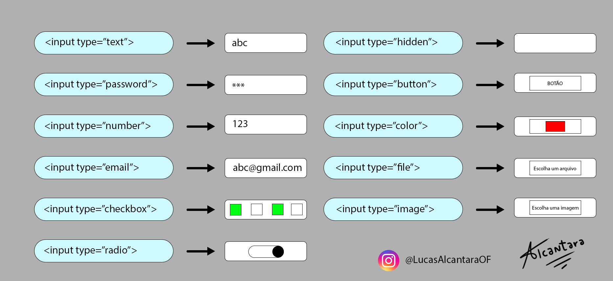
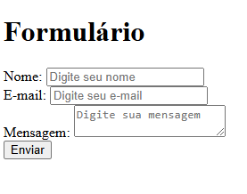
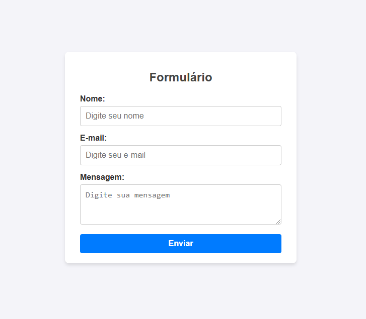

# HTML para alguns idiotas

HTML é a sigla para "HyperText Markup Language", a melhor tradução que podemos ter na lingua brasileira seria "Linguagem de Marcação de Hipertexto", reforçando novamente, se trata de uma linguagem de marcação fundamental para qualquer desenvolvedor web. Seria então o código que define a estrutura e o conteúdo de uma pagina WEB, sendo o seu componente base, como visual e/ou auditivo. Portanto, para exemplificar podemos utilizar o próprio GitHub.


> Fonte: Site Oficial do GitHub: 31/10/2024 (https://github.com)

Todos os conteúdos presentes na pagina inicial do GitHub são formados pelo HTML, no superior da pagina, ao canto esquerdo, temos um menu que é comumente chamando dentro da área de T.I como nav, que seria um conjunto de links que direcionam o usúario para outras telas, como também no meio da tela temos um título, que seria o maior texto seguido de textos menores que seria o páragrafo, paralelamente, no centro e nos cantos superior a direita temos os botões. Dentro do HTML temos diversas elementos, que seriam todos esses links, textos, botões, (etc...). Ademais, não é preciso ter nenhum conhecimento prévio sobre o assunto tratado até o momento, apenas estamos apresentando a ideia do que séria o HTML.

<details>
    <summary>Um breve momento de desopilar a mente</summary>   

    Sinceramente, quando comecei a estudar para me tornar um desenvolvedor, me senti sem rumo, comecei vendo lógica de programação, nas linguagens de JavaScript e PHP, juntamente com a criação de telas front-end, muitas coisas para ver e aprender, além de toda a cobraça do "Será que é isso que eu quero para minha vida?" "Será que eu consigo?" são perguntas que nem mesmo eu tenho respostas nesse momento, caso você esteja utilizando meu conteúdo para aprender ou revisita um assunto que você ja possa ter visto, primeiramente, obrigado pela consideração, paralelamente, digo que mesmo as coisas mais difíceis valem a pena ser aprendidas. 

    Só é preciso que você mesmo defina as coisas que você considera como difícil.

    - Lucas Alcântara, 2024
</details>

</br>

## Estrutura básica do HTML

Primeiramente, antes de realizamos o estudo mais aprofudando do HTML precisamos entender como funciona a estrutura base do arquivo

```html
<!DOCTYPE html> <!--Definindo que esse documento se trata de um HTML-->
<html lang="pt-br"> <!--Definindo a lingua utilizada no site para a internet-->
<head>
    <meta charset="UTF-8">
    <meta name="viewport" content="width=device-width, initial-scale=1.0">
    <title>Meu Título</title> <!--Título da Pagina-->
</head>
<body> <!--Começo do "corpo" do site-->
    
</body>
</html>
```

No arquivo HTML, temos uma ordem na sua estrutura. Primeiramente, declaramos o tipo de documento utilizando uma tag específica. Em seguida, escolhemos o idioma do nosso site, o que é importante principalmente para que a internet saiba qual idioma é utilizado nas informações presentes na página web.

Em seguida, temos duas partes principais: o "head" e o "body". O "head", que pode ser traduzido como "cabeça", é uma seção destinada a informações essenciais que geralmente não são exibidas diretamente ao usuário. Exemplos incluem a definição do idioma da página, links para fontes externas, a inclusão de arquivos CSS para estilização, entre outros. Esses detalhes são fundamentais para o funcionamento da página, mas não aparecem no conteúdo visível da web. Explicarei esses conceitos com mais detalhes a seguir.

Paralelamente, temos o "body", que pode ser traduzido como "corpo". Analogamente, essa seção corresponde ao conteúdo visível da página web, ou seja, a área onde são exibidas as informações principais que o usuário verá ao acessar o site.

## Tag's do HTML

Uma tag em HTML (Hypertext Markup Language) é um elemento usado para estruturar e formatar o conteúdo de uma página web. Tags HTML consistem em palavras-chave ou identificadores envolvidos por colchetes angulares (< >) que dizem ao navegador como interpretar e exibir o conteúdo entre elas.

__Tag's de Texto__

Este é o primeiro contato com o desenvolvimento de páginas Front-End, ou seja, a parte do desenvolvimento web responsável pela criação e apresentação visual do conteúdo para o usuário. Nesse contexto, as tags de texto são as primeiras que aprendemos ao iniciar o estudo de HTML. Elas formam a base para construir páginas web e, à medida que avançamos, podemos explorar tags e conceitos mais complexos. No entanto, não devemos subestimar a importância dessas tags iniciais, pois elas são fundamentais para a estruturação e apresentação de conteúdo em nosso site.

```html
<!--Tags de Texto-->

<h1>Cabeçalho</h1> <!--Conhecido como cabeçalhos, sendo do mais ao menos importante, ou seja, hierarquia, a partir do <h1> ao <h6>-->

<p>Parágrafo</p> 

<b>Texto em Negrito</b>

<strong>Texto parecido com negrito</strong> 

<em>Texto em Itálico</em> 

<small>Texto Pequeno</small>

<del>Texto excluído<del>

<br> <!--Quebra de Linha-->

<hr> <!--Linha Horizontal-->
```

__Tags de Mídia__

Outra série de tags comumente utilizada no desenvolvimento front-end é aquela que serve para vincular mídia ao nosso código. Por exemplo, quando queremos estilizar nosso site com o logotipo da empresa, usamos a tag "img", que incorpora uma mídia externa para visualização pelo cliente. Além disso, temos a tag "a", que serve para vincular um objeto a outro endereço. Afinal, são tags usadas para todo os contéudos relacionado a mídia.

```html
<!--Tags de Mídia-->


<audio src="pasta/arquivo.audio" alt="descrição do audio">

<video src="pasta/arquivo.video" alt="descrição do video"> 

<a href="url">Texto do Link</a>

<link src="pasta/arquivo">
```

__Tags de Lista__

Tags de Lista são as queridas para o desenvolvimento de uma série de informações que você gostaria de deixar organizada por terem atributos muitas vezes parecidos, muito utilizado quando trabalharmos com menus, que teremos varios itens dentro de uma mesma lista.

```html
<!--Tags de Lista-->

<ul>Lista não ordenada</ul> <!--com marcadores-->

<ol>Lista ordenada</ol> <!--numerada-->

<li>Item de uma lista</li>
```

__Tags de Formulário__

As tags de formulário no HTML são usadas para criar áreas de interação onde os usuários podem inserir dados e enviá-los ao servidor para processamento.

```html
<!--Tags de Formulário-->

<form>Espaço destinado para um formulário</form>

<input> <!--Campo de Entrada-->

<label> <!--Rótulo de uma campo de entrada-->

<select> <!--Menu Suspenso-->
      </select>

<button> <!--Botão Clicável>
```

__Tags de Organização__

```html
<div></div> <!--Utilizado para agrupar elementos dentro de uma divisoria-->
    <!--Dentro da div teremos alguns atributos que podemos usar-->
    <div class=""></div> <!--Atributo que pode ser utilizado para mais de uma div-->
    <div id=""></div> <!--Atributo que poed ser utilizado somente para um div-->

```

__Tags de Input__

Entretando, iremos analisar especificamente os diferente tipos de input que é muito importante para o desenvolvimento um profissional do Front-End



> Fonte: Imagem própria

Vale ressaltar que não retratamos nem metade de todas as tags presentes dentro do HTML, entretanto, como um futuro(a) desenvolvedora, fica por sua responsabilidade procurar mais ainda sobre o assunto, mas trouxemos as principais que você precisa saber.

## Exemplos práticos de Projetos

Agora com um pouco do conhecimento das tags que eu considero mais importantes, podemos tentar retratar algum exemplo real, mesmo que simples, mas já utilizando os conhecimentos que previamente já foram ensinados.

```html

<!--Exemplo Prático de Projeto 01-->
<!DOCTYPE html>
<html lang="pt-BR">
<head>
    <meta charset="UTF-8">
    <meta name="viewport" content="width=device-width, initial-scale=1.0">
    <title>Formulário de Login</title>
</head>
<body>
  <div class="form-container">
        <h1>Formulário</h1>
        <form action="#" method="post">
            <div class="form-group">
                <label for="nome">Nome:</label>
                <input type="text" id="nome" name="nome" placeholder="Digite seu nome" required>
            </div>
            <div class="form-group">
                <label for="email">E-mail:</label>
                <input type="email" id="email" name="email" placeholder="Digite seu e-mail" required>
            </div>
            <div class="form-group">
                <label for="mensagem">Mensagem:</label>
                <textarea id="mensagem" name="mensagem" placeholder="Digite sua mensagem"></textarea>
            </div>
            <button type="submit">Enviar</button>
        </form>
    </div>
</body>
</html>
```

Resultado:
<br>


Apenas realizando uma prévia do que seremos capaz de montar com a continuidade dos nosso estudos com o HTML + CSS, demonstraremos para você como estilizaremos formulários simples assim:

Vale ressaltar antes que documentos assim, com o CSS dentro do HTML fica além de muito baguçado e poluído, é completamente contra os postulados de código limpo, entretanto, será aprensentando melhor mais a frente.

```html
<!DOCTYPE html>
<html lang="pt-BR">
<head>
    <meta charset="UTF-8">
    <meta name="viewport" content="width=device-width, initial-scale=1.0">
    <title>Formulário Simples</title>
    <style>
        /* Estilos gerais */
        body {
            font-family: Arial, sans-serif;
            background-color: #f4f4f9;
            color: #333;
            margin: 0;
            padding: 0;
            display: flex;
            justify-content: center;
            align-items: center;
            height: 100vh;
        }

        /* Estilo do contêiner do formulário */
        .form-container {
            background-color: #ffffff;
            padding: 20px 30px;
            border-radius: 8px;
            box-shadow: 0 4px 6px rgba(0, 0, 0, 0.1);
            width: 100%;
            max-width: 400px;
        }

        .form-container h1 {
            text-align: center;
            font-size: 24px;
            margin-bottom: 20px;
            color: #444;
        }

        /* Estilos dos campos do formulário */
        .form-group {
            margin-bottom: 15px;
        }

        label {
            display: block;
            font-weight: bold;
            margin-bottom: 5px;
        }

        input, textarea, select {
            width: 100%;
            padding: 10px;
            font-size: 16px;
            border: 1px solid #ccc;
            border-radius: 4px;
            outline: none;
            box-sizing: border-box;
        }

        input:focus, textarea:focus, select:focus {
            border-color: #007bff;
            box-shadow: 0 0 4px rgba(0, 123, 255, 0.2);
        }

        textarea {
            resize: vertical;
            min-height: 80px;
        }

        /* Estilo do botão */
        .form-container button {
            width: 100%;
            background-color: #007bff;
            color: white;
            border: none;
            padding: 10px 15px;
            font-size: 16px;
            font-weight: bold;
            border-radius: 4px;
            cursor: pointer;
            transition: background-color 0.3s ease;
        }

        .form-container button:hover {
            background-color: #0056b3;
        }
    </style>
</head>
<body>
    <div class="form-container">
        <h1>Formulário</h1>
        <form action="#" method="post">
            <div class="form-group">
                <label for="nome">Nome:</label>
                <input type="text" id="nome" name="nome" placeholder="Digite seu nome" required>
            </div>
            <div class="form-group">
                <label for="email">E-mail:</label>
                <input type="email" id="email" name="email" placeholder="Digite seu e-mail" required>
            </div>
            <div class="form-group">
                <label for="mensagem">Mensagem:</label>
                <textarea id="mensagem" name="mensagem" placeholder="Digite sua mensagem"></textarea>
            </div>
            <button type="submit">Enviar</button>
        </form>
    </div>
</body>
</html>
```
Resultado:
</br>


<details>
    <summary>Muita coisa para aprender?</summary>   

    Olha, quando comecei a estudar, fiquei me perguntando se era muita coisa para aprender, até mesmo por que é um assunto que nunca vimos até o momento que você, como aspirante a desenvoldedor, teve a curiosidade de procurar sobre, visto que, na escola não temos um matérial mesmo que básico sobre essa parte computacional, são poucas as escolas que dão acesso a computação quando novos para os alunos, nas minhas escolas por exemplo, não tinhamos. Portanto, eu sei que pode parecer coisa demais e pode parecer que você não consegue dar conta, mas esse conteúdo, mesmo que mais simples e muito de decorar, é sim algo que um desenvolvedor que queira seguir carreira como Front-End ou até mesmo um Full-Stack precisa dominar, é um proecsso que qualquer curso ou até mesmo a faculdade precisa ensinar e gostam de ser o conteúdo inicial. Afinal, sei que é bem díficil, extenso e muitas coisas que nem ao menos parece ser facil, acho muito assutador especificamente essa parte do CSS, vejo grandes desenvolvedores fazendo páginas web grandiosas, com os mais diversas animações, mas preciso que você entenda uma coisa, um cara assim já está a anos no mercado, muito possivelmente você começou essa semana e está dando seus primeiros passos como um desenvolvedor, sempre digo que acho muito legal um aspirante a dev começar com HTML e CSS, por além de ser algo mais simples e didático, ajuda sim a você lidar com versionadores de códigos, até certo ponto um estudo sobre organização e sobre como a base funciona.

    O importante de fato é você entender que todo mundo tem o seu tempo, além do mais, como uma pessoa que tem um grande senso de imediatismo também aconselho a você ter calma nesse processo, você de fato ainda não é um desenvolvedor, e não fez nenhum programa, nenhuma lógica, mas está entendendo melhor como funciona esse mercado, você precisa realizar cada passo de uma vez.

    - Lucas Alcântara, 2024
</details>

## HTML Semântico

A nossa página web é desenvolvida e moldada a partir de diversos campos onde colocamos as informações para o usuário ter acesso de clicar e utlizar, ou apenas visualizar, antigamente toda essa organização é feita através de uma série de "divs", oque não estaria errado, visto que até hoje temos e devemos utlizar "divs" para organizar ainda melhor nosso site, entretanto, existem alguns campos denominados como padrão e que quase todo site vai ter. Afinal, para melhor organização a comunidade de desenvolvedores moldaram o HTML Semântico , que seria um conceito em desenvolvimento web que se refere ao uso de elementos do HTML para descrever claramente o significado do contéudo de uma página. Esses elementos têm nomes que refletem seu próposito ou função, tornando o código mais légivel para outros desenvolvedores e até mesmo o navegador que estará sendo usado a sua página web. 


> Fonte: Imagem própria

Portanto, além da organização da hierarquia da tags do HTML, que seriam a sintaxe que nem comentamos diretamente, visto que ja foi instruido desde o começo dos estudos, que se você coloca um cabeçalho com "h1" em cima de uma imagem, sempre ele vai estar nessa posição, ou seja, em cima, que ja foi estabelecida no nosso código. Paralelamente, devemos utilizar o HTML semântico para melhorar ainda mais essa nossa organização, já que muito possivelmente, dentro da sua empresa, não terá apenas você de desenvolvedor, isso fica didaticamente mais fácil de montar e futuramente realizar correções e atualizações.

Tag  | Uso
--------- | ------
header | Representa o cabeçalho da página ou de uma seção.
nav | Contém links de navegação.
main| Representa o conteúdo principal da página.
article | Conteúdo independente, como um post ou notícia.
section | Agrupa conteúdo relacionado.
aside |	Informações complementares, como barras laterais ou widgets.
footer | Rodapé da página ou de uma seção.

## Boas maneiras com HTML

A principal e mais óbvia conduta de boa maneira com HTML será a organização e o desenvolvimento de um código limpo, ou seja, sempre ser claro sobre suas ideias e estilização, sempre utilizando nomeclaturas convencionais e não informais, paralelamente, utlizar os conhecimentos do HTML semântico, para além de ser mais didático para você, quanto para outros desenvolvedores da sua equipe.

## Linkar indepedencias externas

__CSS:__
```html
<!--Dentro do Head-->
<link rel="stylesheet" href="style.css">
```

__JavaScript:__
```html
<!--Dentro do Body-->
<script src=",/pasta/nomedoarquivo.js"></script>
```